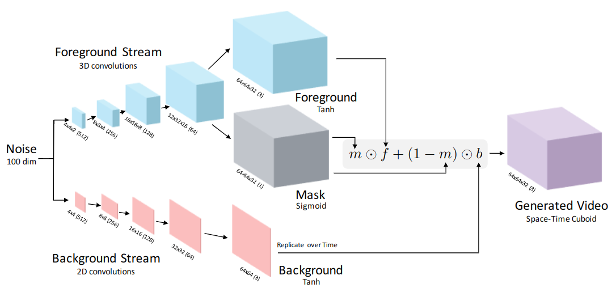
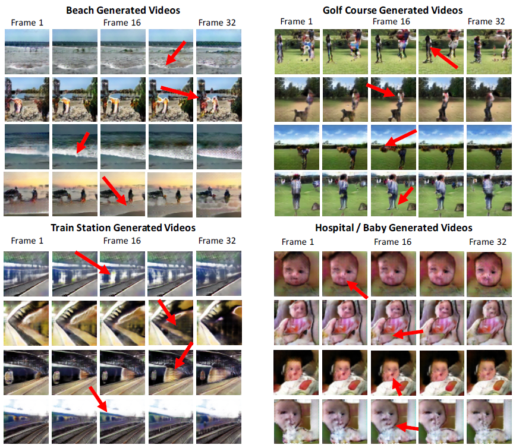

# TITLE: NIPS 2016 Generating Videos with Scene Dynamics

- [TITLE: NIPS 2016 Generating Videos with Scene Dynamics](#title-nips-2016-generating-videos-with-scene-dynamics)
  - [SUMMARY](#summary)
    - [APPLICATIONS SUMMARY](#applications-summary)
    - [ARCHITECTURE SUMMARY](#architecture-summary)
    - [AUTHORS](#authors)
    - [COMPARED TO](#compared-to)
    - [CONTRIBUTIONS](#contributions)
    - [DATASETS](#datasets)
    - [IMPLEMENTATION](#implementation)
    - [METRICS](#metrics)
    - [QUALITATIVE EVALUATION SUMMARY](#qualitative-evaluation-summary)
    - [QUANTITATIVE EVALUATION SUMMARY](#quantitative-evaluation-summary)
    - [RELATED WORK](#related-work)
    - [RESULTS](#results)

## SUMMARY

### APPLICATIONS SUMMARY

- Unconditional video generation

- Future prediction: Given a single input frame predict the future frames. The architecture is augmented with a 5 layer convolutional network at the front of the generator. The input image is passed through this network and produces the (100 dim) latent vector for the generator. During training a L1 loss is applied between the first generated frame and the input image.

- Video representation learning: The discriminator weights that are learned by the GAN are also useful for action recognition/classification. The final layer is replaced with a linear layer to K outputs. Softmax activation is applied and the model is fine-tuned on a small set of labeled data. The learned weights were found to significantly outperform both randomly initialized weights and also to hand-crafted STIP features.

### ARCHITECTURE SUMMARY

We design the architecture of the generator network with a few principles in mind. Firstly, we want the network to be invariant to translations in both space and time. Secondly, we want a low-dimensional z to be able to produce a high-dimensional output (video). Thirdly, we want to assume a stationary camera and take advantage of the the property that usually only objects move. We are interested in modeling object motion, and not the motion of cameras. Moreover, since modeling that the background is stationary is important in video recognition tasks [44], it may be helpful in video generation as well. We explore two different network architectures:

One Stream Architecture: We combine spatio-temporal convolutions [14, 40] with fractionally strided convolutions [51, 31] to generate video. Three dimensional convolutions provide spatial and temporal invariance, while fractionally strided convolutions can upsample efficiently in a deep network, allowing z to be low-dimensional. We use an architecture inspired by [31], except extended in time. We use a five layer network of 4 x 4 x 4 convolutions with a stride of 2, except for the first layer which uses 2 x 4 x 4 convolutions (time x width x height). We found that these kernel sizes provided an appropriate balance between training speed and quality of generations.

Two stream architecture: top stream generates foreground and bottom stream generates background. Background is assumed static. Background generated using Conv2dtranspose layers. Foreground generated using Conv3dTranspose layers. The 2nd last layer of the top stream is also used to generate a soft mask. The mask contains a value in [0, 1] for each pixel in each frame and is used to combine the foreground and background into the final video. Sigmoid activation is used to create the mask. Tanh activation is used for the foreground and background. Intermediate layers in generator use Relu and the intermediate layers in the discriminator use LeakyRelu.

$$G_2(z) = m(z) \odot f(z) + (1 - m(z)) \odot b(z)$$

In order to encourage the network to use the background stream, a sparsity prior is added to the mask during learning.

### AUTHORS

- Carl Vondrick (MIT) [vondrick@mit.edu](mailto:vondrick@mit.edu)
- Hamed Pirsiavash (UMBC) [hpirsiav@umbc.edu](mailto:hpirsiav@umbc.edu)
- Antonio Torralba (MIT) [torralba@mit.edu](mailto:torralba@mit.edu)

### COMPARED TO

- Autoencoder (custom model for video genration).
The encoder is similar to the discriminator network (except producing 100 dimensional code), while the decoder follows the two-stream generator network. Hence, the baseline autoencoder network has a similar number of parameters as our full approach. We then feed examples through the encoder and fit a Gaussian Mixture Model (GMM) with 256 components over the 100 dimensional hidden space. To generate a novel video, we sample from this GMM, and feed the sample through the decoder.

- One stream architecture (custom model for video genration). This is just 5 conv3dtranspose layers. Although the one-stream architecture is capable of generating stationary backgrounds, it may be difficult to find this solution, motivating a more explicit architecture. The one-stream architecture generally produces high-frequency temporal flickering in the background.

- [STIP features](https://arxiv.org/abs/1212.0402): Space Time Interest Points for unsupervised future prediction

- [Temporal Coherence](http://yann.lecun.com/exdb/publis/pdf/hadsell-chopra-lecun-06.pdf) for unsupervised future prediction

- [Shuffle and Learn](https://arxiv.org/abs/1603.08561)  for unsupervised future prediction

- [ImageNet Supervision](https://arxiv.org/abs/1507.02159) for supervised future prediction

### CONTRIBUTIONS

- The primary contribution of this paper is showing how to leverage large amounts of unlabeled video in order to acquire priors about scene dynamics.

- The secondary contribution is the development of a generative model for video.

### DATASETS

- Unlabeled Video Dataset: The authors took 2 million videos from Flickr using tags. The dataset is over 5000 hours. This contains parts of the Yahoo Flickr Creative Commons Dataset.

- Filtered Unlabeled Videos: The above dataset filtered by scene category using Places2 pre-trained model [NIPS 2014 Learning deep features for scene recognition using
places database](https://papers.nips.cc/paper/5349-learning-deep-features-for-scene-recognition-using-places-database.pdf). 4 scene categories: golf course, hospital rooms (babies), beaches, and train station. Stabilized the camera motion for both datasets. Extracted SIFT keypoints, used RANSAC to estimate a homography (rotation, translation, scale) between adjacent frames, and warped frames to minimize background motion. When the homography moved out of the frame, filled in the missing values using the previous frames. If the homography has too large of a re-projection error, ignored that segment of the video for training, which only happened 3% of the time. Videos are 32 frames of spatial resolution 64 x 64.

### IMPLEMENTATION

- Lua and Torch (by the authors): <https://github.com/cvondrick/videogan>
- Python and Tensorflow (Implementation is different from the original paper): <https://github.com/GV1028/videogan>

### METRICS

- **User study on Amazon Mechanical Turk (AMT)**: Quantitatively evaluated generations using a psychophysical two-alternative forced choice with workers on Amazon Mechanical Turk. Workers were showed two random videos, and asked “Which video is more realistic?”. Collected over 13000 opinions across 150 unique workers. Workers were paid one cent per comparison, and were required to historically have a 95% approval rating on MTurk. Experimented with removing bad workers that frequently said real videos were not realistic, but the relative rankings did not change.

- Relative accuracy gain for future prediction task.

### QUALITATIVE EVALUATION SUMMARY

Figure 2: Video Generations: We show some generations from the two-stream model. The red arrows
highlight motions.

We observe that a) the generated scenes tend to be fairly sharp and that b) the motion patterns are generally correct for their respective scene. For example, the beach model tends to produce beaches with crashing waves, the golf model produces people walking on grass, and the train station generations usually show train tracks and a train with windows rapidly moving along it. While the model usually learns to put motion on the right objects, one common failure mode is that the objects
lack resolution. For example, the people in the beaches and golf courses are often blobs.

Figure 3: Streams: We visualize the background,foreground, and masks for beaches (left) and golf (right). The network generally learns to disentangle the foreground from the background.

Figure 5: Future Generation: We show one application of generative video models where we predict videos given a single static image. The red arrows highlight regions of motion. Since this is an ambiguous task, our model usually does not generate the correct video, however the generation is often plausible.

Figure 6: Visualizing Representation: We visualize some hidden units in the encoder of the future generator, following the technique from [52]. We highlight regions of images that a particular convolutional hidden unit maximally activates on. While not at all units are semantic, some units
activate on objects that are sources for motion, such as people and train tracks.

### QUANTITATIVE EVALUATION SUMMARY

Percentage of trials where workers prefered one generation over the other:

| “Which video is more realistic?”            | Golf | Beach | Train | Baby | Mean |
|---------------------------------------------|------|-------|-------|------|------|
| Random Preference                           | 50   | 50    | 50    | 50   | 50   |
| Prefer VGAN Two Stream over Autoencoder     | 88   | 83    | 87    | 71   | 82   |
| Prefer VGAN One Stream over Autoencoder     | 85   | 88    | 85    | 73   | 82   |
| Prefer VGAN Two Stream over VGAN One Stream | 55   | 58    | 47    | 52   | 53   |
| Prefer VGAN Two Stream over Real            | 21   | 23    | 23    | 6    | 18   |
| Prefer VGAN One Stream over Real            | 17   | 21    | 19    | 8    | 16   |
| Prefer Autoencoder over Real                | 4    | 2     | 4     | 2    | 3    |

Table 1: Video Generation Preferences: We show two videos to workers on Amazon Mechanical Turk, and ask them to choose which video is more realistic. The table shows the percentage of times that workers prefer one generations from one model over another. In all cases, workers tend to prefer video generative adversarial networks over an autoencoder. In most cases, workers show a slight preference for the two-stream model.

To evaluate whether static frames are better than our generations, we also ask workers to choose between our videos and a static frame, and workers only chose the static frame 38% of the time, suggesting our model produces more realistic motion than static frames on average.

Video Representation Learning: We evaluate the representation learned by the discriminator for action classification on UCF101 [35]. Table (a) shows accuracy with unsupervised methods.

| Method               | Accuracy |
|----------------------|---------:|
| Chance               | 0.9%     |
| STIP Features        | 43.9%    |
| Temporal Coherence   | 45.4%    |
| Shuffle and Learn    | 50.2%    |
| VGAN + Random Init   | 36.7%    |
| VGAN + Logistic Reg  | 49.3%    |
| **VGAN + Fine Tune** |**52.1%** |
| ImageNet Supervision | 91.4%    |

Table (a): By fine-tuning the discriminator on a relatively small labeled dataset, we can obtain better performance than random initialization, and better than hand-crafted space-time interest point (STIP) features. Moreover, our model slightly outperforms another unsupervised video representation [24] despite using an order of magnitude fewer learned parameters and only 64 x 64 videos. Note unsupervised video representations are still far from models that leverage external supervision.

Figure 4: (b) Our unsupervised representation with less labeled data outperforms random initialization with all the labeled data. Our results suggest that, with just 1/8th
of the labeled data, we can match performance to a randomly initialized network that used all of the labeled data. (c) The fine-tuned model has larger relative gain over random initialization in cases with less labeled data. Note that table (a) is over all train/test splits of UCF101, while figures (b and c) are over the first split in order to make experiments less expensive.

Performance vs Data: We also experimented with varying the amount of labeled training data available to our fine-tuned network. Figure 4b reports performance versus the amount of labeled training data available. As expected, performance increases with more labeled data. The fine-tuned model shows an advantage in low data regimes: even with one eighth of the labeled data, the finetuned model still beats a randomly initialized network. Moreover, Figure 4c plots the relative accuracy gain over the fine-tuned model and the random initialization (fine-tuned performance divided by random initialized performance). This shows that fine-tuning with our model has larger relative gain over random initialization in cases with less labeled data, showing its utility in low-data regimes.

### RELATED WORK

However, previous work has focused mostly on small patches, and evaluated it for video clustering. Here, we develop a generative video model for natural scenes using state-of-the-art adversarial learning methods [9, 31].

Our technical approach builds on recent work in generative adversarial networks for image modeling [9, 31, 4, 47, 28], which we extend to video. To our knowledge, there has been relatively little work extensively studying generative adversarial networks for video. Most notably, [22] also uses adversarial networks for video frame prediction.

Our work is also related to efforts to predict the future in video [33, 22, 43, 50, 42, 17, 8, 54] as well as concurrent work in future generation [6, 15, 20, 49, 55]. Often these works may be viewed as a generative model conditioned on the past frames. Our work complements these efforts in two ways. Firstly, we explore how to generate videos from scratch (not conditioned on the past). Secondly, while prior work has used generative models in video settings mostly on a single frame, we jointly generate a sequence of frames (32 frames) using spatio-temporal convolutional networks, which may help prevent drifts due to errors accumulating.

Finally, this paper is related to a growing body of work that capitalizes on large amounts of unlabeled video for visual recognition tasks [18, 46, 37, 13, 24, 25, 3, 32, 26, 27, 19, 41, 42, 1]. We instead leverage large amounts of unlabeled video for generation.

### RESULTS

