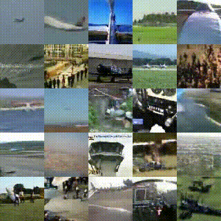

# TITLE: 2017 Improving Video Generation for Multi-functional Applications

- [TITLE: 2017 Improving Video Generation for Multi-functional Applications](#title-2017-improving-video-generation-for-multi-functional-applications)
  - [SUMMARY](#summary)
    - [APPLICATIONS SUMMARY](#applications-summary)
    - [ARCHITECTURE SUMMARY](#architecture-summary)
    - [AUTHORS](#authors)
    - [COMPARED TO](#compared-to)
    - [CONTRIBUTIONS](#contributions)
    - [DATASETS](#datasets)
    - [IMPLEMENTATION](#implementation)
    - [METRICS](#metrics)
    - [QUALITATIVE EVALUATION SUMMARY](#qualitative-evaluation-summary)
    - [QUANTITATIVE EVALUATION SUMMARY](#quantitative-evaluation-summary)
    - [RELATED WORK](#related-work)
    - [RESULTS](#results)

## SUMMARY

### APPLICATIONS SUMMARY

- Unconditional video generation

- Video Colorization: Works on image and video colorization can be divided into
two categories: interactive colorization that requires some kind of user input [20,21,22,23,24,25] and automatic methods [26,27,28,29,30,31]. Our approach belongs to the latter category.

- Video Inpainting: State-of-the-art frameworks like [39] use complex algorithms involving optical flow computation; thus demanding an optimized version to run within a feasible amount of time. Recovering big areas of an image or a video, also called hole-filling, is inherently a more difficult problem than the classical inpainting. Approaches like texture synthesis [40,41] or scene completion [42] do not work for hole-filling [43]. While there has been some work on image inpainting with adversarial loss functions [43], we are not aware of any in the case of videos.

- Future Prediction: Our method builds upon recent future prediction work e.g. [2,3,4,44,45,46,47,48,49], especially that using generative models and adversarial losses [1,5,50,51].

### ARCHITECTURE SUMMARY

Fig. 1. iVGAN video generation framework and its multi-functional extension

Output videos are of 32 frames and resolution 64 x 64 (color images).

Our model consists of a generator and a discriminator network in the GAN framework. Particularly, the designed generator $G: Z \to X$ produces a video x from a low dimensional latent code z. The proposed critic network $C: X \to R$ is optimized to distinguishing between real and fake samples and provides the generator updates with useful gradient information.

Wasserstien loss is used and in order to enforce the Lipschitz constraint on the critic function, we penalize its gradient norm with respect to the input:

$$ min_G max_{||C||_L \leq 1} V(G, C) = E_{x \sim p_{data}(x)}\big[C(x)\big] - E_{z \sim p_z(z)}\big[C(G(z))\big]$$

$$L_{GP}(C) = E_{\hat{x} \sim p_{\hat{x}}}\big[(||\nabla_{\hat{x}}C(\hat{x}) ||_2- 1)^2\big]$$

The distribution $p_{\hat{x}}$ is defined by uniformly sampling on straight lines between points in the data distribution and points in the generator distribution. Hence, the final unconstrained objective is given by:

$$min_G max_C V(G, C) + \lambda L_{GP}(C)$$

- Generator:
The generator takes a latent code sampled from a 100-dimensional normal distribution
$z \sim N(0, I)$ and produces an RGB video containing 32 frames of 64 x 64 pixels. We use a linear up-sampling layer in the first step, producing a tensor of size 2 x 4 x 4 x 512. The linear block is followed by four convolutional blocks of spatio-temporal [52] and fractionally-strided [53] convolutions. All convolutional layers utilize 4 x 4 x 4 kernels, a stride of 2 x 2 x 2, and add a bias to the output. We found the initialization of the convolutional weights essential for stable training and faster convergence. Inspired by the ResNet architecture [54] we initialize the kernels according to He et al. [55]. Similar to DCGAN [9], all but the last layers are followed by a batch normalization layer [56]. Batch normalization stabilizes the optimization by normalizing the inputs of a layer to zero mean and unit variance, which proved critical for deep generators in early training, preventing them from collapsing. The first four blocks are followed by a ReLU non-linearity after the normalization layer, while the last layer uses a hyperbolic tangent function. This is beneficial to normalize the generated videos, identically to the videos in our dataset, within the range [-1, 1].

- Critic:
The critic consists of five convolutional layers and is followed by an additional linear down-sampling layer. As in [5], we use spatio-temporal convolutions with 4 x 4 x 4 kernels. Again we found the initialization of kernel weights important for stability and convergence during training and used the initializion following [55]. For more expressiveness, we add a trainable bias to the output. All convolutions include a stride of 2 x 2 x 2. Batch normalization is not valid when using gradient penalty so layer normalization was used. We found that layer normalization is not necessary for convergence, but essential if we optimize the generator with additional objectives.

### AUTHORS

- Bernhard Kratzwald [kratzwab@ethz.ch](mailto:kratzwab@ethz.ch)
- Zhiwu Huang [zhiwu.huang@ethz.ch](mailto:zhiwu.huang@vision.ee.ethz.ch)
- Danda Pani Paudel [paudel@ethz.ch](mailto:paudel@vision.ee.ethz.ch)
- Acharya Dinesh [acharyadg@ethz.ch](mailto:acharyadg@ethz.ch)
- Luc Van Gool [vangool@ethz.ch](mailto:vangool@vision.ee.ethz.ch)

### COMPARED TO

- [VGAN](https://papers.nips.cc/paper/6194-generating-videos-with-scene-dynamics) for unconditional video generation
- [TGAN](https://arxiv.org/abs/1611.06624) for unconditional video generation
- [Colorful Image Colorization (CIC) model](https://arxiv.org/abs/1603.08511) for colorization

### CONTRIBUTIONS

- We propose improved Video GAN (iVGAN), a robust and unrestricted one-stream video generation framework. Our experiments show that iVGAN outperforms state-of-the-art generation frameworks on multiple challenging datasets.

- We demonstrate the utility of the multi-functional extension of iVGAN
for three challenging problems: video colorization, video inpainting, and future prediction. To the best of our knowledge, this is the first work exploiting the advantages of GANs in the domains of video inpainting and video colorization.

### DATASETS

- Stabilized Videos (From VGAN paper): All videos have been preprocessed
to ensure a static background. The task of background stabilization may very often not be valid, forcing us to renounce a significant fraction of data.

- Airplanes Dataset (created by the authors): We compiled a second more challenging dataset of filtered, unlabeled and unprocessed video clips. Similar to the golf dataset videos are filtered by scene category, in this case airplanes. Therefore, we collected videos from the YouTube-BoundingBoxes dataset [64] which have been classified containing airplanes. No pre-processing of any kind has been applied to the data and the dataset thus contains static scenes as well as scenes with moving background or moving cameras.

### IMPLEMENTATION

- In Tensorflow 1.2.1 by the authors: <https://github.com/bernhard2202/improved-video-gan>

### METRICS

- We used **Amazon Mechanical Turk** for a quantitative evaluation. Following [5] we generated random samples from all three models as well as the original dataset.We showed workers a pair of videos drawn from different models and asked them: “Which video looks more realistic?”. We paid workers one cent per comparison and required them to historically have a 95% approval rating on Amazon MTurk. We aggregated results from more than 9000 opinions by 130 individual workers.

- We evaluated the sharpness of the colorization quantitatively by the **Peak Signal
to Noise Ratio (PSNR)** in gray-space. PSNR correlates better with visual perception
than the L2-loss. For the colorization quality we asked workers on **Amazon Mechanical Turk** to rate how realistic the video looks on a linear scale from 5 (very realistic) to 1 (very unrealistic). We generated random samples from each model and used random clips from the dataset as a reference value. The mean score for each model was calculated from more than 7000 ratings. We trained our models on 95% of the VGAN (golf scenes) dataset and evaluated them on 5% hold-out data as well as on the out-of-domain airplane dataset. Notably even though we trained on stabilized video clips, our model is able to colorize clips with moving cameras and camera motion.

### QUALITATIVE EVALUATION SUMMARY

On golf dataset from VGAN paper (stabilized/static background).

Fig. 2.Video generation results on stabilized golf clips.Left: Videos generated by the two-streamVGAN model.Middle: Videos generated by the TGAN model.Right: Videos generated by ourone-stream iVGAN model

The foreground suffers from the same flaws as the VGAN and TGAN model: it is blurrier than the background, with people and other foreground objects turning into blobs. The network correctly learns which objects should move, and generates plausible motions. Some samples are close to reality, a fraction of samples collapse during training. Overall, the network learns correct semantics and produces scenes with a sharp and realistic looking background but blurry and only fairly realistic foreground-motion.

On Airplanes dataset (not stabilized/non static background).

Fig. 3.Video  generation  results  on  unstabilized  airplane  videos.  Comparing  videos  generatedusing the one and two stream VGAN as well as the TGAN model, against our iVGAN framework

VGAN both one stream and two stream versions collapse. TGAN does not collapse but fails to produce videos with moving backgrounds or camera motions. Although the quality of our samples is lower compared to the stabilized golf videos, our generator did in no single experiment collapse. The iVGAN model – unlike any other generative model – produces both: videos with static background, as well as videos with moving background
or camera motion. A fraction of the generated videos collapsed to meaningless colored noise, nonetheless. Nevertheless, it is clear that the network does learn important semantics since a significant number of videos shows blurry but realistic scenes, objects, and motions.

Colorization:

The CIC model colorizes videos in their original resolution frame by frame. Our model, on the other hand, colorizes the entire clip at once but is restricted to in- and outputs of 64 x 64 pixels.

Fig. 4. Color consistency over time with different colorization approaches. Red arrows mark spots where color is inconsistent over time.

The CIC colorized jacket changes its color over time while our colorization stays consistent. Our network overall learns correct color semantics: areas in the input are selected, “classified” and then painted accordingly. The sky e.g. is colorized in shades of blue or gray-white and trees are painted in a darker green than the grass. Therefore, we argue that the network not only selects the trees, but also recognizes (classifies) them as such, and paints them according to their class. The quality of the segmentation depends on the sharpness of the edges in the grayscale input. Colorized videos are blurrier compared to the grayscale input. This is mainly due to the fact that we do not keep the spatial resolution of the videos but encode them to a latent code, from which the colorized videos are then generated. Furthermore, using the mean squared error function to guide reconstructions is known to generate blurry results.

Video inpainting:

Fig. 5. Comparison of ground-truth videos with the reconstructions of salt and pepper noise, missing holes in the center and at random positions.

We corrupt inputs in various ways and observe the reconstruction quality of our network: 25% salt and pepper noise, 20 x 20 pixel holes in the center of the clip, and 20 x 20 pixel holes at random positions. We trained our network on stabilized golf videos, and evaluate it on the unstabilized airplane dataset.

Denoising salt and pepper corruptions is a well-studied problem, going back many
years [65]. State-of-the-art approaches operate on noise levels as high as 70% [66]. The denoised reconstructions generated by our model are sharp and accurate.
The reconstructed output is slightly blurrier than the ground-truth, which we attribute to the fact that we generate the entire video from a latent encoding and do not keep the undamaged parts of the input.

The task of hole-filling is more challenging since the reconstructions have to be
consistent in both space and time. While we do not claim to compete with the stateof-the-art, we use it to illustrate that our network learns advanced spatial and temporal dependencies. For instance, in the second clip and second column of Fig. 5 we can see that, although the airplane’s pitch elevator is mostly covered in the input, it is reconstructed almost perfectly and not split into two halves.

Our model learns temporal dependencies, as objects which are covered in some—but not all frames—are reconstructed consistently over time.

Future prediction:

Fig. 6. Future prediction results: Generated videos and the input frames the generations were conditioned on. The first row shows two people who seem to fight. In person in the second row seems to start walking. The Person in the third row rides a horse; the horse is dropped in the future frames but the person moves.

Future frames are blurrier, compared to the inpainting and colorization results, which we attribute to the fact that the reconstruction loss only guides the first frame of the generated clip – not the entire clip. Although in many cases the network fails to generate a realistic future, it often learns which objects should move and generates fairly plausible motions. Since we use only one frame guiding the generation and omit to use the ground-truth future, these semantics are solely learned by the adversarial loss function. We emphasize that, to the best of our knowledge, this work and [5] are the only two approaches using a single input frame to generate multiple future frames. We suffer from the same problems as [5], such as hallucinating or omitting objects. For example, the horse in the bottom-most clip in Fig. 6 is dropped in future frames.

### QUANTITATIVE EVALUATION SUMMARY

Unsupervised video generation:

Table 1.Quantitative Evaluation on Amazon Mechanical Turk: We show workers two pairs of videos and ask them which looks more realistic. We show the percentage of times workers preferour model against real videos, VGAN and TGAN samples on two datastes.

| ”Which video is more realistic?”   | Percentage of Trials |
|------------------------------------|---------------------:|
| Random Preference                  | 50                   |
| Prefer iVGAN over Real (Golf)      | 23.3                 |
| Prefer iVGAN over VGAN (Golf)      | 59.3                 |
| Prefer iVGAN over TGAN (Golf)      | 57.6                 |
| Prefer iVGAN over Real (Airplanes) | 15.4                 |
| Prefer iVGAN over TGAN (Airplanes) | 59.7                 |

Since the VGAN model did not produce meaningful results on the airplane dataset we omitted the trivial comparison on this dataset.

Colorization and Inpainting:

Table 2. Quantitative evaluation of video colorization and inpainting frameworks. Left: Average user rating of their realism from 1 (very unrealistic) to 5 (very realistic). Right: Peak signal to noise ratio between generated videos, and grayscale input (colorization) or ground-truth videos (inpainting)

| Model              | MTurk          | PSNR          | PSNR               |
|--------------------|---------------:|--------------:|-------------------:|
| Video Colorization | average rating | hold-out data | out-of-domain data |
| supervised         | 2.45           | 25.2 dB       | 23.4 dB            |
| unsupervised       | 2.95           | 25.6 dB       | 24.2 dB            |
| Video Inpainting   | average rating | hold-out data | out-of-domain data |
| salt & pepper      | 3.63           | 29.2 dB       | 25.4 dB            |
| boxes (fixed)      | 3.37           | 25.3 dB       | 22.9 dB            |
| boxes (random)     | 3.43           | 24.7 dB       | 22.7 dB            |

To investigate the interplay between the GAN-loss and encoder-generator reconstruction loss we compare two variations of our model. As described in Sec. 4, the supervised model calculates the reconstruction loss in RGB color space, while the unsupervised model calculates the loss in grayscale color space. Our experiments indicate that the supervised colorization network, having a stronger objective, tends to overfit. Although they perform equally well on the training data, the unsupervised network outperforms the supervised network on hold-out and out-of-domain data. The unsupervised model relies strongly on the GAN loss, which we argue – following Zhao et al. [61] – acts as a regularizer preventing the encoder-generator network from learning identity functions.

For video inpainting, users rate the salt & pepper reconstructions with a score of 3:63 very high (real videos score 4:10). The margin between boxes at fixed and random positions is very small and not significant.

Salt and pepper reconstructions achieve the best PSNR score. The margin between boxes at fixed and boxes at random positions is too small to rank the models. All three models perform better on hold-out data than on the out-of-domain data.

### RELATED WORK

- [Generative Adversarial Networks (GANs)](https://papers.nips.cc/paper/5423-generative-adversarial-nets)
- [Video GAN (VGAN)](https://arxiv.org/abs/1609.02612)
- [Temporal GAN (TGAN)](https://arxiv.org/abs/1611.06624)
- [MoCoGAN](https://arxiv.org/abs/1707.04993)

To deal with the instability of training GANs all three models separate integral parts of a video, as foreground from background or dynamic from static patterns. We argue that it is more natural to learn these patterns and their interference conjointly. Therefore, we propose a single-streamed but robust video generation architecture

### RESULTS

")

Colorization:

Video inpainting:

For salt and pepper noise:

For box in the center:

For randomly placed box:

