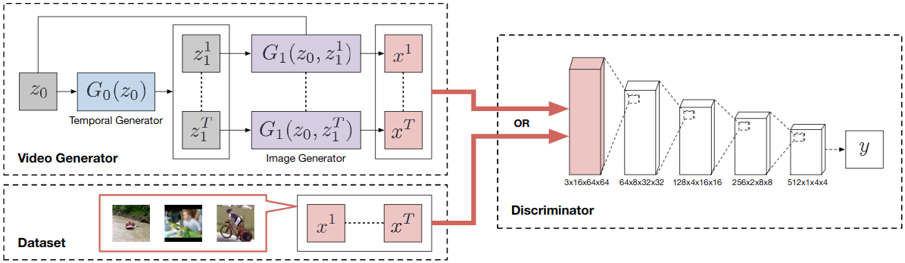
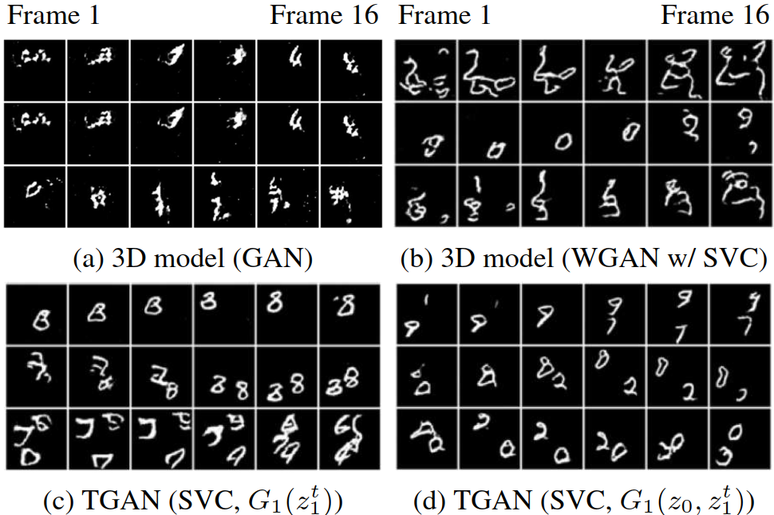
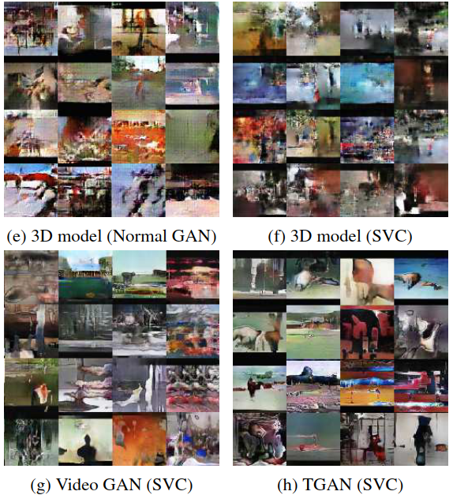
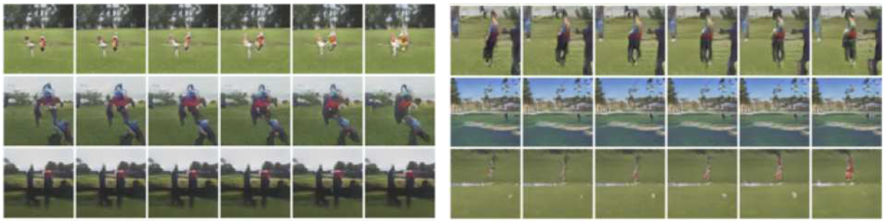
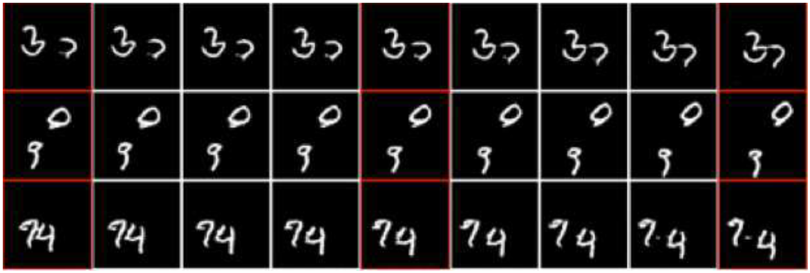
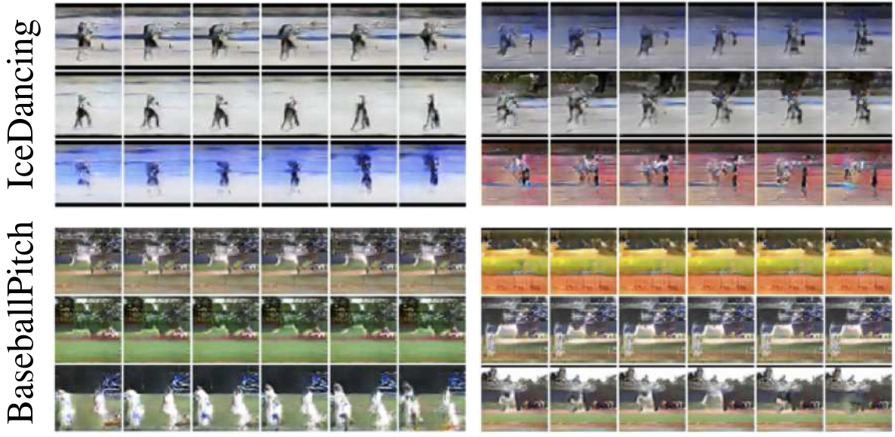
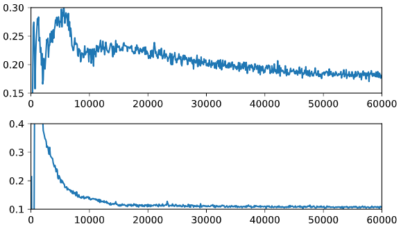
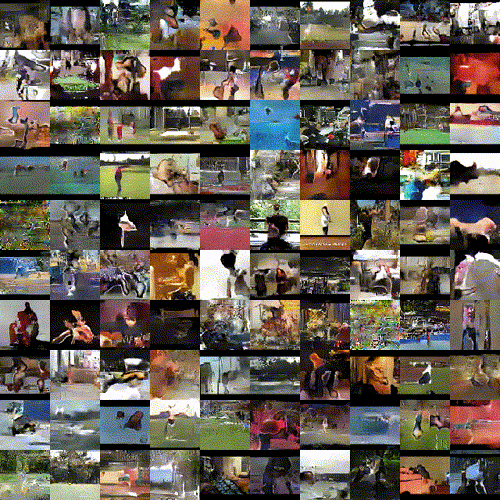

# TITLE: ICCV 2017 Temporal Generative Adversarial Nets with Singular Value Clipping

- [TITLE: ICCV 2017 Temporal Generative Adversarial Nets with Singular Value Clipping](#title-iccv-2017-temporal-generative-adversarial-nets-with-singular-value-clipping)
  - [SUMMARY](#summary)
    - [APPLICATIONS SUMMARY](#applications-summary)
    - [ARCHITECTURE SUMMARY](#architecture-summary)
    - [AUTHORS](#authors)
    - [COMPARED TO](#compared-to)
    - [CONTRIBUTIONS](#contributions)
    - [DATASETS](#datasets)
    - [IMPLEMENTATION](#implementation)
    - [METRICS](#metrics)
    - [QUALITATIVE EVALUATION SUMMARY](#qualitative-evaluation-summary)
    - [QUANTITATIVE EVALUATION SUMMARY](#quantitative-evaluation-summary)
    - [RELATED WORK](#related-work)
    - [RESULTS](#results)

## SUMMARY

### APPLICATIONS SUMMARY

- Unconditional video generation

- Frame interpolation by simply interpolating the trajectory in the latent space $[z^1_1, z^2_1, ... , z^T_1]$ and running the image generator $G_1$ on the new points. The authors used a simple bilinear filter for interpolating the $z^t_1$. The resulting images have more realistic motion dynamics than what a simple image interpolation method on $x^t$ would produce.

- Condition TGAN can use label information (category of video) to produce better quality videos. The labels are converted to one hot vectors and given to $G_0$, $G_1$ and the discriminator. The one hot vector is broadcast to a voxel of the same resolution as the video and concatenated with the video and this is given to the discriminator.

### ARCHITECTURE SUMMARY



Figure 1. Illustration of TGAN. The video generator consists of two generators, the temporal generator and the image generator. The temporal generator $G_0$ yields a set of latent variables $z^t_1(t= 1, . . . , T)$ from $z_0$. The image generator $G_1$ transforms those latent variables $z^t_1(t = 1, . . . , T)$ and $z_0$ into a video data which has T frames. The discriminator consists of three-dimensional convolutional layers,and evaluates whether these frames are from the dataset or the video generator. The shape of a tensor in the discriminator is denoted as “(channels)x(time)x(height)x(width)”.

Temporal genrator $G_0$ turns a fixed length random vector $z_0$ drawn from a uniform distribution in [-1, 1] into a series of random vectors $[z^1_1, z^2_1, ..., z^T_1]$

$$G_0: z_0 \to [z^1_1, z^2_1, ..., z^T_1]$$

Conv1d is used to turn a $z_0$ which is of 1 time step and $K_0$ channels into T time steps and $K_1$ channel $[z^1_1, z^2_1, ..., z^T_1]$

Example (testing-chainer <https://colab.research.google.com/drive/1LOC2A8m7slamX-cykkbs4ThxpjpXf0BH#scrollTo=8CRL9QaZjJYA):>

```text
debug 1: (16, 100, 1)
debug 2: (16, 512, 1)
debug 3: (16, 256, 2)
debug 4: (16, 128, 4)
debug 5: (16, 128, 8)
debug 6: (16, 100, 16)

(16, 100, 16)
(batch_size, 100 channels, 1 timestep) into (batch_size, 100 channels, 16 time steps)
```

Image generator $G_1$ turns each random vector $z^t_1$ and the fixed $z_0$ into an single frame of the video.

$$G_1: (z^t_1, z_0) \to x^t$$

Same example as before (testing-chainer <https://colab.research.google.com/drive/1LOC2A8m7slamX-cykkbs4ThxpjpXf0BH#scrollTo=8CRL9QaZjJYA):>

```text
debug -4: (16, 100)
debug -3: original shape: (16, 4096) , target shape: (16, 256, 4, 4)
debug -2: original shape: (16, 4096) , target shape: (16, 256, 4, 4)
debug -1: (16, 256, 4, 4) (16, 256, 4, 4)
debug 0: (16, 512, 4, 4)
debug 1: (16, 256, 8, 8)
debug 2: (16, 128, 16, 16)
debug 3: (16, 64, 32, 32)
debug 4: (16, 32, 64, 64)
debug 5: (16, 1, 64, 64)

(16, 1, 64, 64)
(batch_size, 1 channels, 64 height, 64 width) for moving mnist
```

Discriminator takes the entire video as input. Discriminator consists of just 4 Conv3d layers and 1 Conv2d layer leading to a real scalar value. Wasserstein loss is used. SVD clipping is used to enforce Lipschitz constraint. SVD of each weight matrix is calculated and all singular values above 1 are set to 1. SVD is expensive and only done every 5 iterations. The discriminator is trained for 1 iteration just like normal GAN (but can be trained for more iterations since Wasserstein loss is being used).

Same example as before (testing-chainer <https://colab.research.google.com/drive/1LOC2A8m7slamX-cykkbs4ThxpjpXf0BH#scrollTo=8CRL9QaZjJYA):>

```text
debug 0: (16, 1, 16, 64, 64)
debug 1: (16, 64, 8, 32, 32)
debug 2: (16, 128, 4, 16, 16)
debug 3: (16, 256, 2, 8, 8)
debug 4: (16, 512, 1, 4, 4)
debug 5: (16, 512, 4, 4)
debug 6: (16, 1, 1, 1)

((16, 1, 1, 1), dtype('float32'))
(batch_size, 1 channels, 1 height, 1 width) scalar output of discriminator.
```

| Layer | Condition | Method |
|-------|:---------:|--------|
| Linear | $\lVert W \rVert  \leq 1$ | SVC |
| Convolution | $\lVert \hat{W} \rVert \leq 1$ | SVC |
| Batch normalization | $0 < \gamma \leq \sqrt{\sigma_B^2 + \epsilon}$ | Clipping $\gamma$ |
| LeakyReLU | $a \leq 1$ | Do nothing |

Table 2. Proposed methods to satisfy the1-Lipschitz constraint. $\lVert . \rVert$ denotes a spectral norm. a represents a fixed parameter ofthe LeakyReLU layer. $\gamma$ and $\sigma_B$ are a scaling parameter after the batch normalization and a running mean of a standard deviation of a batch, respectively.

### AUTHORS

Preferred Networks inc., Japan

- Masaki Saito [msaito@preferred.jp](mailto:msaito@preferred.jp)
- Eiichi Matsumoto [matsumoto@preferred.jp](mailto:matsumoto@preferred.jp)
- Shunta Saito [shunta@preferred.jp](mailto:shunta@preferred.jp)

### COMPARED TO

- 3D model (custom model). A simple model in which the generator has one linear layer and
four 3D deconvolutional layers and the discriminator has five 3D convolutional layers.

- Video GAN nips-2016-generating-videos-with-scene-dynamics

### CONTRIBUTIONS

- The generative model that can efficiently capture the latent space
of the time dimension in videos. It also enables a natural
extension to an application such as frame interpolation.

- The alternative parameter clipping method for WGAN that
significantly stabilizes the training of the networks that have
advanced structure.

### DATASETS

- Moving MNIST
- UCF-101
- Golf scene dataset

### IMPLEMENTATION

In Chainer by the authors: <https://github.com/pfnet-research/tgan>

### METRICS

- Generative Adversarial Metric (GAM compares adversarial models against each other)
- Inception score

### QUALITATIVE EVALUATION SUMMARY

- Moving MNIST: Predicted frames by the existing model tend to be blurry. TGAN is capable of producing consistent frames in which each image is sharp, clear and easy to discriminate two digits. However even though each digit continues to move in a straight line, its shape sometimes slightly changes by time. Even though existing models seem to generate frames in which each digit does not change, these methods
can not be directly compared with TGAN because the qualitative results the authors have shown are for “video prediction” that predicts future frames from initial inputs,
whereas TGAN generates them without such priors. In order to illustrate the effectiveness of $z_0$ in $G_1$, we further conducted the experiment with the TGAN in which G1 does not take $z_0$ as an argument (model (c)). In this experiment, we observed that in the model (c) the problem of mode collapse tends to occur compared to our model.



Figure 3. Generated videos with four different models: (a) 3D model trained with the normal GAN, (b) 3D model trained with the WGAN and the SVC, (c) TGAN in which $G_1$ only uses $z_1$, and (d)TGAN in which $G_1$ uses both $z_0$ and $z_1$. Although these models generate 16 frames, for brevity we extract six frames from them at even intervals.

- Videos generated by the 3D model have the most artifacts compared with other models. VideoGAN tends to avoid these artifacts because the background is relatively fixed in the UCF-101, however the probability of generating unidentified videos is higher than that of TGAN. This is because VideoGAN is vulnerable to videos with background movement. In order to indicate that the quality of our model is comparable with that of VideoGAN (these results can be seen in their project page), an experiment was conducted with the golf scene dataset. This dataset, in which the background is always fixed, is advantageous for VideoGAN that exploits this
assumption. Even under such unfavorable conditions, the quality of the videos generated by our model is almost the same as the existing method; both create a figure that seems likes a person’s shadow, and it changes with time.



Figure 4. A comparison between four models: (e) 3D model trained with the normal GAN, (f) 3D model trained with the WGAN and the SVC, (g) Video GAN trained with the WGAN and the SVC, and (h) TGAN trained with the WGAN and the SVC. Only the first frame is shown.



Figure 5. Example of videos generated by the TGAN with WGAN and SVC. The golf scene dataset was used.



Figure 6. Examples of frame interpolation with our method. The red columns represent the adjacent frames generated by the temporal generator. The remaining columns show the intermediate frames.



Figure 7. Generated videos by the conditional TGAN. The left-most column shows the category in UCF-101 dataset, and the second and third columns show the generated samples given the category.

### QUANTITATIVE EVALUATION SUMMARY



Figure 2. The difference of training curves in UCF-101. The upper row shows the loss of the generator per iteration in conventional clipping method, while the lower row shows the loss in our clipping method, Singular Value Clipping (SVC).

Table 4. Inception scores for models of UCF-101.

|Method                      | Inception Score     |
|----------------------------|--------------------:|
| 3D model (Weight clipping) |  4.32 $\pm$ .01     |
| 3D model (SVC)             |  4.78 $\pm$ .02     |
| Video GAN (Normal GAN)     |  8.18 $\pm$ .05     |
| Video GAN (SVC)            |  8.31 $\pm$ .09     |
| TGAN (Normal GAN)          |  9.18 $\pm$ .11     |
| TGAN (Weight clipping)     | 11.77 $\pm$ .11     |
| TGAN (SVC)                 | **11.85 $\pm$ .07** |
| Conditional TGAN (SVC)     | **15.83 $\pm$ .18** |
| UCF-101 dataset            | 34.49 $\pm$ .03     |

Ablation study:

For the comparison of two generative models, we used GAM scores in the moving MNIST dataset. Unlike the normal GAN in which the discriminator uses the binary cross-entropy loss, the discriminator of the WGAN is learned to keep the fake samples and the real samples away, and we cannot choose zero as a threshold for discriminating real and fake samples. Therefore, we first generate a sufficient number of fake samples, and set a score that can classify fake and real samples well as the threshold.

Table 3. GAM scores for models of moving MNIST. “TGAN” denotes the model trained with the WGAN and the SVC. In “TGAN ($G_1(z^t_1)$)”, $G_1$ has $z_1$ only (the SVC was used for training). “3D model (GAN)” and “3D model (SVC)” were trained with the normal GAN and the SVC, respectively.

| Model A | Model B             | GAM score | Winner |
|---------|---------------------|----------:|--------|
| TGAN    | 3D model (GAN)      | 1.70      | TGAN   |
| TGAN    | 3D model (SVC)      | 1.27      | TGAN   |
| TGAN    | TGAN ($G_1(z^t_1)$) | 1.03      | TGAN   |

In the GAM, a score higher thanone means that the model A generates better fake samplesthat can fool the discriminator in the model B. It can be seen that our model can generate better samples that can deceive other existing methods. It can be seen that the TGAN beats the 3D models easily, but wins against the TGAN in which $G_1$ has $z^t_1$ only. These results are the same as the results obtained by the afore mentioned qualitative evaluation.

### RELATED WORK

Although a simple approach is to use 3D convolutional
layers for representing the generating process of a video, it implies that images along x-t plane and y-t plane besides
x-y plane are considered equally, where x and y denote
the spatial dimensions and t denotes the time dimension.
We believe that the nature of time dimension is essentially
different from the spatial dimensions in the case of videos
so that such approach has difficulty on the video generation
problem. The relevance of this assumption has been also
discussed in some recent studies [33, 24, 46] that have shown good performance on the video recognition task.

Our contributions are summarized as follows. (i) The
generative model that can efficiently capture the latent space of the time dimension in videos. It also enables a natural extension to an application such as frame interpolation. (ii) The alternative parameter clipping method for WGAN that significantly stabilizes the training of the networks that have advanced structure.

The Generative Adversarial Network (GAN), which we
have mainly employed in this study, is a model for unsupervised learning that finds a good representation of samples by simultaneously training two different networks called the generator and the discriminator.

In particular, Ranzato et al. [28] proposed a Recurrent Neural Network (RNN) model that can learn both spatial and temporal correlations.

Kalchbrenner et al. [15] also employed a convolutional LSTM model, and proposed Video Pixel Networks that directly learn the joint distribution of the raw pixel values.

However, the above studies cannot directly be applied to the
task of generating entire sequences from scratch since they
require an initial sequence as an input.

It is known that the GAN training is unstable and requires
careful adjustment of the parameters. To overcome such
instability of learning, Arjovsky et al. [1] focused on the
property that the GAN training can also be interpreted as the minimization of the Jensen-Shannon (JS) divergence, and
proposed Wasserstein GAN (WGAN) that trains the generator
and the discriminator to minimize an Earth Mover’s distance (EMD, a.k.a. first Wasserstein distance) instead of the JS divergence. Several experiments the authors conducted
reported that WGANs are more robust than ordinal GANs, and tend to avoid mode dropping.

In order to make the discriminator be the K-Lipschitz,
the authors proposed a method that clamps all the weights
in the discriminator to a fixed box denoted as $w \in [−c, c]$. Although this weight clipping is a simple and assures the discriminator satisfies the K-Lipschitz condition, it also implies we cannot know the relation of the parameters between c and K. As it is known that the objective of the discriminator of Eq.(2) is a good approximate expression of EMD in the case of K = 1, this could be a problem when we want to find the approximate value of EMD.

### RESULTS



