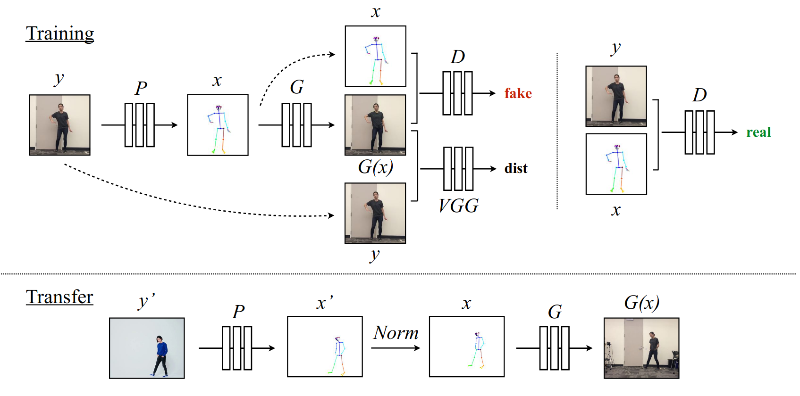
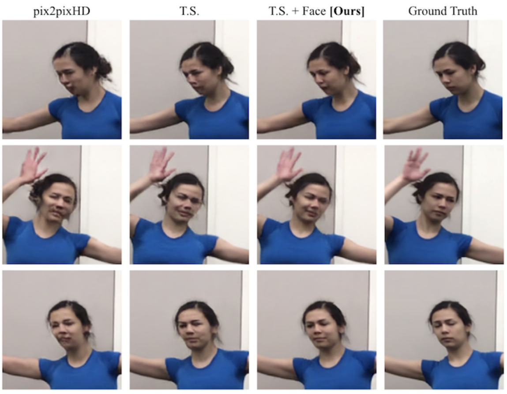

# TITLE: 2018 Everybody Dance Now

- [TITLE: 2018 Everybody Dance Now](#title-2018-everybody-dance-now)
  - [SUMMARY](#summary)
    - [APPLICATIONS SUMMARY](#applications-summary)
    - [ARCHITECTURE SUMMARY](#architecture-summary)
    - [AUTHORS](#authors)
    - [COMPARED TO](#compared-to)
    - [CONTRIBUTIONS](#contributions)
    - [DATASETS](#datasets)
    - [IMPLEMENTATION](#implementation)
    - [METRICS](#metrics)
    - [QUALITATIVE EVALUATION SUMMARY](#qualitative-evaluation-summary)
    - [QUANTITATIVE EVALUATION SUMMARY](#quantitative-evaluation-summary)
    - [RELATED WORK](#related-work)
    - [RESULTS](#results)

## SUMMARY

### APPLICATIONS SUMMARY

### ARCHITECTURE SUMMARY

The pose stick figure images are obtained using an off the shelf pose detector (OpenPose) for all videos in the dataset. The generator is given the pose image and asked to synthesize the corresponding frame in the video. The discriminator looks at both (fake frame, real pose) pairs and (real frame, real pose) pairs and learns to tell the difference.

During testing the source frame is passed through the pose detector to get the pose image for that person. It is normalized to the pose for the target person in the training set. This normalized pose is given to the generator to create the corresponding frame in the output video.

To maintain temporal coherence we feed in 2 consecutive (frame, pose) pairs at a time to the discriminator.

In order to get more realistic detailed faces, a separate GAN is learned to generate faces. The generator for this GAN looks at the (fake frame, real pose) pair and generates a residual that is added to the fake frame to produce the final frame.

In addition to the adversarial loss a perceptual reconstruction loss which compares pretrained VGGNet features at different layers of the network is added to better.

We adapt architectures from various models for different stages of
our pipeline. To extract pose keypoints for the body, face, and hands
we use architectures provided by a state of the art pose detector
OpenPose [5, 27, 35].
For the image translation stage of our pipeline, we adapt the architectures
proposed by Wang et al. in the pix2pixHD model [33].
To create 128x128 face image residuals, we do not need the full capability
of the entire pix2pixHD generator and therefore we predict
face residuals using the global generator of pix2pixHD. Similarly,
we use a single 70x70 Patch-GAN discriminator [14] for the face
discriminator. In practice we use the LSGAN [24] objective during
training similarly to pix2pixHD for both the full image and face
GANs.

### AUTHORS

- CAROLINE CHAN, UC Berkeley
- SHIRY GINOSAR, UC Berkeley
- TINGHUI ZHOU, UC Berkeley
- ALEXEI A. EFROS, UC Berkeley

### COMPARED TO

- pix2pixHD baseline: We conduct an ablation study on the inclusion of our temporal smoothing setup and face GAN compared to a pix2pixHD baseline.

### CONTRIBUTIONS

- Our main contributions are a learning-based
pipeline for human motion transfer between videos, and the quality
of our results which demonstrate complex motion transfer in realistic
and detailed videos.

- We also conduct an ablation study on the
components of our model comparing to a baseline framework.

### DATASETS

- Authors created their own dataset:
We collect source and target videos in slightly different manners.
To learn the appearance of the target subject in many poses, it is
important that the target video captures a sufficient range of motion
and sharp frames with minimal blur. To ensure the quality of the
frames, we filmed our target subject for around 20 minutes of real
time footage at 120 frames per second which is possible with some
modern cell phone cameras. Since our pose representation does not
encode information about clothes, we had our target subjects wear
tight clothing with minimal wrinkling.
In contrast to some of the preparation required for filming a
target subject, source videos do not require the same (albeit still
reasonable) quality as we only need decent pose detections from the
source video. Without such limitations, many high quality videos
of a subject performing a dance are abundant online.
We found pre-smoothing pose keypoints to be immensely helpful
in reducing jittering in our outputs. For videos with a high framerate
(120 fps), we gaussian smooth the keypoints over time, and we use
median smoothing for videos with lower framerates.

### IMPLEMENTATION

- In pytorch by the authors: (Includes all functionality except pose normalization. The project requires tensorflow>1.9.0 since the pose estimator is implemented in Keras.) <https://github.com/Lotayou/everybody_dance_now_pytorch>

### METRICS

- Structural Similarity (SSIM) and Learned Perceptual Image Patch Similarity (LPIPS)

- Since we do not have ground truth flows for our data, we rely on qualitative analysis to evaluate the temporal coherence of our output videos.

- Also run pose detector on generated frames and compared it to original pose. L2 distance between the keypoints is used to compare the poses. To avoid dealing with missing detections (i.e. without viewing the original image of the subject it can be hard to discern whether a “missed” detection is due to noise or occlusion), we only compare poses where all joints are detected.

### QUALITATIVE EVALUATION SUMMARY

Fig. 7. Comparison of synthesis results for different models. Images have
been cropped to a bounding box around the original pose. T.S. denotes a
model with our temporal smoothing setup, and T.S. + Face is our full model
with both the temporal smoothing setup and Face GAN. The temporal
smoothing setup adds details to the hands, head, shirt, and shadows. These
details are carried over in the full model includes additional detail to the
face and surrounding area resulting in the most realistic synthesis.

Fig. 8. Face image comparison from different models on the validation set.
T.S. denotes a model with our temporal smoothing setup, and T.S. + Face
is our full model with both the temporal smoothing setup and Face GAN.
Details improve and distortions decrease upon the additions of the temporal
smoothing setup and the face GAN.

Although the ablation study scores for the temporal smoothing
setup are generally comparable or an improvement to the pix2pixHD
baseline, significant differences occur in video results where the
temporal smoothing setup exhibits more frame to frame coherence
than the pix2pixHD baseline. Qualitatively, the temporal smoothing
setup helps with smooth motion, color consistency across frames,
and also in individual frame synthesis.
Consistent with the ablation study, we find that adding a specialized
facial generator and discriminator adds considerable detail and
encourages synthesizing realistic body parts. We compare the face
synthesis with and without the face GAN in Figure 8 and in our
video results.

### QUANTITATIVE EVALUATION SUMMARY

Table 1. Body output image comparisons - result cropped to bounding box
around input pose. For all tables, T.S. denotes a model with our temporal
smoothing setup, and T.S. + Face is our full model with both the temporal
smoothing setup and Face GAN.

| Loss               | SSIM mean | LPIPS mean |
|--------------------|----------:|-----------:|
| pix2pixHD          | 0.89564   | 0.03189    |
| T.S.               | 0.89597   | 0.03137    |
| T.S. + Face [Ours] |**0.89807**|**0.03066** |

Table 2. Face output image comparisons - result cropped to bounding box
around input face.

| Loss               | SSIM mean | LPIPS mean |
|--------------------|----------:|-----------:|
| pix2pixHD          | 0.81374   | 0.03731    |
| T.S.               | 0.8177    | 0.03662    |
| T.S. + Face [Ours] |**0.83046**|**0.03304** |

Table 3. Mean pose distances, using the pose distance metric described in
Section 7. Lower pose distance is more favorable.

| Loss               | Body (23) | Face (70) | Hands (21) | Overall (135) |
|--------------------|----------:|----------:|-----------:|--------------:|
| pix2pixHD          |**2.39352**| 1.1872    | 3.86359    | 2.0781        |
| T.S.               | 2.63446   | 1.14348   | 3.76056    | 2.06884       |
| T.S. + Face [Ours] | 2.56743   |**0.91636**|**3.29771** |**1.92704**    |

Table 4. Mean number of missed detections per image, fewer missed detections
is better.

| Loss               | Body (23) | Face (70) | Hands (21) | Overall (135) |
|--------------------|----------:|----------:|-----------:|--------------:|
| pix2pixHD          | 0.17864   | 0.77796   | 1.67584    | 2.63244       |
| T.S.               | 0.15989   | 0.56318   | 1.76016    | 2.48323       |
| T.S. + Face [Ours] |**0.15578**|**0.47392**|**1.66366** |**2.29336**    |

### RELATED WORK

Over the past few years there have been several frameworks, which often (but not all) use GANS, developed to solve such mappings including:

- [pix2pix](https://arxiv.org/abs/1611.07004)
- [CoGAN](https://arxiv.org/abs/1606.07536)
- [UNIT](https://papers.nips.cc/paper/6672-unsupervised-image-to-image-translation-networks)
- [DiscoGAN](https://arxiv.org/abs/1703.05192)
- [CycleGAN](https://arxiv.org/abs/1703.10593)
- [Cascaded Refinement Networks](https://arxiv.org/abs/1707.09405)
- [pix2pixHD](https://arxiv.org/abs/1711.11585)

### RESULTS

Fig. 6. Transfer results. In each section we show five consecutive frames. The top row shows the source subject, the middle row shows the normalized pose
stick figures, and the bottom row shows the model outputs of the target person.
