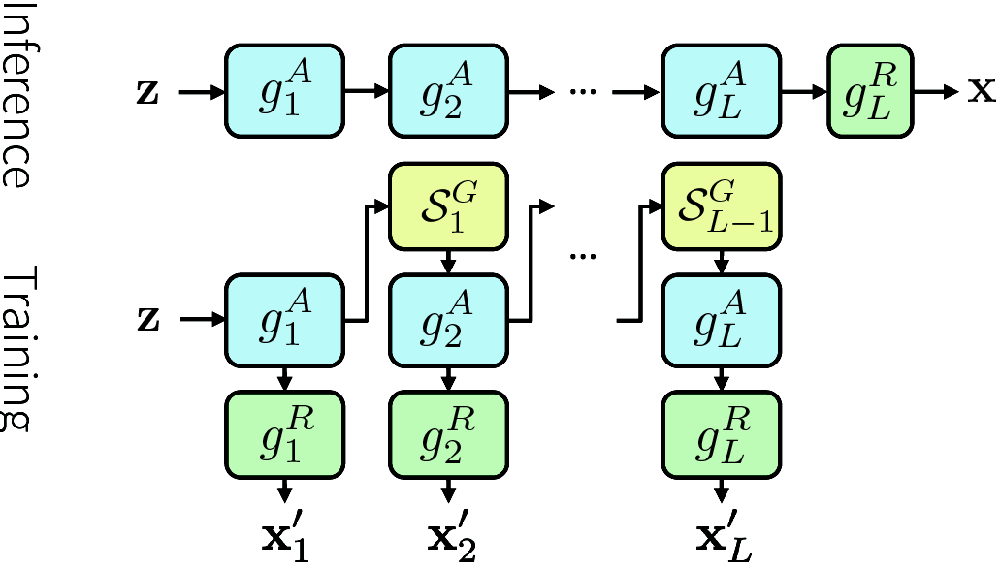
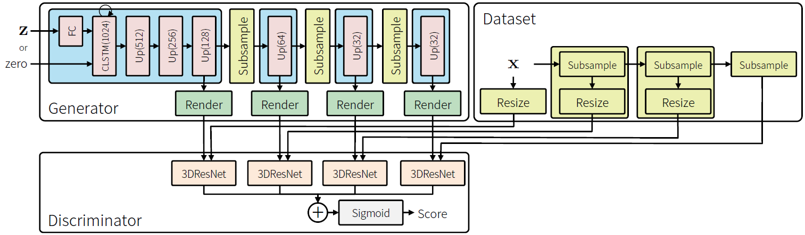
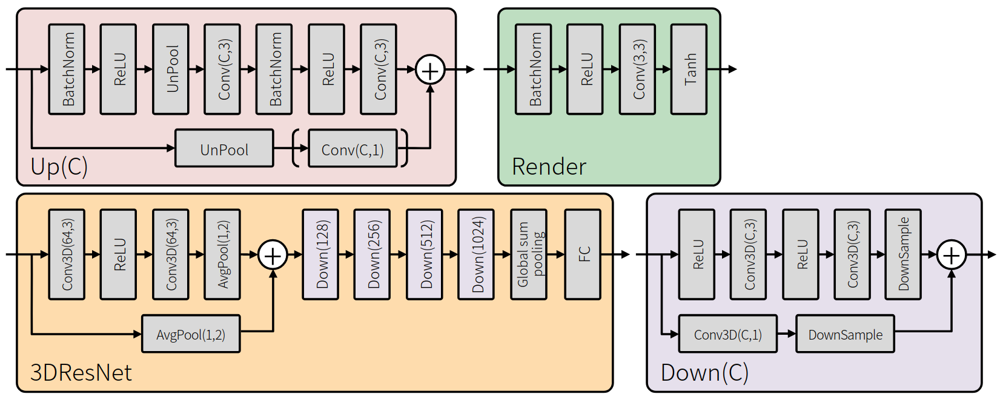
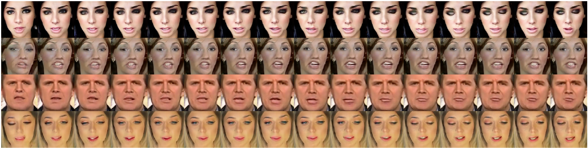
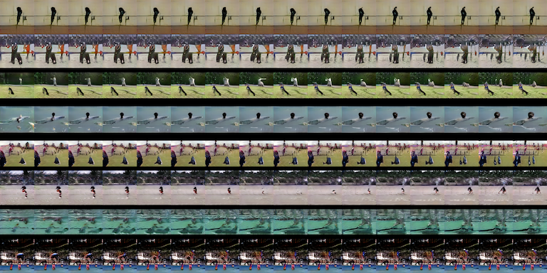

# TITLE: 2018 TGANv2 Efficient Training of Large Models for Video Generation with Multiple Subsampling Layers

- [TITLE: 2018 TGANv2 Efficient Training of Large Models for Video Generation with Multiple Subsampling Layers](#title-2018-tganv2-efficient-training-of-large-models-for-video-generation-with-multiple-subsampling-layers)
  - [SUMMARY](#summary)
    - [APPLICATIONS SUMMARY](#applications-summary)
    - [ARCHITECTURE SUMMARY](#architecture-summary)
    - [AUTHORS](#authors)
    - [COMPARED TO](#compared-to)
    - [CONTRIBUTIONS](#contributions)
    - [DATASETS](#datasets)
    - [IMPLEMENTATION](#implementation)
    - [METRICS](#metrics)
    - [QUALITATIVE EVALUATION SUMMARY](#qualitative-evaluation-summary)
    - [QUANTITATIVE EVALUATION SUMMARY](#quantitative-evaluation-summary)
    - [RELATED WORK](#related-work)
    - [RESULTS](#results)

## SUMMARY

### APPLICATIONS SUMMARY

### ARCHITECTURE SUMMARY

Figure 1. The generator using multiple subsampling layers.

In our method, the generator consists of two blocks: abstract block $g^A$ and rendering block $g^R$. While the abstract block is a function that computes the latent feature map we call abstract map, the rendering block generates a sample from the abstract map. In the following, we assume that the computational speed of the abstract block is relatively fast, whereas that of the rendering block is much slower than the abstract block. In the inference, the generation process of samples by the generator is equivalent to the generator in the conventional GAN; that is, G(z) can be represented by

$$x = G(z) =  (g^R \circ g^A)(z)$$

The conventional discriminator directly computes a score
from its detailed sample, however, it causes a significant
decrease in the computational speed and an increase in the
amount of memory consumption in the case where the dimension
of the target domain is quite large. To cope with
this problem, in the training stage, we introduce a subsampling
layer for the generator $S^G$ that randomly subsamples
the abstract map with a given function (e.g., crop function
where rectangle size is fixed but the position is randomly
determined, or reduction of the frame rate) and creates a
smaller one. From this smaller abstract map, the rendering
block efficiently generates a smaller sample. Namely, in our
method, the subsampled data $x'$ generated by the generator
$G'$ can be formulated as

$$x' = G'(z) = \bigg(g^R \circ S^G \circ g^A\bigg)(z)$$

As the number of dimensions of x is reduced by $S^G$, we
have to modify the discriminator in Equation (1). Unlike
the original discriminator that takes a detailed sample as
an argument, our discriminator $D'$ efficiently computes the
score from a subsampled data. Regarding the sample in the
dataset, we introduce another subsampling layer $S^D$ that
corresponds to $S^G$ and transforms it into the subsampled
data. In other words, in the training stage of our method, the
objective of Equation (1) can be rewritten by

$$E_{x \sim p_d}[ln D'(S^D(x))] + E_{z \sim p_z}[ln (1 - D'(G'(z)))]$$

To generate consistent samples in both inference and
training, $g^R$, $S^G$, and $S^D$ need to satisfy the following three
conditions:

- $g^R$ can accept both the original abstract map and the reduced one
- $S^G$ and $S^D$ are differentiable with respect to the input, and
- the subsampled regions of $S^G$ and $S^D$ are stochastically determined.

For example, in the case where $S^G$ and $S^D$ are crop functions with a fixed rectangle, its crop position is stochastically determined. $g^R$ needs to be a block consisting of fully-convolutional layers.

Advantages of using a single subsampling layer:

- It enables to train networks which generate large samples that have too high dimensionality to fit the GPU memory.

- Another advantage is the efficient training of a large network; choosing appropriate $S^G$ and $g^R$, we can update the parameters much quicker than the conventional training procedures.

Disadvantages of using a single subsampling layer:

- After the same number of training iterations, the performance of our method using stochastic subsampling tends to be lower than the conventional one. However, it can be alleviated by introducing multiple levels of abstract maps.

Training with multiple subsampling layers:

There exists a trade-off between the efficient computation with a subsampling layer and the quality of a generated sample. When the dimensionality of a sample comes from S is small, we can efficiently train the network, but the quality tends to decrease. Thus, it requires careful hyper-parameter tuning to balance the trade-off when using a single subsampling layer. However, by introducing a generator that yields several samples rendered at multiple levels (e.g., multiple resolutions or multiple frame rates), we can efficiently train the network without significantly sacrificing the quality.

Almost all generators including DCGAN [37] and SA-GAN [54] have a network structure that first yields a spatially small feature map with many channels and gradually transforms it into a larger one with fewer channels. In this case, the initial
block in the generator has a large number of parameters, but its computational cost is relatively low. On the other hand, although the number of parameters in the latter block is quite smaller, it takes a lot of time for the computation. Therefore, when using the subsampling layer, reducing the abstract map in the initial block is not advantageous from the viewpoint of computational cost, while it is desirable to reduce the abstract maps in the latter blocks aggressively.

In our method, we introduce the generator consisting of L abstract blocks, L rendering blocks, and L - 1 subsampling layers. We respectively denote them as $g^A_l$, $g^R_l$, and S^G_l. In the inference, x can be evaluated simply by sequentially applying abstract blocks and rendering with a single g^R_L

$$x = \bigg(g^R_L \circ g^A_L \circ g^R_{L - 1} \circ ... \circ g^A_1\bigg)$$

$$G'_1 = g^R_1 \circ g^A_1$$
$$G'_2 = g^R_2 \circ g^A_2 \circ \bigg( S^G_1 \circ g^A_1 \bigg)$$
$$...$$
$$G'_L = g^R_L \circ g^A_L \circ \bigg(S^G_{L - 1} \circ g^A_{L - 1} \bigg) \circ ... \circ \bigg(S^G_1 \circ g^A_1\bigg)$$

$$D^{\prime}\left(\mathrm{x}_{1}^{\prime}, \ldots, \mathrm{x}_{L}^{\prime}\right)=\sigma\left(\sum_{l=1}^{L} D_{l}^{\prime}\left(\mathrm{x}_{l}^{\prime}\right)\right)$$

where $\sigma(.)$ denotes a sigmoid function.

To create $x'l$ from a sample in the dataset, we introduce other L subsampling layers described as $S^D_l$. The specific algorithm of $S^D_l$ depends on the contents of $g^A_l$ and $S^G_l$, for example, if all $S^G_l$s are crop functions and $g^A_l$ contains some upscaling function, $S^D_l$ consists of a stochastic crop function and a resize function.

Adaptive batch reduction:
In the above discussion, it is implicitly assumed that subsampling layers are functions for reducing an abstract map per sample. However, in the actual training of neural networks, the network practically received input as a mini-batch in which a plurality of samples are concatenated. Therefore, by extending the subsampling layers in batch-axis (i.e., reducing the batch size in addition to the abstract map when applying subsampling layers), we can reduce the computational cost of the latter block while increasing the batch size in the initial block. We call this method “adaptive batch reduction”.

It has been shown that the large batch size is significant for GANs [5] to improve the
quality of generated images, the size of mini-batch required by conditional GANs such as Pix2Pix [20] and Vid2Vid [49] is extremely small (e.g., 1 to 4). Also, the initial block in the generator has to output various feature maps from the input (this is the reason why the number of parameters of the initial block in many generators is quite large), whereas the latter blocks do not need to generate such various maps. From
these viewpoints, we consider that setting the batch sizes for the initial block to be large and setting it for the latter blocks to be small have some validity as well as computational efficiency.

Based on the above discussion, we introduce the model for video generation called Temporal GAN v2:

Suppose a generator yielding a video with T frames and W x H pixels. Unlike other conventional models that generate videos with 3D convolutional networks [48, 35, 1], as with the TGAN [40], our generator first yields T latent feature maps from a noise vector and then transforms each map into a corresponding frame. The specific network structure is shown in Figure 2.

Figure 2. Network configuration of our model. “CLSTM(C)” represents the convolutional LSTM with C channels and 3 x 3 kernel. “Up(C)” means the upsampling block that returns a feature map with C channels and twice the resolution of the input.

Given d-dimensional noise vector z randomly drawn from the uniform distribution within a range of [-1, 1], the generator converts it into a feature map of (W/64) x (H/64) pixels with a fully-connected layer. A recurrent block consisting of a Convolutional LSTM [42] receives this feature map as an input, and then returns another feature map with the same shape. This map from z is used to initialize the state of the CLSTM. For $t \geq 1$ the CLSTM always gets a map from a zero vector as input. After that, each feature map is transformed into another feature
map with W x H pixels by six upsampling blocks, and a rendering block renders it into the frame.

Our discriminator consists of several sub-discriminators. In the experiments, we
use four 3D ResNet models, where each model has several spatio-temporal three-dimensional residual blocks [16, 17] and one fully-connected layer.
(The network configuration of 3D ResNet itself is almost the same as the discriminator used in the "Spectral Normalization for Generative Adversarial Networks" paper except the kernel of all convolutional layers is replaced with (3 x 3) to (3 x 3 x 3)).

Suppose abstract map h has a shape of $(N_h \times C_h \times T_h \times H_h \times W_h$), where each variable denotes batch size, channels, number of frames, height, and width. The subsampling layer reduces the shape of h to $(N_h/s_n \times C_h \times T_h/s_t \times H_h \times W_h)$.

The subsampling layers can be represented by `hd = h[::sn, :, bt::st]` in numpy code.
We used sn = 2 and st = 2 in all the experiments; that is, the dimensionality of the four rendered videos are almost equivalent since the upsampling block doubles width and height while the number of frames and the batch size are halved. This strategy to make the size of rendered tensor constant also has the advantage that the total amount of consumed memory increases only linearly, even if the resolution of the generated video is doubled.

### AUTHORS

Preferred Networks, Inc.

- Masaki Saito [msaito@preferred.jp](mailto:msaito@preferred.jp)
- Shunta Saito [shunta@preferred.jp](mailto:shunta@preferred.jp)

### COMPARED TO

- [VGAN](https://arxiv.org/abs/1609.02612)
- [TGAN](https://arxiv.org/abs/1611.06624)
- [MoCoGAN](https://arxiv.org/abs/1707.04993)
- [ProgressiveVGAN](https://arxiv.org/abs/1810.02419)
- [ProgressiveVGAN w/ SWL](https://arxiv.org/abs/1810.02419)

### CONTRIBUTIONS

- The subsampling layer to accelerate the training of large models.

- The multi-scale model combining multiple subsampling layers.

- Demonstrating that subsampling of frames and adaptive batch reduction are useful for video generation problem.

- Achieving the state-of-the-art score that significantly outperforms the other existing methods.

### DATASETS

- UCF101 UCF101 is a common video dataset that contains 13320 videos with 320 x 240 pixels and 101 different sport categories such as Baseball Pitch [43]. In the experiments, we randomly extracted 16 frames from the training dataset,
cropped a rectangle with 240 x 240 pixels from the center, resized it to 192 x 192 pixels, and used for training. The values of all the samples are normalized to [-1, 1]. To amplify the samples we randomly flipped video during the training.

- FaceForensics Following to Wang et al. [49], we created the facial videos from FaceForensics [39] containing 854 news videos with different reporters. Specifically, we first identified the position of the face with a mask video in the dataset, cropped only the area of the face, and resized it to 256 x 256 pixels. In training, we randomly extracted 16 frames from them and sent it to the discriminator. As with UCF101 dataset, all the values are normalized to [-1, 1].

### IMPLEMENTATION

### METRICS

- Inception Score (IS)
- Frechet Inception Distance (FID)

Regarding the classifier used for computing IS and FID, we used a pre-trained model of Convolutional 3D (C3D) network [46], which was trained with Sports-1M dataset [22] and then fine-tuned on the UCF101 dataset. We used this pre-trained model as is, and did not update any parameters in the classifier. As the resolution and the number of frames in a video used in the classifier are 128 x 128 pixels and 16 frames, we resized the generated video with 192 x 192 pixels to 128 x 128 pixels and regarded it as the input of the classifier. 2048 samples were used for computing IS and FID. The standard deviation was calculated by performing the same procedure 10 times.

### QUALITATIVE EVALUATION SUMMARY

Figure 3. Example of videos generated by TGANv2. Our model successfully generated facial videos with high resolution (256 x 256) without causing a large mode collapse.

One of the main reasons why it could produce such various videos even if the dataset has high resolution videos is that our method allows large batch size in the beginning part of the generator. Initial batch size is 64, and it gradually decreases to 32, 16, and 8 as the level goes deeper.

Even if the resolution was only 64 x 64 pixels, the batch sizes of videos used in the MoCoGAN [47] and the TGAN [40] were 3 and 8, respectively.

Figure 4. Example of videos generated at different levels. The leftmost image represents the frame of the video generated by the initial rendering block, and the rightmost one denotes the final generated image.

To check whether each rendering block generates the same content under the same z, we visualized the result of each rendering block in Figure 4. Interestingly, every rendering block in our method correctly generated the same content even though it does not perform a color-consistency regularization introduced in StackGAN++ [55].

### QUANTITATIVE EVALUATION SUMMARY

Table 1. A list of batch sizes used in each block. $N_l$ is the batch size at level l. “bs” is a batch size used in the initial abstract map.

| Method                                          | $N_1$ | $N_2$ | $N_3$ | $N_4$ |
|-------------------------------------------------|------:|------:|------:|------:|
| TGANv2(bs = 64)                                 | 64    | 32    | 16    | 8     |
| TGANv2(bs = 64) (frame subsampling only)        | 8     | 8     | 8     | 8     |
| TGANv2(bs = 64) (adaptive batch reduction only) | 8     | 4     | 4     | 4     |
| TGANv2(bs = 64) (without subsampling layers)    | 4     | 4     | 4     | 4     |
| TGANv2(bs = 256)                                | 256   | 128   | 64    | 32    |

Table 2. Inception Score and Frechet Inception Distance on UCF101 dataset (SWL = Sliced Wasserstein Loss).

| Method                                          | IS                  | FID           |
|-------------------------------------------------|--------------------:|--------------:|
| VGAN                                            | 8.31 $\pm$ .09      |               |
| TGAN                                            | 11.85 $\pm$ .07     |               |
| MoCoGAN                                         | 12.42 $\pm$ .03     |               |
| ProgressiveVGAN                                 | 13.59 $\pm$ .07     |               |
| ProgressiveVGAN w/ SWL                          | 14.56 $\pm$ .05     |               |
| TGANv2(bs = 64)                                 | **22.70 $\pm$ .19** | 3591 $\pm$ 24 |
| TGANv2(bs = 64) (frame subsampling only)        | 21.01 $\pm$ .30     | 3723 $\pm$ 20 |
| TGANv2(bs = 64) (adaptive batch reduction only) | 14.30 $\pm$ .22     | 4525 $\pm$ 26 |
| TGANv2(bs = 64) (without subsampling layers)    | 12.10 $\pm$ .10     | 5222 $\pm$ 20 |
| TGANv2(bs = 256)                                | **24.34 $\pm$ .35** | 3620 $\pm$ 26 |

The VGAN, the TGAN, and the MoCoGAN generate videos with 64 x 64 pixels, whereas the resolution of videos generated by ProgressiveVGAN is 128 x 128 pixels.

The quantitative results shown in Table 2. indicate that the IS and the FID computed by our model with four GPUs improved over any other existing methods. In particular, the IS of our model is about 83% higher than the MoCoGAN [47], which was published in 2018 and reported the 5% higher score than the TGAN in 2017 [40]. It shows that our proposed method succeeded in generating higher
quality videos by efficiently training the large model with the large batch size.

It should be noted that this score cannot be achieved by simply making the output of the generator high resolution. For example, the resolution of the ProgressiveVGAN is 128 x 128 pixels, which matches the resolution of the pre-trained classifier, but its reported score is 36% lower than the proposed method. It implies that our method using subsampling layers is more effective for training the large GAN dealing with videos. We also observed that the IS of our model could be improved by increasing the total batch size from 64 to 256. Although there was no significant improvement in FID (it implies that increasing the batch size improved the image quality itself, but did not improve diversity), this finding is consistent with that of the BigGAN to some extent.

### RELATED WORK

- [Generative Adversarial Networks (GANs)](https://papers.nips.cc/paper/5423-generative-adversarial-nets)

### RESULTS

Figure 8. Examples of generated videos with UCF101. Due to the size of the paper, each frame is resized to 48 x 48 pixels (originally 192 x 192).
