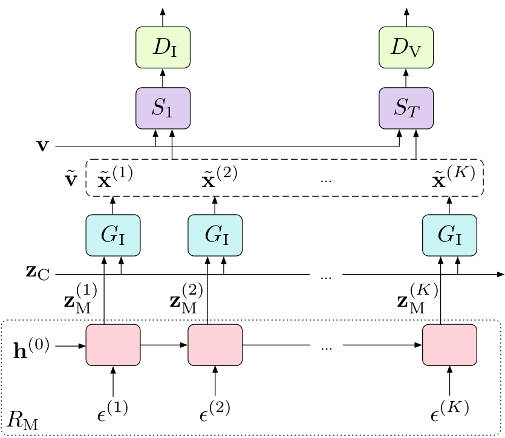
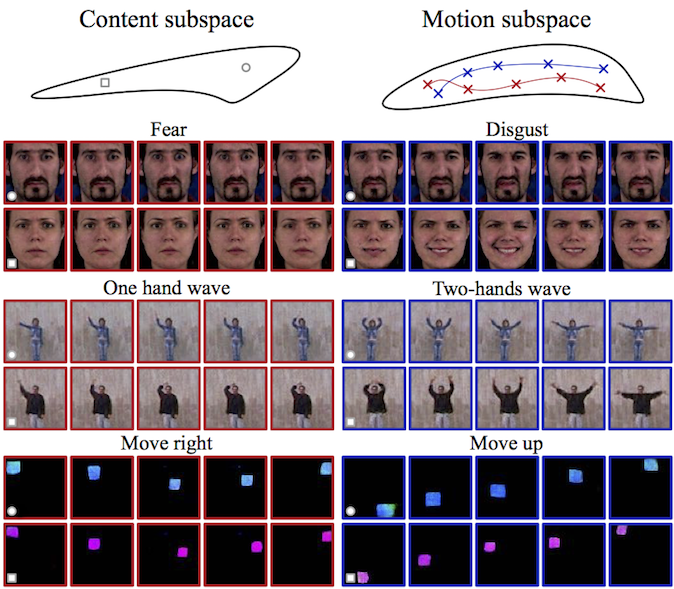
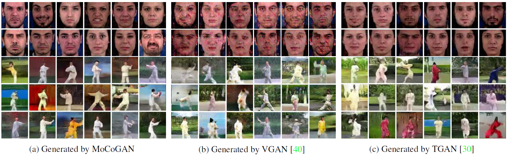
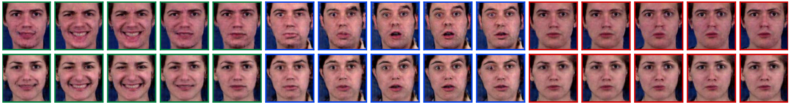

# TITLE: CVPR 2018 MoCoGAN Decomposing Motion and Content for Video Generation

- [TITLE: CVPR 2018 MoCoGAN Decomposing Motion and Content for Video Generation](#title-cvpr-2018-mocogan-decomposing-motion-and-content-for-video-generation)
  - [SUMMARY](#summary)
    - [APPLICATIONS SUMMARY](#applications-summary)
    - [ARCHITECTURE SUMMARY](#architecture-summary)
    - [AUTHORS](#authors)
    - [COMPARED TO](#compared-to)
    - [CONTRIBUTIONS](#contributions)
    - [DATASETS](#datasets)
    - [IMPLEMENTATION](#implementation)
    - [METRICS](#metrics)
    - [QUALITATIVE EVALUATION SUMMARY](#qualitative-evaluation-summary)
    - [QUANTITATIVE EVALUATION SUMMARY](#quantitative-evaluation-summary)
    - [RELATED WORK](#related-work)
    - [RESULTS](#results)

## SUMMARY

### APPLICATIONS SUMMARY

- Image-to-video translation
- Categorical Video Generation

### ARCHITECTURE SUMMARY

Figure 2: The MoCoGAN framework for video generation. For a video, the content vector, $z_C$, is sampled once and fixed. Then, a series of random variables [$\epsilon^{(1)}$, ..., $\epsilon^{(K)}$] are sampled and mapped to a series of motion codes [$z_M^{(1)}$, ..., $z_M^{(K)}$] via the recurrent neural network $R_M$. A generator $G_I$ produces a frame, $\tilde{x}^{(k)}$  , using the content and the motion vectors {$z_C$, $z_M^{(k)}$}. The discriminators, $D_I$ and $D_V$, are trained on real and fake images and videos, respectively, sampled from the training set $v$ and the generated set $\tilde{v}$. The function $S_1$ samples a single frame from a video, $S_T$ samples T consequtive frames.

### AUTHORS

NVIDIA and Snap Research

- Sergey Tulyakov [stulyakov@snap.com](mailto:stulyakov@snap.com)
- Ming-Yu Liu [mingyul@nvidia.com](mailto:mingyul@nvidia.com)
- Xiaodong Yang [xiaodongy@nvidia.com](mailto:xiaodongy@nvidia.com)
- Jan Kautz [jkautz@nvidia.com](mailto:jkautz@nvidia.com)

### COMPARED TO

- [VGAN](https://papers.nips.cc/paper/6194-generating-videos-with-scene-dynamics) for unconditional video generation
- [TGAN](https://arxiv.org/abs/1611.06624) for unconditional video generation

### CONTRIBUTIONS

- We propose a novel GAN framework for unconditional video generation, mapping noise vectors to videos.

- We show the proposed framework provides a means to control content and motion in video generation, which is absent in the existing video generation frameworks.

- We conduct extensive experimental validation on benchmark datasets with both quantitative and subjective comparison to the state-of-the-art video generation algorithms including VGAN[40] and TGAN [30] to verify the effectiveness of the proposed algorithm.

### DATASETS

- Shape motion. The dataset contained two types of shapes (circles and squares) with varying sizes and colors, performing two types of motion: one moving from left to right, and the other moving from top to bottom. The motion trajectories were sampled from Bezier curves. There were 4000 videos in the dataset; the image resolution was 64 x 64 and video length was 16.

- Facial expression. We used the **MUG Facial Expression Database** for this experiment. The dataset consisted of 86 subjects. Each video consisted of 50 to 160 frames. We cropped the face regions and scaled to 96 x 96. We discarded videos containing fewer than 64 frames and used only the sequences representing one of the six facial expressions: anger, fear, disgust, happiness, sadness, and surprise. In total, we trained on 1254 videos.

- Tai-Chi. We downloaded 4500 Tai Chi video clips from YouTube. For each clip, we applied a human pose estimator [4] and cropped the clip so that the performer is in
the center. Videos were scaled to 64 x 64 pixels.

- Human actions. We used the **Weizmann Action database** [13], containing 81 videos of 9 people performing 9 actions, including jumping-jack and waving-hands. We
scaled the videos to 96 x 96. Due to the small size, we did not conduct a quantitative evaluation using the dataset. Instead, we provide visual results in Fig. 1 and Fig. 4a.

- UCF101: The database is commonly used for video action recognition. It includes 13, 220 videos of 101 different action categories. Similarly to the TGAN work, we scaled each frame to 85 x 64 and cropped the central 64 x 64 regions for learning.

### IMPLEMENTATION

- In pytorch by the authors (uses nvidia docker): <https://github.com/sergeytulyakov/mocogan>

### METRICS

- **Average Content Distance (ACD)** metric: For quantitative comparison, we measured content consistency of a generated video using the Average Content
Distance (ACD) metric.
  - For shape motion, we first computed the average color of the generated shape in each frame. Each frame was then represented by a 3-dimensional vector. The ACD is then given by the average pairwise L2 distance of the per-frame average color vectors.
  - For facial expression videos, we employed OpenFace [2], which outperforms human performance in the face recognition task, for measuring video content consistency. OpenFace produced a feature vector for each frame in a face video. The ACD was then computed using the average pairwise L2 distance of the per-frame feature vectors.

- User study on **Amazon Mechanical Turk (AMT)**. We conducted a user study to quantitatively compare MoCoGAN to VGAN and TGAN using the facial expression and Tai-Chi datasets. For each algorithm, we used the trained model to randomly generate 80 videos for each task. We then randomly paired the videos generated by the MoCoGAN with the videos from one of the competing algorithms to form 80 questions. These questions were sent to the workers on Amazon Mechanical Turk (AMT) for evaluation. The videos from different algorithms were shown in random order for a fair comparison. Each question was answered by 3 different workers. The workers were instructed to choose the video that looks more realistic. Only the workers with a lifetime HIT (Human Intelligent Task) approval rate greater than 95% participated in the user study.

- **Inception score**

- **Motion control score (MCS)**: To evaluate the capability in motion generation control. To compute MCS, we first trained a spatio-temporal CNN classifier for
action recognition using the labeled training dataset. During test time, we used the classifier to verify whether the generated video contained the action. The MCS is then given by testing accuracy of the classifier. A model with larger MCS offers better control over the action category.

### QUALITATIVE EVALUATION SUMMARY

Figure 3: Generated video clips used in the user study. The video clips were randomly selected.

Fig. 5 shows two videos from the best model in the ablation study results in Table 4.

### QUANTITATIVE EVALUATION SUMMARY

Unconditional video generation:

We compared MoCoGAN to VGAN and TGAN using the shape motion and facial expression
datasets. For each dataset, we trained a video generation model and generated 256 videos for evaluation. The VGAN and TGAN implementations can only generate
fixed-length videos (32 frames and 16 frames correspondingly). For a fair comparison, we generated 16 frames using MoCoGAN, and selected every second frame from the
videos generated by VGAN, such that each video has 16 frames in total.

Table 1: Video generation content consistency comparison.
A smaller ACD meanImage-to-video translations the generated frames in a video are perceptually more similar. We also compute the ACD for the training set, which is the reference.

| ACD Shape | Motion Facial | Expressions |
|-----------|--------------:|------------:|
| Reference | 0             | 0.116       |
| VGAN      | 5.02          | 0.322       |
| TGAN      | 2.08          | 0.305       |
| MoCoGAN   | **1.79**      | **0.201**   |

From the table, we found that the content of the videos generated by MoCoGAN was
more consistent, especially for the facial expression video generation task: MoCoGAN achieved an ACD score of 0.201, which was almost 40% better than 0.322 of VGAN
and 34% better than 0.305 of TGAN.

Table 2: Inception score for models trained on UCF101. All values except MoCoGAN’s are taken from [30].

|        | VGAN           | TGAN            | MoCoGAN             |
|--------|---------------:|----------------:|--------------------:|
| UCF101 | 8.18 $\pm$ .05 | 11.85 $\pm$ .07 | **12.42 $\pm$ .03** |

Table 3: User preference score on video generation quality.

| User preference, % | Facial Exp.     | Tai-Chi         |
|--------------------|----------------:|----------------:|
| MoCoGAN / VGAN     | **84.2** / 15.8 | **75.4** / 24.6 |
| MoCoGAN / TGAN     | **54.7** / 45.3 | **68.0** / 32.0 |

Table 4: Performance on categorical facial expression video
generation with various MoCoGAN settings.

| Settings                   | MCS       | ACD       |
|----------------------------|----------:|-----------|
| $\sout{D_I}$ $z_A \to G_I$ | 0.472     | 1.115     |
| $\sout{D_I}$ $z_A \to R_M$ | 0.491     | 1.073     |
| $D_I$ $zA \to G_I$         | 0.355     | 0.738     |
| $D_I$ $zA \to R_M$         | **0.581** | **0.606** |

Ablation study: We also evaluated the impact of different conditioning schemes to the categorical video generation performance. The first scheme is our default scheme where $zA \to R_M$. The second scheme, termed $z_A \to G_I$, was to feed the category variable directly to the image generator. In addition, to show the impact of the image discriminative network $D_I$, we considered training the MoCoGAN framework without $D_I$. Table 4 shows experimental results. We find that the models trained with $D_I$ consistently yield better performances on various metrics. We also find that $z_A \to R_M$ yields better performance.

### RELATED WORK

- Due to limitations in computation, data, and modeling tools, early video
generation works focused on generating dynamic texture
patterns [34, 41, 9].

- Various deep generative models were recently proposed for image generation including GANs [12], variational autoencoders (VAEs) [20, 28, 36], and PixelCNNs [38].

- Denton et al. [8] showed a Laplacian pyramid implementation. Radford et al. [27] used a deeper convolution network. Zhang et al. [43] stacked two generative networks to progressively render realistic images. Coupled GANs [22] learned to generate corresponding images in different domains, later extended to translate an image from one domain to a different domain in an unsupervised fashion [21]. InfoGAN [5] learned a more interpretable latent representation. Salimans et al. [31] proposed several GAN training tricks. The WGAN [3] and LSGAN [23] frameworks adopted alternative distribution distance metrics for more stable adversarial training. Roth et al. [29] proposed a special gradient penalty to further stabilize training. Karras et al. [18] used progressive growing of the discriminator and the generator to generate high resolution images.

### RESULTS

