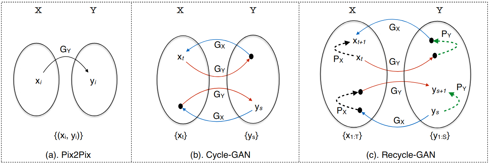

# TITLE: ECCV 2018 Recycle GAN Unsupervised Video Retargeting

- [TITLE: ECCV 2018 Recycle GAN Unsupervised Video Retargeting](#title-eccv-2018-recycle-gan-unsupervised-video-retargeting)
  - [SUMMARY](#summary)
    - [APPLICATIONS SUMMARY](#applications-summary)
    - [ARCHITECTURE SUMMARY](#architecture-summary)
    - [AUTHORS](#authors)
    - [COMPARED TO](#compared-to)
    - [CONTRIBUTIONS](#contributions)
    - [DATASETS](#datasets)
    - [IMPLEMENTATION](#implementation)
    - [METRICS](#metrics)
    - [QUALITATIVE EVALUATION SUMMARY](#qualitative-evaluation-summary)
    - [QUANTITATIVE EVALUATION SUMMARY](#quantitative-evaluation-summary)
    - [RELATED WORK](#related-work)
    - [RESULTS](#results)

## SUMMARY

### APPLICATIONS SUMMARY

- Unsupervised video to video translation

### ARCHITECTURE SUMMARY

We adopt much of the training details from Cycle-GAN [53] to train our spatial translation model, and Pix2Pix [23] for our temporal prediction model. The generative network consists of two convolution (downsampling with stride-2), six residual blocks and finally two upsampling convolution (each with a stride 0.5). We use the same network architecture for $G_X$, and $G_Y$. The resolution of the images for all the experiments is set to 256 x 256. The discriminator network is a 70 x 70 PatchGAN [23,53] that is used to classify a 70 x 70 image patch if it is real or fake. We set all $\lambda_s$ = 10. To implement our temporal predictors $P_X$ and $P_Y$ , we concatenate the last two frames as input to a network whose architecture is identical to U-Net architecture [23,37].

### AUTHORS

Carnegie Mellon University and Facebook Reality Lab, Pittsburgh

- Aayush Bansal
- Shugao Ma
- Deva Ramanan
- Yaser Sheikh

<http://www.cs.cmu.edu/~aayushb/Recycle-GAN/>

### COMPARED TO

- CycleGAN

### CONTRIBUTIONS

- We introduce a new approach that incorporates spatiotemporal cues along with conditional generative adversarial networks [15] for video retargeting. We demonstrate the advantages of spatiotemporal constraints over the spatial constraints alone for image-to-labels, and labels-to-image in varying environmental settings. We then show the importance of proposed approach in learning better association between two domains, and its importance for self-supervised content alignment of the visual data. Inspired by the ever-existing nature of space-time, we qualitatively demonstrate the effectiveness of our approach for various natural processes such as face-to-face translation, flower-to-flower, synthesizing clouds and winds, aligning sunrise and sunset.

- In this work, we use our model trained with spatiotemporal constraints to align the
semantical content of two videos in a self-supervised manner, and do automatic
alignment of the visual data without any additional supervision.

### DATASETS

Face and Flowers datasets were created by authors. All 3 datasets are available on github: <https://github.com/aayushbansal/Recycle-GAN>

- Face to Face: We use the publicly available videos of various public figures for the face-to-face translation task. The faces are extracted using the facial keypoints generated using the OpenPose Library[6] and a minor manual efforts are made to remove false positives.

- Flower to Flower: We use various flowers, and extracted their time-lapse from publicly available videos. The time-lapses show the blooming of different flowers but without any sync. We use our approach to align the content,
i.e. both flowers bloom or die together.

- Windy and cloudy weather conditions, sunrise and sunset.

- Viper (used as a proxy for Cityscapes)

### IMPLEMENTATION

Python and pytorch (by the authors): <https://github.com/aayushbansal/Recycle-GAN>

### METRICS

- Mean Pixel Accuracy (MP)
- Average Class Accuracy (AC)
- Intersection over union (IoU)
- FCN score

### QUALITATIVE EVALUATION SUMMARY

Fig. 1. Our approach for video retargeting used for faces and flowers. The top row shows translation from John Oliver to Stephen Colbert. The bottom row shows how a synthesized flower follows the blooming process with the input flower. The corresponding videos are available on the project webpage.

Fig. 2. Spatial cycle consistency is not sufficient: We show two examples illustrating why spatial cycle consistency alone is not sufficient for the optimization. (a) shows an example of perceptual mode-collapse while using Cycle-GAN [53] for Donald Trump to Barack Obama. First row shows the input of Donald Trump, and second row
shows the output generated. The third row shows the output of reconstruction that takes the second row as input. The second row looks similar despite different inputs; and
the third row shows output similar to first row. On a very close observation, we found that a few pixels in second row were different (but not perceptually significant) and
that was sufficient to get the different reconstruction; (b) shows another example for image2labels and labels2image. While the generator is not able to generate the required
output for the given input in both the cases, it is still able to perfectly reconstruct the input. Both the examples suggest that the spatial cyclic loss is not sufficient to ensure the required output in another domain because the overall optimization is focussed on reconstructing the input. However as shown in (c) and (d) , we get better outputs with our approach combining the spatial and temporal constraints. Videos for face comparison are available on project webpage.

Fig. 4. We compare the performance of our approach for image2labels and labels2image with Cycle-GAN [53] on a held out data of Viper dataset [36] for various environmental
conditions.

Fig. 5. Face to Face: The top row shows multiple examples of face-to-face between John Oliver and Stephen Colbert using our approach. The bottom row shows example of translation from John Oliver to a cartoon character, Barack Obama to Donald Trump, and Martin Luther King Jr. (MLK) to Barack Obama. Without any input alignment or manual supervision, our approach could capture stylistic expressions for these public figures. As an example, John Oliver’s dimple while smiling, the shape of mouth characteristic of Donald Trump, and the facial mouth lines and smile of Stephen Colbert. More results and videos are available on our project webpage.

Fig. 6. Flower to Flower: We shows two examples of flower-to-flower translation. Note the smooth transition from Left to Right. These results can be best visualized using videos on our project webpage.

Fig. 7. Synthesizing Clouds & Winds: We use our approach to synthesize clouds and winds. The top row shows example frames of a video captured on a day with light breeze. We condition it on video data from a windy data (shown in second row) by learning a transformation between two domains using our approach. The last row shows the output synthesized video with the clouds and trees moving faster (giving a notion of wind blowing). Refer to the videos on our project webpage for better visualization and more examples.

Fig. 8. Sunrise & Sunset: We use our approach to manipulate and align the videos of sunrise and sunset. The top row shows example frames from a sunset video. We condition it on video data of sunrise (shown in second row) by learning a transformation between two domains using our approach. The third row shows example frames of new synthesized video of sunrise. Finally, the last row shows random examples of input-output pair from different sunrise and sunset videos. Videos and more examples are available on our project webpage.

Fig. 9. Failure Example: We present the failure in association/synthesis for our approach using a transformation from a real bird to an origami bird. While the origami bird (output) is trying to imitate the real bird (input) when it is sitting (Column 1 - 4), and also flies away when the real bird flies (Column 5 - 6). We observe that it reappears after sometime (red bounding box in Column 7) in a flying mode while the real bird didn’t exist in the input. Our algorithm is not able to make transition of association when the real bird is completely invisible, and so it generated a random flying origami.

### QUANTITATIVE EVALUATION SUMMARY

| Criterion | Approach           | day    | sunset | rain   | snow   | night  | all    |
|-----------|-------------------:|-------:|-------:|-------:|-------:|-------:|-------:|
| MP        | Cycle-GAN          | 35.8   | 38.9   | 51.2   | 31.8   | 27.4   | 35.5   |
|           | Recycle-GAN (Ours) |**48.7**|**71.0**|**60.9**|**57.1**|**45.2**|**56.0**|
| AC        | Cycle-GAN          | 7.8    | 6.7    | 7.4    | 7.0    | 4.7    | 7.1    |
|           | Recycle-GAN (Ours) |**11.9**|**12.2**|**10.5**|**11.1**|**6.5** |**11.3**|
| IoU       | Cycle-GAN          | 4.9    | 3.9    | 4.9    | 4.0    | 2.2    | 4.2    |
|           | Recycle-GAN (Ours) |**7.9** |**9.6** |**7.1** |**8.2** |**4.1** |**8.2** |

Table 1. Image2Labels (Semantic Segmentation): We use the Viper [36] dataset to evaluate the performance improvement when using spatio-temporal constraints as opposed to only spatial cyclic consistency [53]. We report results using three criteria: (1). Mean Pixel Accuracy (MP); (2). Average Class Accuracy (AC); and (3). Intersection over union (IoU). We observe that our approach achieves significantly better performance than prior work over all the criteria in all the conditions.

| Approach           | day  | sunset | rain   | snow   | night  | all    |
|--------------------|-----:|-------:|-------:|-------:|-------:|-------:|
| Cycle-GAN          | 0.33 | 0.27   |**0.39**| 0.29   | 0.37   | 0.30   |
| Recycle-GAN (Ours) | 0.33 |**0.51**| 0.37   |**0.43**|**0.40**|**0.39**|

Table 2. Normalized FCN score for Labels2Image: We use a pre-trained FCN-style model to evaluate the quality of synthesized images over real images using the Viper [36] dataset. Higher performance on this criteria suggest that the output of a particular approach produces images that look closer to the real images.

### RELATED WORK

### RESULTS

