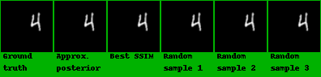

# TITLE: ICML 2018 Stochastic Video Generation with a Learned Prior

- [TITLE: ICML 2018 Stochastic Video Generation with a Learned Prior](#title-icml-2018-stochastic-video-generation-with-a-learned-prior)
  - [SUMMARY](#summary)
    - [APPLICATIONS SUMMARY](#applications-summary)
    - [ARCHITECTURE SUMMARY](#architecture-summary)
    - [AUTHORS](#authors)
    - [CONTRIBUTIONS](#contributions)
    - [DATASETS](#datasets)
    - [IMPLEMENTATION](#implementation)
    - [METRICS](#metrics)
    - [QUALITATIVE EVALUATION SUMMARY](#qualitative-evaluation-summary)
    - [QUANTITATIVE EVALUATION SUMMARY](#quantitative-evaluation-summary)
    - [RELATED WORK](#related-work)
    - [RESULTS](#results)

## SUMMARY

### APPLICATIONS SUMMARY

- Unconditional video generation.

### ARCHITECTURE SUMMARY

Figure 1. Inference (left) and generation in the SVG-FP (middle)and SVG-LP models (right).

Figure 2. Our proposed video generation model. (a) Training with a fixed prior (SVG-FP); (b) Training with learned prior (SVG-LP); (c) Generation with the learned prior model. The red boxes show the loss functions used during training.

$LSTM_{\theta}$ is a two layer LSTMs with 256 cells in each layer. $LSTM_{\phi}$ and $LSTM_{\psi}$  are both single layer LSTMs with 256 cells in each layer. Each network has a linear embedding layer and a fully connected output layer. The output of LSTM is passed through a tanh nonlinearity before going into the frame decoder. For Stochastic Moving MNIST, the frame encoder has a
DCGAN discriminator architecture (Radford et al., 2016) with output dimensionality |h| = 128. Similarly, the decoder uses a DCGAN generator architecture and a sigmoid output layer.

For KTH and BAIR datasets, the frame encoder uses the same architecture as VGG16 (Simonyan & Zisserman, 2015) up until the final pooling layer with output dimensionality |h| = 128. The decoder is a mirrored version of the encoder with pooling layers replaced with spatial up-sampling and a sigmoid output layer.

For all datasets we add skip connections from the encoder at the last ground truth frame to the decoder at t, enabling the model to easily generate static background features.

### AUTHORS

Courant Institute, New York University and Facebook AI Research.

Project webpage: <https://sites.google.com/view/svglp/>

- Emily Denton [denton@cs.nyu.edu](mailto:denton@cs.nyu.edu)
- Rob Fergus

### CONTRIBUTIONS

- Novel video prediction model that combines a deterministic prediction of the next frame with stochastic latent variables, drawn from a time-varying distribution
learned from training sequences. Our recurrent inference network estimates the latent distribution for each time step allowing easy end-to-end training.

- Evaluating the model on real-world sequences, we demonstrate high quality generations that are comparable to, or better than, existing approaches. On synthetic data where it is possible to characterize the distribution of samples, we see that is
able to match complex distributions of futures. The framework is sufficiently general that it can readily be applied to more complex datasets, given appropriate encoder and
decoder modules.

### DATASETS

- Stochastic Moving MNIST (introduced by this paper): Stochastic Moving MNIST (SM-MNIST) is a dataset consisting of sequences of frames of size 64×64, containing one or two MNIST digits moving and bouncing off edge of the frame (walls). In the original Moving MNIST dataset (Srivastava et al., 2015) the digits move with constant velocity and bounce off the walls in a deterministic manner. By contrast, SM-MNIST digits move with a constant velocity along a trajectory until they hit at wall at which point they bounce off with a random speed and direction. This dataset thus contains segments of deterministic motion interspersed with moments of uncertainty, i.e. each time a digit hits a wall.

- KTH Action Dataset: The  KTH  Action  dataset  (Schuldt  et  al.,  2004)  consistsof real-world videos of people performing one of six actions (walking, jogging, running, boxing, handwaving, hand-clapping) against fairly uniform backgrounds. The human motion in the video sequences is fairly regular, however there is still uncertainty regarding the precise locations of the person’s joints at subsequent time steps.  We trained SVG-FP, SVG-LP and the deterministic baseline on 64 x 64 video sequences by conditioning on 10 frames and trainingthe model to predict the next 10 frames in the sequence.

- BAIR robot pushing dataset

### IMPLEMENTATION

Python and pytorch (by the authors): <https://github.com/edenton/svg>

### METRICS

- Structural Similarity (SSIM)
    The structural similarity (SSIM) index is a method for predicting the perceived quality of digital television and cinematic pictures, as well as other kinds of digital images and videos.
SSIM is used for measuring the similarity between two images. The SSIM index is a full reference metric; in other words, the measurement or prediction of image quality is based on an initial uncompressed or distortion-free image as reference. SSIM is designed to improve on traditional methods such as peak signal-to-noise ratio (PSNR) and mean squared error (MSE).

    The SSIM index is calculated on various windows of an image. The measure between two windows x and y of common size N x N is:

$$\operatorname{SSIM}(x, y)=\frac{\left(2 \mu_{x} \mu_{y}+c_{1}\right)\left(2 \sigma_{x y}+c_{2}\right)}{\left(\mu_{x}^{2}+\mu_{y}^{2}+c_{1}\right)\left(\sigma_{x}^{2}+\sigma_{y}^{2}+c_{2}\right)}$$

with $\mu_x$ the average of x, $\mu_y$ the average of y, $\sigma^2_x$ the variance of x, $\sigma^2_y$ the variance of y, $\sigma_{xy}$ the covariance of x and y, $c_1 = (k_1 L)^2$ $c_2 = (k_2 L)^2$ two variables to stabilize the division with weak denominator, L the dynamic range of the pixel-values (typically this is $2^{\text{bits per pixel}} − 1$) and $k_1$ = 0.01 and $k_2$ = 0.03 by default.

- Peak Signal-to-Noise Ratio (PSNR)

Peak signal-to-noise ratio, often abbreviated PSNR, is an engineering term for the ratio between the maximum possible power of a signal and the power of corrupting noise that affects the fidelity of its representation. Because many signals have a very wide dynamic range, PSNR is usually expressed in terms of the logarithmic decibel scale. PSNR is most easily defined via the mean squared error (MSE). Given a noise-free m x n monochrome image I and its noisy approximation K, MSE is defined as:

$$M S E=\frac{1}{m n} \sum_{i=0}^{m-1} \sum_{j=0}^{n-1}[I(i, j)-K(i, j)]^{2}$$

The PSNR (in dB) is defined as:

$$\begin{aligned} P S N R &=10 \cdot \log _{10}\left(\frac{M A X_{I}^{2}}{M S E}\right) \\ &=20 \cdot \log _{10}\left(\frac{M A X_{I}}{\sqrt{M S E}}\right) \\ &=20 \cdot \log _{10}\left(M A X_{I}\right)-10 \cdot \log _{10}(M S E) \end{aligned}$$

Here $MAX_I$ is the maximum possible pixel value of the image. When the pixels are represented using 8 bits per sample, this is 255. More generally, when samples are represented using linear PCM with B bits per sample, $MAX_I$ is $2^{B−1}$.

### QUALITATIVE EVALUATION SUMMARY

Figure 3. Qualitative  comparison  between  SVG-LP  and  a  purely  deterministic  baseline.   The  deterministic  model  produces  sharp predictions until ones of the digits collides with a wall, at which point the prediction blurs to account for the many possible futures. In contrast, samples from SVG-LP show the digit bouncing off in different plausible directions.

Fig. 3 shows sample generations fromthe deterministic model and SVG-LP. Generations from thedeterministic model are sharp for several time steps, but themodel rapidly degrades after a digit collides with the wall,since the subsequent trajectory is uncertain.

Figure 4.Qualitative comparison between SVG-LP and a purely deterministic baseline. Both models were conditioned on the first 10frames (the final 5 are shown in the figure) of test sequences. The deterministic model produces plausible predictions for the future framesbut frequently mispredicts precise limb locations. In contrast, different samples from SVG-FP reflect the variability on the persons pose infuture frames. By picking the sample with the best PSNR, SVG-FP closely matches the ground truth sequence.

Figure 5. Three examples of our SVG-LP model accurately capturing the distribution of MNIST digit trajectories following collision with a wall. On the right we show the trajectory of a digit prior to the collision. In the ground truth sequence, the angle and speed immediately after impact are drawn from at random from uniform distributions. Each of the sub-plots shows the distribution of $\Delta x$, $\Delta y$ at each timestep. In the lower ground truth sequence, the trajectory is deterministic before the collision (occurring between t = 7 and t = 8 in the first example), corresponding to a delta-function. Following the collision, the distribution broadens out to an approximate uniform distribution (e.g. t = 8), before being reshaped by subsequent collisions. The upper row shows the distribution estimated by our SVG-LP model (after conditioning on ground-truth frames from t = 1...5). Note how our model accurately captures the correct distribution many time steps into the future, despite its complex shape. The distribution was computed by drawing many samples from the model, as well as averaging over different digits sharing the same trajectory. The 2nd and 3rd examples show different trajectories with correspondingly different impact times (t = 11 and t = 16 respectively).

Figure 6.Learned prior of SVG-LP accurately predicts collision points in SM-MNIST. Five hundred test video sequences with different MNIST test digits but synchronized motion were fed into the learned prior. The mean ($\pm$ one standard deviation) of $\sigma_\psi(x_{1:t−1})$ is plotted for t = 1 ,..., 100.  The true points of uncertainty in the video sequences, i.e. when a digits hits a wall, are marked by vertical lines, colored red and blue for each digit respectively.

Figure 9.Qualitative comparison between our SVG-LP model and Babaeizadeh et al. (2017).   All models are conditioned on the first two frames of unseen test videos. SVG-LP generates crisper images and predicts plausible movement of the robot arm.

Figure 10. Additional examples of generations from SVG-LP showing crisp and varied predictions. A large segment of the background is occluded in conditioning frames, preventing SVG-LP from directly copying these background pixels into generated frames. In addition to crisp robot arm movement, SVG-LP generates plausible background objects in the space occluded by the robot arm in initial frames.

Figure 11. Long range generations from SVG-LP. The robot arm remains crisp up to 100 time steps and object motion can be seen in the generated video frames.

### QUANTITATIVE EVALUATION SUMMARY

We show quantitative compar-isons by computing structural similarity (SSIM) and PeakSignal-to-Noise Ratio (PSNR) scores between ground truthand generated video sequences. Since neither of these metrics fully captures perceptual fidelity of generated sequenceswe also make a qualitative comparison between samples from our model and current state-of-the-art methods.

We compute SSIM for SVG-FP and SVG-LP by drawing 100 samples from the model for each test sequence andpicking the one with the best score with respect to the groundtruth. Fig. 7(left) plots average SSIM on unseen test videos.Both SVG-FP and SVG-LP outperform the deterministicbaseline and SVG-LP performs best overall, particularlyin later time steps.

We  hypothesize  that  the  improvement  of  SVG-LP  over the SVG-FP model is due to the mix of deterministic and stochastic movement in the dataset. In SVG-FP, the frame predictor must determine how and if the latent variables for a given time step should be integrated into the prediction. In SVG-LP , the burden of predicting points of high uncertainty can be offloaded to the prior network.

Figure 7. Quantitative evaluation of SVG-FP and SVG-LP videogeneration quality on SM-MNIST (left) and KTH (right).  The models are conditioned on the first 5 frames for SM-MNIST and 10 frames for KTH. The vertical bar indicates the frame number the models were trained to predict up to; further generations indicate generalization ability. Mean SSIM over test videos is plotted with 95% confidence interval shaded.

Figure 8. Quantitative comparison between our SVG models and Babaeizadeh et al. (2017) on the BAIR robot dataset. All models are conditioned on the first two frames and generate the subsequent 28 frames. The models were trained to predict up 10 frames in the future, indicated by the vertical bar; further generations indicate generalization ability. Mean SSIM and PSNR over test videos is plotted with 95% confidence interval shaded.

### RELATED WORK

A range of deep video generation models have recently been proposed. Srivastava et al. (2015) use LSTMs trained on pre-learned low dimensional image representations.  Ranzatoet al. (2014) adopt a discrete vector quantization approach inspired by text models. Video Pixel Networks (Kalchbren-ner et al., 2016) are a probabilistic approach to generation whereby pixels are generated one at a time in raster-scan order (similar autoregressive image models include Salimanset al. (2017); van den Oord et al. (2016)).  Our approach differs from these in that it uses continuous representations throughout and generates the new frame directly, rather than via a sequential process over scale or location.

### RESULTS

