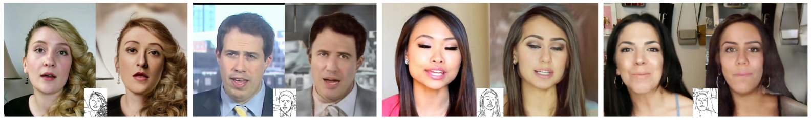
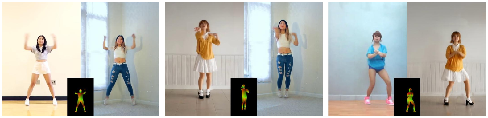

# TITLE: NIPS 2018 Video to Video Synthesis

- [TITLE: NIPS 2018 Video to Video Synthesis](#title-nips-2018-video-to-video-synthesis)
  - [SUMMARY](#summary)
    - [APPLICATIONS SUMMARY](#applications-summary)
    - [ARCHITECTURE SUMMARY](#architecture-summary)
    - [AUTHORS](#authors)
    - [COMPARED TO](#compared-to)
    - [CONTRIBUTIONS](#contributions)
    - [DATASETS](#datasets)
    - [IMPLEMENTATION](#implementation)
    - [METRICS](#metrics)
    - [QUALITATIVE EVALUATION SUMMARY](#qualitative-evaluation-summary)
    - [QUANTITATIVE EVALUATION SUMMARY](#quantitative-evaluation-summary)
    - [RELATED WORK](#related-work)
    - [RESULTS](#results)

## SUMMARY

### APPLICATIONS SUMMARY

- Supervised video to video translation

- Future prediction

### ARCHITECTURE SUMMARY

$$F(\tilde{x}^{t−1}_{t−L}, s^t_{t−L}) = (1 − \tilde{m}_t) \odot \tilde{w}_{t−1}(\tilde{x}_{t−1}) + \tilde{m}_t \odot \tilde{h}_t$$
The first part corresponds to pixels warped from the previous frame, while the second part hallucinates new pixels.

- $\tilde{w}_{t−1} = W(\tilde{x}^{t−1}_{t−L}, s^t_{t−L})$ is the estimated optical flow from $\tilde{x}_{t−1}$ to $\tilde{x}_t$, and W is the optical flow prediction network. We estimate the optical flow using both input source images $s^t_{t−L}$ and
previously synthesized images $\tilde{x}^{t−1}_{t−L}$. By $\tilde{w}_{t−1}(\tilde{x}_{t−1})$, we warp $\tilde{x}_{t−1}$ based on $\tilde{w}_{t−1}$.

- $\tilde{h}_t = H(\tilde{x}^{t−1}_{t−L}, s^t_{t−L})$ is the hallucinated image, synthesized directly by the generator H.

- $m̃ t = M(\tilde{x}^{t−1}_{t−L}, s^t_{t−L})$ is the occlusion mask with continuous values between 0 and 1. M denotes the mask prediction network. Our occlusion mask is soft instead of binary to better handle the “zoom in” scenario. For example, when an object is moving closer to our camera, the object will become blurrier over time if we only warp previous frames. To increase the resolution of the object, we need to synthesize new texture details. By using a soft mask, we can add details by gradually blending the warped pixels and the newly synthesized pixels.

We use residual networks [26] for M , W , and H. To generate high-resolution videos, we adopt a coarse-to-fine generator design similar to the method of Wang et. al [73].

As using multiple discriminators can mitigate the mode collapse problem during GANs training [19, 67, 73], we also design two types of discriminators as detailed below.

- Conditional image discriminator $D_I$ . The purpose of $D_I$ is to ensure that each output frame resembles a real image given the same source image. This conditional discriminator should output 1 for a true pair $(x_t , s_t)$ and 0 for a fake one $(\tilde{x}_t, s_t)$.

- Conditional video discriminator $D_V$. The purpose of $D_V$ is to ensure that consecutive output frames resemble the temporal dynamics of a real video given the same optical flow. While $D_I$ conditions on the source image, $D_V$ conditions on the flow. Let $w^{t−2}_{t−K}$ be K − 1 optical flow for the K consecutive real images $x^{t−1}_{t−K}$. This conditional discriminator $D_V$ should output 1 for a true pair
$(x^{t−1}_{t−K}, w^{t−2}_{t−K})$ and 0 for a fake one $(\tilde{x}^{t−1}_{t−K}, w^{t−2}_{t−K})$.

Learning objective function: We train the sequential video synthesis function F by solving

$$min_F (max_{D_I} L_I(F, D_I) + max_{D_V} L_V(F, D_V)) + \lambda_W L_W(F)$$

where $L_I$ is the GAN loss on images defined by the conditional image discriminator $D_I$, $L_V$ is the GAN loss on K consecutive frames defined by $D_V$, and $L_W$ is the flow estimation loss. The weight $\lambda_W$ is set to 10 throughout the experiments based on a grid search. In addition we also use the discriminator feature matching loss [40, 73] and VGG feature matching loss [16, 34, 73] as they improve the convergence speed and training stability [73].

Recall that we synthesize a video x̃ T 1 by recursively applying F .
The flow loss $L_W$ includes two terms. The first is the endpoint error between the ground truth and the estimated flow, and the second is the warping loss when the flow warps the previous frame to the next frame. Let $w_t$ be the ground truth flow from $x_t$ to $x{t+1}. The flow loss $L_W$ is given by:

$$L_W = \frac{1}{T − 1} \Sigma_{t = 1}^{T - 1}\big(||\tilde{w}_t − w_t||_1 + ||\tilde{w}_t(x_t) − x_{t+1}||_1 \big).$$

Foreground-background prior: When using semantic segmentation masks as the source video, we can divide an image into foreground and background areas based on the semantics. Split the hallucination network into 2, a foreground model $\tilde{h}_{F, t} = H_F(s^t_{t−L})$ and a background model $\tilde{h}_{B, t} = H_B(\tilde{x}^{t−1}_{t−L}, s^t_{t−L})$. This prior improves the visual quality by a large margin with the cost of minor flickering artifacts. In Table 2, our user study shows that most people prefer the results with foreground–background modeling.

$$F(\tilde{x}^{t−1}_{t-L}, s^t_{t−L}) = (1 - \tilde{m}_t) \odot \tilde{w}_{t−1}(\tilde{x}_t−1) + \tilde{m}_t \odot \big((1 − m_{B, t}) \odot \tilde{h}_{F, t} + m_{B, t} \odot \tilde{h}_{B, t})\big)$$

where $m_{B, t}$ is the background mask derived from the ground truth segmentation mask $s_t$. We note that background motion can be modeled as a global transformation in general, where optical flow can be estimated quite accurately. As a result, the background region can be generated accurately via warping, and the background hallucination network $H_B$ only needs to synthesize the occluded areas. On the other hand, a foreground object often has a large motion and only occupies a small portion of the image, which makes optical flow estimation difficult. The network $H_F$ has to synthesize most of the foreground content from scratch.

Multimodal synthesis: The synthesis network F is a unimodal mapping function. Given an input source video, it can only generate one output video. To achieve multimodal synthesis [19, 73, 83], we adopt a feature embedding scheme [73] for the source video that consists of instance-level semantic segmentation masks. Specifically, at training time, we train an image encoder E to encode the ground truth real image $x_t$ into a d-dimensional feature map (d = 3 in our experiments). We then apply
an instance-wise average pooling to the map so that all the pixels within the same object share the same feature vectors. We then feed both the instance-wise averaged feature map $z_t$ and the input semantic segmentation mask $s_t$ to the generator F . Once training is done, we fit a mixture of Gaussian distribution to the feature vectors that belong to the same object class. At test time, we sample a feature vector for each object instance using the estimated distribution of that object class. Given different feature vectors, the generator F can synthesize videos with different visual appearances.

We use the multi-scale PatchGAN discricontributionsminator architecture [33, 73] for the image discriminator $D_I$. In addition to multi-scale in the spatial resolution, our multi-scale video discriminator $D_V$ also looks at different frame rates of the video to ensure both short-term and long-term consistency.

### AUTHORS

NVIDIA and MIT CSAIL

- Ting-Chun Wang1 <mailto:tingchunw@nvidia.com>
- Ming-Yu Liu1 <mailto:mingyul@nvidia.com>
- Jun-Yan Zhu2 <mailto:junyanz@mit.edu>
- Guilin Liu1 <mailto:guilinl@nvidia.com>
- Andrew Tao1 <mailto:atao@nvidia.com>
- Jan Kautz1 <mailto:jkautz@nvidia.com>
- Bryan Catanzaro1 <mailto:bcatanzaro@nvidia.com>

### COMPARED TO

We compare our approach to two baselines trained on the same data:

- pix2pixHD is the state-of-the-art image-to-image translation approach. When applying the approach to the video-to-video synthesis task, we process input videos frame-by-frame.

- COVST is built on the coherent video style transfer by replacing the stylization network with pix2pixHD. The key idea in COVST is to warp high-level deep features using optical flow for achieving temporally coherent outputs. No additional adversarial training is applied. We feed in ground truth optical flow to COVST, which is impractical for real applications. In contrast, our model estimates optical flow from source videos.

### CONTRIBUTIONS

- Our model is capable of synthesizing 2K resolution videos of street scenes up to 30 seconds long, which significantly advances the state-of-the-art of video synthesis.

- Finally, we apply our method to future video prediction, outperforming several competing systems. In particular our method outperforms a strong baseline that combines a recent video style transfer with a state-of-the-art image-to-image translation approach.

### DATASETS

- Cityscapes (augmented by the authors): The dataset consists of 2048 × 1024 street scene videos captured in several German cities. Only a subset of images in the videos contains ground truth semantic segmentation masks. To obtain the input source videos, we use those images to train a DeepLabV3 semantic segmentation network [11] and apply the trained network to segment all the videos. We use the optical flow extracted by FlowNet2 [32] as the ground truth flow w. We treat the instance segmentation masks computed by the Mask R-CNN [25] as our instance-level ground truth. In summary, the training set contains 2975 videos, each with 30 frames. The validation set consists of 500 videos, each with 30 frames. Finally, we test our method on three long sequences from the Cityscapes demo videos, with 600, 1100, and 1200 frames, respectively.

- Apolloscape: consists of 73 street scene videos captured in Beijing, whose video lengths vary from 100 to 1000 frames. Similar to Cityscapes, Apolloscape is constructed for the image/video semantic segmentation task. We split the dataset into half for training and validation.

- Face video dataset: We use the real videos in the FaceForensics dataset, which contains 854 videos of news briefing from different reporters. We use this dataset for the sketch video to
face video synthesis task.

- Dance video dataset (created by the authors): We download YouTube dance videos for the pose to human motion
synthesis task. Each video is about 3 ∼ 4 minutes long at 1280 × 720 resolution, and we crop the
central 512 × 720 regions. We extract human poses with DensePose [23] and OpenPose [7], and
directly concatenate the results together. Each training set includes a dance video from a single
dancer, while the test set contains videos of other dance motions or from other dancers.

### IMPLEMENTATION

- In pytorch by the authors: <https://github.com/NVIDIA/vid2vid>

### METRICS

- Human preference score: We perform a human subjective test for evaluating the visual quality of synthesized videos. We use the **Amazon Mechanical Turk (AMT)** platform. During each test, an AMT participant is first shown two videos at a time (results synthesized by two different algorithms) and then asked which one looks more like a video captured by a real camera. We specifically ask the worker to check for both temporal coherence and image quality. A worker must have a life-time task approval rate greater than 98% to participate in the evaluation. For each
question, we gather answers from 10 different workers. We evaluate the algorithm by the ratio that the algorithm outputs are preferred.

- Frechet Inception Distance (FID) is a widely used metric for implicit generative models, as it correlates well with the visual quality of generated samples. The FID was originally developed for evaluating image generation. We propose a variant for video evaluation, which measures both visual quality and temporal consistency. Specifically, we use a pre-trained video recognition CNN as a feature extractor after removing the last few layers from the network. This feature extractor will be our “inception” network. For each video, we extract a spatio-temporal feature map with
this CNN. We then compute the mean $\tilde{\mu}$ and covariance matrix $\tilde{\Sigma}$ for the feature vectors from all the synthesized videos. We also calculate the same quantities $\mu$ and $\Sigma$ for the ground truth videos. The FID is then calculated as $||\mu − \tilde{\mu}||^2 + Tr\bigg(\Sigma + \tilde{\Sigma} − 2 \sqrt{\Sigma\tilde{\Sigma}}\bigg)$. We use two different pre-trained video recognition CNNs in our evaluation: I3D [8] and ResNeXt [76].

### QUALITATIVE EVALUATION SUMMARY

Figure 1: Generating a photorealistic video from an input segmentation map video on Cityscapes. Top left: input. Top right: pix2pixHD. Bottom left: COVST. Bottom right: vid2vid (ours).

Figure 7: Future video prediction results. Top left: ground truth. Top right: PredNet [45]. Bottom left: MCNet [68]. Bottom right: ours.

Figure 5: Example face to sketch to face results. Each set shows the original video, the extracted edges, and our synthesized video.

Figure 6: Example dance to pose to dance results. Each set shows the original dancer, the extracted poses, and the synthesized video.

### QUANTITATIVE EVALUATION SUMMARY

Table 1: Comparison between competing video-to-video synthesis approaches on Cityscapes.

| Fréchet Inception Dist.| I3D    | ResNeXt |
|------------------------|-------:|--------:|
| pix2pixHD              | 5.57   | 0.18    |
| COVST                  | 5.55   | 0.18    |
| vid2vid (ours)         |**4.66**|**0.15** |

| Human Preference Score     | short seq.      | long seq.       |
|----------------------------|----------------:|----------------:|
| vid2vid (ours) / pix2pixHD | **0.87** / 0.13 | **0.83** / 0.17 |
| vid2vid (ours) / COVST     | **0.84** / 0.16 | **0.80** / 0.20 |

Table 2: Ablation study. We compare the proposed approach to its three variants.

|Method                                               | Human Preference Score    |
|-----------------------------------------------------|--------------------------:|
| vid2vid (ours) / no background–foreground prior     | **0.80** / 0.20           |
| vid2vid (ours) / no conditional video discriminator | **0.84** / 0.16           |
| vid2vid (ours) / no flow warping                    | **0.67** / 0.33           |

Table 3: Comparison between future video prediction methods on Cityscapes.

| Fréchet Inception Dist. | I3D    | ResNeXt |
|-------------------------|-------:|--------:|
| PredNet                 | 11.18  | 0.59    |
| MCNet                   | 10.00  | 0.43    |
| vid2vid (ours)          |**3.44**|**0.18** |

| Method                   | Human Preference Score |
|--------------------------|-----------------------:|
| vid2vid (ours) / PredNet | **0.92** / 0.08        |
| vid2vid (ours) / MCNet   | **0.98** / 0.02        |

### RELATED WORK

- [Generative Adversarial Networks (GANs)](https://papers.nips.cc/paper/5423-generative-adversarial-nets)

- Image-to-image translation algorithms transfer an input image from one domain to a corresponding image in another domain. There exists a large body of work for this problem [6, 31, 33, 43, 44, 63, 66, 73, 82, 83]. Our approach is their video counterpart.

- Unconditional video synthesis. Recent work [59, 67, 69] extends the GAN framework for unconditional video synthesis, which learns a generator for converting a random vector to a video. VGAN [69] uses a spatio-temporal convolutional network. TGAN [59] projects a latent code to a set of latent image codes and uses an image generator to convert those latent image codes to frames.
MoCoGAN [67] disentangles the latent space to motion and content subspaces and uses a recurrent neural network to generate a sequence of motion codes. Due to the unconditional setting, these methods often produce low-resolution and short-length videos.

- Future video prediction. Conditioning on the observed frames, video prediction models are trained to predict future frames [15, 18, 36, 41, 42, 45, 50, 65, 68, 71, 72, 77]. Many of these models are trained with image reconstruction losses, often producing blurry videos due to the classic regress-to-the-mean problem. Also, they fail to generate long duration videos even with adversarial training [42, 50]. The video-to-video synthesis problem is substantially different because it does not attempt to predict object motions or camera motions. Instead, our approach is conditional on an existing video and can produce high-resolution and long-length videos in a different domain.

- Video-to-video synthesis. While video super-resolution [61, 62], video matting and blending [3, 12], and video inpainting [74] can be considered as special cases of the video-to-video synthesis problem, existing approaches rely on problem-specific constraints and designs. Hence, these methods cannot be easily applied to other applications. Video style transfer [10, 22, 28, 58], transferring the style of a reference painting to a natural scene video, is also related. In Section 4 , we show that our method outperforms a strong baseline that combines a recent video style transfer with a state-of-the-art image-to-image translation approach.

### RESULTS

