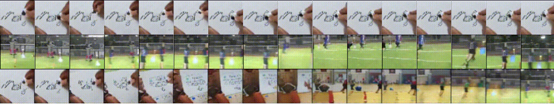

# TITLE: 2019 Efficient Video Generation on Complex Datasets

- [TITLE: 2019 Efficient Video Generation on Complex Datasets](#title-2019-efficient-video-generation-on-complex-datasets)
  - [SUMMARY](#summary)
    - [APPLICATIONS SUMMARY](#applications-summary)
    - [ARCHITECTURE SUMMARY](#architecture-summary)
    - [AUTHORS](#authors)
    - [COMPARED TO](#compared-to)
    - [CONTRIBUTIONS](#contributions)
    - [DATASETS](#datasets)
    - [IMPLEMENTATION](#implementation)
    - [METRICS](#metrics)
    - [QUALITATIVE EVALUATION SUMMARY](#qualitative-evaluation-summary)
    - [QUANTITATIVE EVALUATION SUMMARY](#quantitative-evaluation-summary)
    - [RELATED WORK](#related-work)
    - [RESULTS](#results)

## SUMMARY

### APPLICATIONS SUMMARY

- Frame interpolation
- Future prediction

### ARCHITECTURE SUMMARY

We use the hinge formulation of the objective [32, 10] which is optimized by gradient
descent ($\rho$ is the elementwise ReLU function):

$$D: min_D\ E_{x \sim data(x)}\bigg[\rho(1 - D(x))\bigg] + E_{z \sim p(z)}\bigg[\rho(1 + D(G(z)))\bigg]$$

$$G: max_G\ E\bigg[D(G(z))\bigg]$$

- Dual Discriminators:
Given a video with length T, height H, and width W, DVD-GAN employs two discriminators for its assessment: a Spatial Discriminator $D_S$ and a Temporal Discriminator $D_T$ .

- $D_S$ critiques single frame content and structure by randomly sampling k full-resolution frames and processing them individually. We use k = 8 and show in Section 4.3 this choice improves performance. DS’s final score is the sum of the per-frame scores, similar to TGANv2.

- The temporal discriminator $D_T$ must provide G with the learning signal to generate movement (something not critiqued by DS). To make the model scalable, we would like to achieve this without processing the entire video at full resolution. Rather than subsampling the batch [41] or selecting only a subset of frames [41, 54], we apply a spatial downsampling function $\phi$(.) to the whole video and feed its output to DT .

- This results in an architecture where the discriminators do not process the entire
high-resolution video (since $D_S$ processes only k x H x W pixels and $D_T$ only T x H/2 x W/2), and yet together they ensure that G learns to generate high-resolution and temporally consistent videos.

- $D_S$ is similar to the per-frame discriminator $D_I$ in MoCoGAN [54]. However MoCoGAN’s analog of $D_T$ looks at full resolution videos, whereas $D_S$ is the only source of learning signal for highresolution details in DVD-GAN. For this reason, DS is essential when $\phi$ is not the identity, unlike in MoCoGAN where the per-frame discriminator is less crucial.

- Separable Self-Attention
The Transformer module of self-attention [57] is a popular architectural building block whose global receptive field allows for propagation of information across the entire feature map. However, directly applying it to large video features is prohibitive since self-attention requires the computation and storage of the attention weight matrix of size $(HWT)^2$. To circumvent this limitation, we introduce an efficient self-attention variant that we term Separable Attention. Instead of attending to all locations of our features simultaneously, we apply three attention layers in a row, each subsequently attending over the height, width and time axis. This reduces the size of the largest tensor we need to store in memory from being proportional to $(HWT)^2$ to $max\{H^2WT; HW^2T; HWT^2\}$. This can be seen as a special case of Factorized Attention concurrently introduced in [14].

- The result of the RNN are features of shape [T; 4; 4; ch0] which are fed as the input to a noncausal self-attention block [57]. It has a single attention head and is not separable (as described in Section 3.2) since it operates on a small number of features. Finally, each frame is generated from the corresponding temporal slice of the attention’s output by a residual network nearly identical to that
of BigGAN; though following BigGAN-deep we double the number of overall blocks and pass the entire conditioning vector [z; e(y)] to each block (without a hierarchical split). The residual network is applied to each frame individually (i.e., the time axis is folded into the batch axis before the forward pass), but we do not reduce over the time dimension when calculating Batch Normalization statistics. This prevents the network from utilizing the Batch Normalization layers to pass information between timesteps. The residual network upscales each frame largely independently, with the exception of its self-attention layer which, following BigGAN, is placed before the final residual block. Due to the large size of the tensors, we use the separable self-attention block described in Section 3.2.

- Training Details:
Sampling from DVD-GAN is very efficient, as the core of the generator architecture is a feed-forward convolutional network: two 64 x 64 48-frame videos can be sampled in less than 150ms on a single TPU core. The dual discriminator D is updated twice for every update of G [21] and we use Spectral Normalization [67] for all weight layers (approximated by the first singular value) and orthogonal initialization of weights [45]. Sampling is carried out using the exponential moving average of G’s weights, which is accumulated with decay = 0:9999 starting after 20,000 training steps. The model is optimized using Adam [27] with batch size 512 and a learning rate of 110􀀀4 and 2 x 10 x 4 for G and D respectively. Class conditioning in D [35] is projection-based whereas G relies on class-conditional Batch Normalization [23, 15, 17]: equivalent to standard Batch Normalization without a learned scale and offset, followed by an elementwise affine transformation where each parameter is a function of the noise vector and class conditioning.

- Architecture Extension to Video Prediction
In order to provide results on future video prediction problems we describe a simple modification to DVD-GAN to facilitate the added conditioning. A diagram of the extended model is in Figure 10. Given C conditioning frames $\{f_1, ..., f_C\}$, our modified DVD-GAN-FP passes each frame separately through a deep residual network identical to DS. The resulting features for each conditioning frame are concatenated in the channel dimension and a 1 x 1 convolution reduces the channel number to 512. The spatial dimensions of the output of this network exactly match the shape of the recurrent state in G’s RNN, so we pass the output of this ResNet as the initial state.

### AUTHORS

DeepMind, London, UK

- Aidan Clark [aidanclark@google.com](mailto:aidanclark@google.com)
- Jeff Donahue [jeffdonahue@google.com](mailto:jeffdonahue@google.com)
- Karen Simonyan [simonyan@google.com](mailto:simonyan@google.com)

### COMPARED TO

- [VGAN](https://papers.nips.cc/paper/6194-generating-videos-with-scene-dynamics) for unconditional video generation
- [TGAN](https://arxiv.org/abs/1611.06624) for unconditional video generation
- [MoCoGAN](https://arxiv.org/abs/1707.04993) for unconditional video generation
- [ProgressiveVGAN](https://arxiv.org/abs/1810.02419) for unconditional video generation
- [TGANv2](https://arxiv.org/abs/1811.09245) for unconditional video generation
- [Video Transformer](https://arxiv.org/abs/1906.02634) for video prediction

### CONTRIBUTIONS

- We propose DVD-GAN – a scalable generative model of natural video which produces
high-quality samples at resolutions up to 256 x 256 and lengths up to 48 frames.

- We achieve state of the art for video synthesis on UCF-101 and prediction on Kinetics-600.

- We establish class-conditional video synthesis on Kinetics-600 as a new benchmark for generative video modeling, and report DVD-GAN results as a strong baseline.

### DATASETS

- Kinetics-600: Kinetics is a large dataset of 10-second high-resolution YouTube clips [26, 2] originally created for the task of human action recognition. We use the second iteration of the dataset, Kinetics-600 [13], which consists of 600 classes with at least 600 videos per class for a total of around 500,000 videos (Kinetics is occasionally pruned and so we cannot give an exact size. The dataset is available at [2]). Kinetics videos are diverse and unconstrained, which allows us to train large models without being concerned with the overfitting that occurs on small datasets with fixed objects interacting in specified ways [18, 9]. We focus on Kinetics-600 because of its larger size compared to UCF-101 (almost 50x more videos) and its increased diversity (600 instead of 101 classes – not to mention increased intra-class diversity). Kinetics contains many artifacts expected from YouTube, including cuts (as in Figure 2a), title screens and visual effects. Except when specifically described, we choose frames with stride 2 (meaning we skip every other frame). This allows us to generate videos with higher complexity without incurring extra computational cost.

- UCF-101: We trained on UCF-101 and set a new state-of-the-art Inception Score there.

- BAIR Robot Pushing

### IMPLEMENTATION

- In Tensorflow 1.2.1 by the authors: <https://github.com/bernhard2202/improved-video-gan>

### METRICS

- Inception Score (IS) [44]
- Fréchet Inception Distance (FID) [21]

The standard instantiation of these metrics is intended for generative image models, and uses an Inception model [51] for image classification or feature extraction. For videos, we use the publicly available Inflated 3D Convnet (I3D) network trained on Kinetics-600 [12]. Our Fréchet Inception Distance is therefore very similar to the Fréchet Video Distance (FVD) [56], although our implementation is different and more aligned with the original FID metric (We use ‘avgpool’ features (rather than logits) by default, our I3D model is trained on Kinetics-600 (rather than Kinetics-400), and we pre-calculate ground-truth statistics on the entire training set.).

### QUALITATIVE EVALUATION SUMMARY

At higher resolutions, generating coherent objects becomes more difficult (movement consists of a much larger number of pixels), but high-level details of the generated scenes are still extremely coherent, and textures (even complicated ones like the side of an ice rink in Figure 1a) are generated well. It is further worth noting that the 48-frame models do not see more high resolution frames than the 12-frame model (due to the fixed choice of k = 8 described in Section 3.1), yet nevertheless learn to generate high resolution images across all 48 frames.

We also experiment with interpolations in the latent space (Figure 8) and in the class embedding (Figure 9). In both cases, interpolations are evidence that G has learned a relatively smooth mapping from the latent space to real videos: this would be impossible for a network that has only memorized the training data, or which is only capable of generating a few exemplars per class. Note that while all latent vectors along an interpolation are valid (and therefore G should produce a reasonable sample), at no point during training is G asked to generate a sample halfway between two classes. Nevertheless G is able to interpolate between even very distinct classes.

Figure 18: An example intra-class interpolation. Each column is a separate video (the vertical axis is the time dimension). The left and rightmost columns are randomly sampled latent vectors and are generated under a shared class. Columns in between represent videos generated under the same class across the linear interpolation between the two random samples. Note the smooth transition between videos at all four timesteps displayed here.

Figure 9: Frames from two videos generated from the same z under two distinct classes (top two rows) and the interpolation between them at a single selected frame (bottom row).

Figure 20: An example of class interpolation. As before, each column is a sequence of timesteps of a single video. Here, we sample a single latent vector, and the left and rightmost columns represent generating a video of that latent under two different classes (swimming and fire dancing). Columns in between represent videos of that same latent generated across an interpolation of the class embedding. Even though at no point has DVD-GAN been trained on data under an interpolated class, it nevertheless produces reasonable samples.

We expect G to produce samples of higher quality from latents near the center or mean of the distribution (zero). This is the idea behind the Truncation Trick [10]. Like BigGAN, we find that DVD-GAN is amenable to truncation.

### QUANTITATIVE EVALUATION SUMMARY

Unsupervised video generation:

Table 1: FID/IS for DVD-GAN on Kinetics-600 Video Synthesis. Lower FID is better, Higher IS is better.

| (# Frames / Resolution) | FID   | IS No Truncation | IS With Truncation |
|-------------------------|------:|-----------------:|-------------------:|
| 12/64 x 64              | 0.91  | 61.10            |129.9               |
| 48/64 x 64              | 12.92 | 97.62            |219.05              |
| 12/128 x 128            | 2.16  | 55.09            |80.32               |
| 48/128 x 128            | 31.50 | 111.19           |222.07              |
| 12/256 x 256            | 3.35  | 59.74            |64.05               |

- There is no prior work with which to quantitatively compare these results (for comparative experiments see Section 4.1.2 and Section 4.2.1), but we believe these samples to show a level of fidelity not yet achieved in datasets as complex as Kinetics-600 (see samples from each row in Appendix D.1). Because all videos are resized for the I3D network (to 224 x 224), it is meaningful to compare metrics across equal length videos at different resolutions. Neither IS nor FID are comparable across videos of different lengths, and should be treated as separate metrics.

- Generating longer and larger videos is a more challenging modeling problem, which is conveyed by the metrics (in particular, comparing 12-frame videos across 64 x 64, 128 x 128 and 256 x 256 resolutions). Nevertheless, DVD-GAN is able to generate plausible videos at all resolutions and with actions spanning up to 4 seconds (48 frames). It is further worth noting that the 48-frame models do not see more high resolution frames than the 12-frame model (due to the fixed choice of k = 8 described in Section 3.1), yet nevertheless learn to generate high resolution images across all 48 frames.

Table 2: IS on UCF-101 (higher is better)

| Method              | IS                  |
|---------------------|--------------------:|
| VGAN                | 8.31 $\pm$ .09      |
| TGAN                | 11.85 $\pm$ .07     |
| MoCoGAN             | 12.42 $\pm$ .03     |
| ProgressiveVGAN     | 14.56 $\pm$ .05     |
| TGANv2              | 24.34 $\pm$ .35     |
| **DVD-GAN (ours)**  | **32.97 $\pm$ 1.7** |

- We further verify our results by testing the same model on UCF-101 [46], a smaller dataset of 13,320 videos of human actions across 101 classes that has previously been used for video synthesis and prediction [42, 41, 54]. Our model produces samples with an IS of 32.97, significantly outperforming the state of the art (see Table 2 for quantitative comparison and Appendix B.2 for more details).

Table 3: DVD-GAN-FP’s FVD scores on Video Prediction for 16 frames of Kinetics-600 without frame skipping. The final row represents a Video Synthesis model generating 16 frames without frame skipping.

| Method            | Training Set FVD (#) | Test Set FVD (#)      |
|-------------------|---------------------:|----------------------:|
| Video Transformer | -                    | 170 $\pm$ 5           |
| **DVD-GAN-FP**    | **99.32 $\pm$ 0.55** | **103.78 $\pm$ 1.17** |
| DVD-GAN           | 32.3 $\pm$ 0.82      | 31.1 $\pm$ 0.56       |

- Frame-Conditional Kinetics:
For direct comparison with concurrent work on autoregressive video models [62] we consider the generation of 11 frames of Kinetics-600 at 64  64 resolution conditioned on 5 frames, where the videos for training are not taken with any frame skipping. We show results for all these cases in Table 3. Our frame-conditional model DVD-GAN-FP outperforms the (limited) prior work on frame-conditional prediction for Kinetics. We further evaluate DVD-GAN-FP on the BAIR Robot Pushing [18] dataset, a dataset of stationary videos of a robot arm manipulating a range of small objects. Here our model gets competitive FVD with prior work, but does not achieve state of the art performance.

We analyze several choices for k (the number of frames per sample in the input to DS) and $\phi$ (the downsampling function for DT ). We expect setting $\phi$ to the identity or k = T to result in the best model, but we are interested in the maximally compressive k and $\phi$ that reduce discriminator input size (and the amount of computation), while still producing a high quality generator. For $\phi$, we consider: 2 x 2 and 4 x 4 average pooling, the identity (no downsampling), as well as a $\phi$ which takes a random half-sized crop of the input video (as in [41]). Results can be seen in Figure 7. For each ablation, we train three identical DVD-GANs with different random initializations on 12-frame clips of Kinetics-600 at 64 x 64 resolution for 100,000 steps. We report mean and standard deviation (via the error bars) across each group for the whole training period. For k, we consider 1, 2, 8 and 10 frames.

### RELATED WORK

- Video Synthesis and Prediction
Generative video modeling is a widely explored problem which has included work on VAEs [5, 16, 30, 22], auto-regressive models [38, 48, 24, 62], normalizing flows [29], and GANs [33, 59, 42, 41]. Exact formulations of the task differ in the type of the conditioning signal provided. At one extreme lies unconditional video synthesis where the task is to generate any video following the training distribution. Another extreme is occupied by strongly-conditioned models, including generation conditioned on another video for content transfer [7, 68], per-frame segmentation masks [61], or pose information [60, 58, 66]. The objective of class-conditional video synthesis is to generate a video of a given category (e.g., “riding a bike”) while future video prediction is concerned with generation of continuing video given initial frames.

- Multiple GAN Discriminators for Video:
One approach is to split G into foreground and background models [59, 47], while another considers explicit or implicit optical flow in either G or D [42, 37]. A third approach is to decompose D into sub-networks that judge image quality separately from motion. For instance, MoCoGAN [54] contains a separate discriminator for individual frames in addition to the discriminator operating on slices of the whole video; other models discriminate groups of frames [65, 49] or sub-batches at different resolutions [41]. A benefit of some of these approaches is that D no longer processes the entire batch of videos at full resolution.

### RESULTS

The first frames from a random batch of samples from DVD-GAN trained on 12 frames
of 64 x 64 Kinetics-600.

The first frames from a random batch of samples from DVD-GAN trained on 48
frames of 64 x 64 Kinetics-600. The video in row 1, column 1 showcases DVD-GANs
capability to remember details of the generation which are "off-screen", while the video in row 1, column 5 displays a complex cause-and-effect relationship between the diver and the water splash.

The first frames from a random batch of truncated samples from DVD-GAN trained on 48 frames of 64 x 64 Kinetics-600. These samples were taken from a Gaussian distribution
with $\sigma$ = 0.44.

The first frames from a random batch of samples from DVD-GAN trained on 12 frames of 128 x 128 Kinetics-600.

The first frames from a random batch of samples from DVD-GAN trained on 48 frames of 128 x 128 Kinetics-600. The sample in row 1, column 5 is a stereotypical example of a degenerate sample occasionally produced by DVD-GAN.

The first frames from a random batch of samples from DVD-GAN trained on 12
frames of 256 x 256 Kinetics-600.
