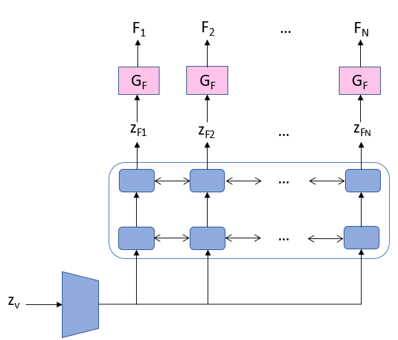
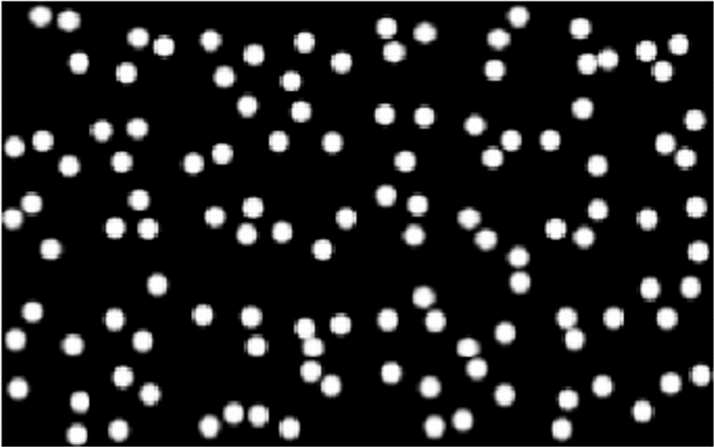
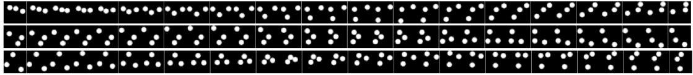
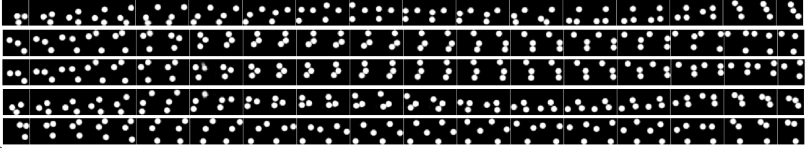
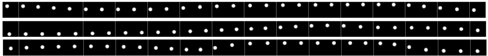
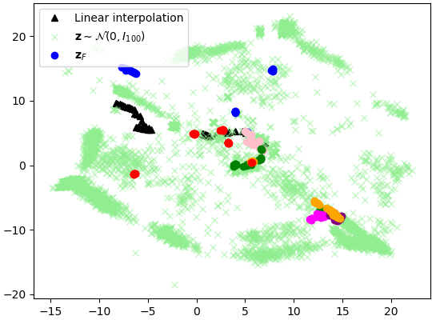

# TITLE: 2019 Learning to Navigate Image Manifolds Induced by Generative Adversarial Networks for Unsupervised Video Generation

- [TITLE: 2019 Learning to Navigate Image Manifolds Induced by Generative Adversarial Networks for Unsupervised Video Generation](#title-2019-learning-to-navigate-image-manifolds-induced-by-generative-adversarial-networks-for-unsupervised-video-generation)
  - [SUMMARY](#summary)
    - [APPLICATIONS SUMMARY](#applications-summary)
    - [ARCHITECTURE SUMMARY](#architecture-summary)
    - [AUTHORS](#authors)
    - [COMPARED TO](#compared-to)
    - [CONTRIBUTIONS](#contributions)
    - [DATASETS](#datasets)
    - [IMPLEMENTATION](#implementation)
    - [METRICS](#metrics)
    - [QUALITATIVE EVALUATION SUMMARY](#qualitative-evaluation-summary)
    - [QUANTITATIVE EVALUATION SUMMARY](#quantitative-evaluation-summary)
    - [RELATED WORK](#related-work)
    - [RESULTS](#results)

## SUMMARY

### APPLICATIONS SUMMARY

### ARCHITECTURE SUMMARY

Fig. 1. Graphical representation of the video generator. Pink blocks represent the pre-trained frame generator.

The proposed method relies on two main components:

- a convolutional frame generator $G_F$ , and
- a recurrent model for generating videos $G_V$.

The goal is to disentangle image quality and temporal coherence components of a video and letting each of the generative models individually focus on one of these two aspects. By doing so, the performance of the model relies on the capability of the frame generator to provide good and diverse images as well as on the sequence generator to be able to sequentially sample frames (i.e. navigate through the frames manifold induced by $G_F$) in a coherent order.

One of the main challenges in such an approach is to be able to train $G_F$ with enough diversity. Several methods have been proposed recently targeting mode dropping in the GAN setting [14]. In our experiments, we found the multiple discriminators approach introduced in [11] to yield better stability during training, as well as higher sample quality and diversity. Training follows the usual steps, i.e. each discriminator is separately updated, but when updating the generator parameters, the average of discriminator losses is considered. Training of $G_F$ was performed with K = 48 discriminators. An architecture similar to DCGAN [2] was employed.

$G_V$ is composed of three main building blocks: an encoding stack of dense layers responsible to map a noise vector $z_v$ into a sequence of high-dimensional vectors. This sequence is fed into a bi-directional recurrent block that computes a sequence of temporally dependent $z_{F_i}$ noise vectors which are then used to sample from $G_F$. Finally, for the case of videos with length N, the output is obtained by sampling N times from the frames generator and ordering the samples to form the final sequence F = ($F_1$, ..., $F_N$). The described framework is represented in Fig. 1. The encoder (trapezoid) is parametrized by fully-connected (FC) layers, and the recurrent model by a two-layer bi-directional LSTM.

The architectures used for the video generation GAN were:

- Generator: FC[100 x 512 x 1024 x 2048 x 3840] $\to$ Bi-LSTM[30 x 128, 30 x 256] $\to$ FC[512, 100].

- Discriminator: similar to [2] but with 3D convolutions in the place of 2D in order to take into account the temporal dimension. Random projections were implemented as norm 1 convolutions.

### AUTHORS

Institut national de la recherche scientifique (INRS-EMT), Quebec, Canada

Centre de Recherche Informatique de Montr´eal (CRIM), Quebec, Canada

- Isabela Albuquerque, INRS-EMT [isabelamcalbuquerque@gmail.com](mailto:isabelamcalbuquerque@gmail.com)
- Joao Monteiro, CRIM [joaomonteirof@gmail.com](mailto:joaomonteirof@gmail.com)
- Tiago H. Falk, INRS-EMT

### COMPARED TO

### CONTRIBUTIONS

- We introduced a novel approach for unsupervised generation of temporal data using GANs.

- Evaluation is performed on unsupervised video generation, and generated video samples presented good quality and diversity per frame as well as temporal coherence.

- This approach further provides indications regarding the structure of the implicit manifold parametrized by GANs, something that still remains elusive in the literature.

- Visualization of latent variables after dimensionality reduction via isomap indicates that the videos manifold is not continuous, as latent representations corresponding to visually similar frames are not necessarily close in the isomap.

### DATASETS

- Moving balls dataset: We built a training dataset composed of 100K samples from bouncing balls data taken from [Unsupervised learning of video representations using lstms ICML 2015](http://proceedings.mlr.press/v37/srivastava15.pdf). Each example consists of 30 frames-long videos with three balls bouncing. Randomly sampled frames from the same set of videos were used to train the frames generator in advance.

### IMPLEMENTATION

By authors in pytorch: <https://github.com/belaalb/frameGAN>

### METRICS

- Mean Squared Error between adjacent frames to evaluate temporal smoothness.

### QUALITATIVE EVALUATION SUMMARY

In Fig. 2, we show samples randomly drawn from the frame generator. By visual inspection, we notice that, as desired, good quality and diversity were obtained.

Fig. 2. Random samples from the frame generator.

Using this model as GF , we train GV and show random samples in Fig. 3b. To provide a reference for comparison, we also show in Fig. 3a three randomly selected video samples drawn from the real data distribution.

Fig. 3. Real data (a) and generated video samples (b). $G_F$ and $G_V$ were both trained using the three bouncing balls dataset. Time increases from left to right.

Fig. 3.(a) Samples from the training data.

Fig. 3.(b) Samples of videos generated by the proposed approach.

Visual inspection of generated sequences of frames indicates that both the quality of individual frames (as ensured by the frame generator) and temporal coherence were close to original samples. More specifically, we notice that most of the transitions between frames are as smooth as in the original data samples.

We further highlight that the generated video samples are diverse, which suggests the proposed training scheme is effective in avoiding strong mode collapse. Nonetheless, failure cases do still occur. For example, on the first row of Fig. 3b we observed an undesired non-smooth transition from the fourth to last to the third to last frames. We also noticed that the temporal dynamics of the videos shown on the second and third rows of Fig. 3b is very similar, even though a framewise comparison shows that the videos are not the same. We refer to this effect as partial mode-collapse and believe this could be mitigated by increasing the number of discriminators when training $G_V$; this is left for future study.

Moreover, time coherence was also studied in a case where GF and GV were trained using different datasets, namely bouncing balls with 1 and 3 balls, respectively. Notice that both one and three bouncing balls datasets have similar temporal dynamics and no further training to fine-tune GV after replacing GF was executed.

Fig. 4. Video generator samples for $G_F$ trained with one bouncing ball and $G_V$ trained with three bouncing balls.

Three samples from the new video generator are shown in Fig. 4, from which one can notice that, even though the dynamics is not perfectly preserved in all frame transitions, as in some cases the ball changes its trajectory without hitting a wall first, smooth transitions between frames are still maintained. This simple experiment indicates that the video generator is indeed able to, at some extent, independently learn the temporal dynamics without specifically focusing on the content of each frame.

Investigating what the frame generator is learning:
We plot the isomap of the sequence of latent variables for 6 videos in order to investigate what the frames generator is learning. We included in this plot samples randomly drawn from the prior $N(0, I_{100})$ with the aim of verifying whether
$G_V$ is simply learning how to sample from the prior without any further knowledge. Another hypothesis we wanted to investigate is whether $G_V$ is learning to linearly interpolate latent variables. For that, we plot in the isomap two sequences of latent variables obtained by linearly interpolating two random samples from the prior. Results are shown in Fig. 5.

Fig. 5. Two-dimensional isomap obtained by plotting $z_{F_i}$ for 6 generated videos (circles, different colors represent different videos), samples from the prior (green crosses), and linear interpolations (black triangles).

By observing the obtained plot, we notice that samples from the prior (green crosses) are spread across the plane, while linear interpolations (black triangles) are concentrated in particular regions of the plane. The set of latent variables obtained with $G_V$ (circles, different colors represent different videos), on the other hand, seem to have a different behavior. In some cases, small clusters of $z_{F_i}$s belonging to the same video are located in different parts of the isomap, which lead us to conclude that the video generator learns to “jump” across the manifold defined by $G_F$ whenever it is necessary.

### QUANTITATIVE EVALUATION SUMMARY

We objectively assessed smoothness by measuring the mean-squared error (MSE) between consecutive frames. Average and standard deviation for 30 random samples drawn
from models obtained using 3 and 1 bouncing balls are presented in Table 1. The same metrics are provided for real data
and videos obtained using a random sequence of latent variables for comparison. For the 1-ball case, generated samples
are as smooth as real videos.

Table 1. A list of batch sizes used in each block. $N_l$ is the batch size at level l. “bs” is a batch size used in the initial abstract map.

| Method                               | Mean   | Std. dev. |
|--------------------------------------|-------:|----------:|
| 3 balls (Real data)                  | 0.0222 | 0.0005    |
| 3 balls (Proposed)                   | 0.0735 | 0.0057    |
| 3 balls ($z_{F_i} \sim N(0, I_100)$) | 0.2060 | 0.0061    |
| 1 ball (Real data)                   | 0.0222 | 0.0005    |
| 1 ball (Proposed)                    | 0.0227 | 0.0051    |
| 1 ball ($z_{F_i} \sim N(0, I_100)$)  | 0.0766 | 0.0023    |

For the 3 ball cases, in turn, aforementioned eventual non-smooth transitions happen for sequences as long as 30 frames, as confirmed by the higher MSE, which is still much lower than random sequences.

### RELATED WORK

- [Generative Adversarial Networks (GANs)](https://papers.nips.cc/paper/5423-generative-adversarial-nets)

### RESULTS
