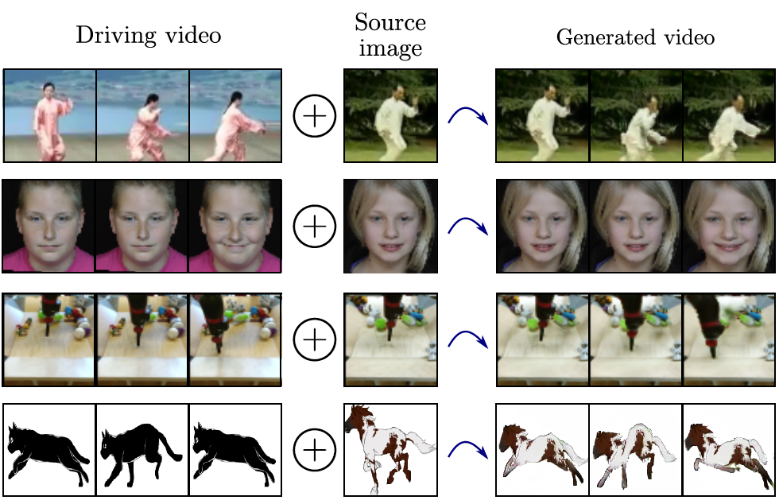
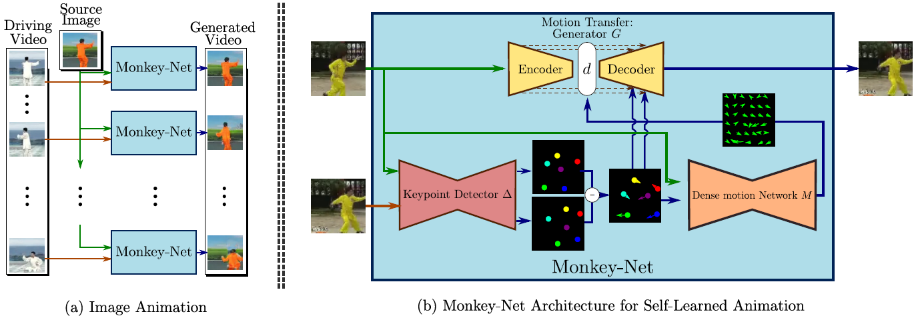
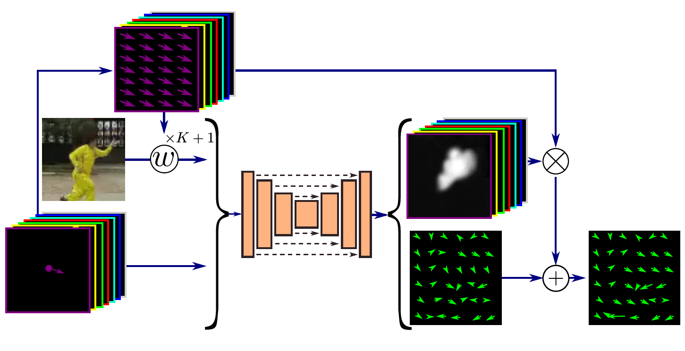
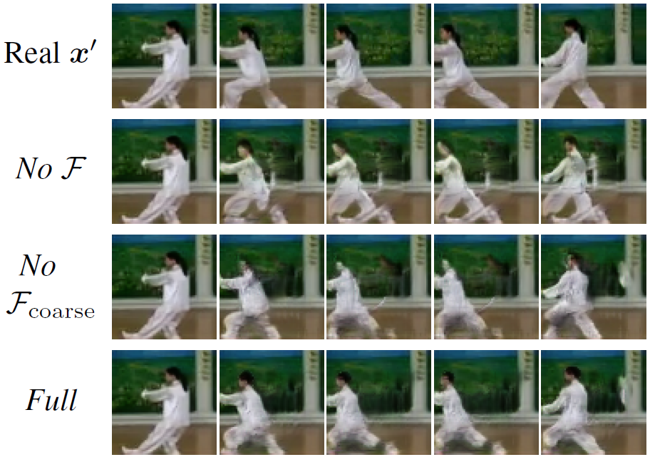
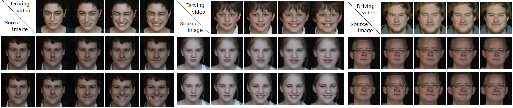
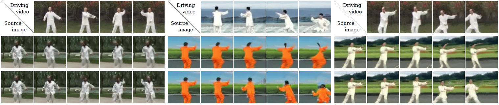
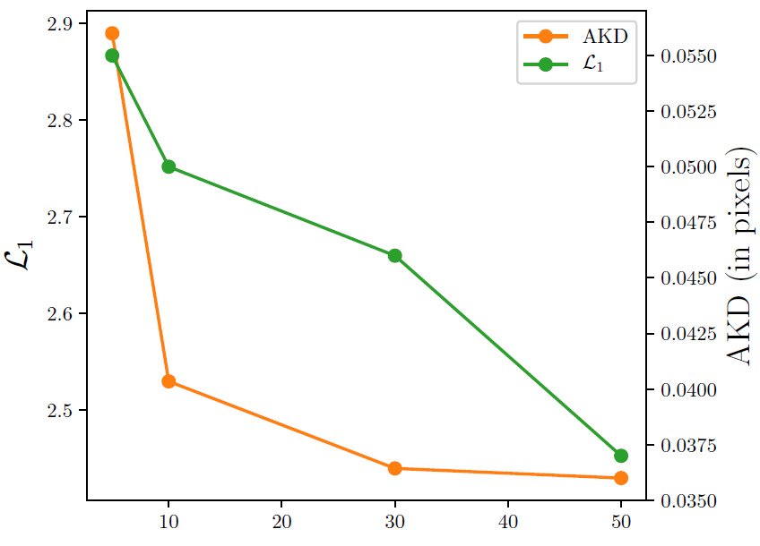
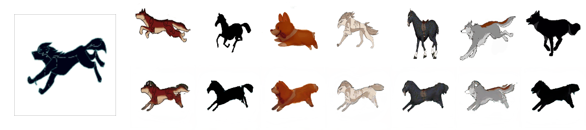

# TITLE: CVPR 2019 Animating Arbitrary Objects via Deep Motion Transfer

- [TITLE: CVPR 2019 Animating Arbitrary Objects via Deep Motion Transfer](#title-cvpr-2019-animating-arbitrary-objects-via-deep-motion-transfer)
  - [SUMMARY](#summary)
    - [APPLICATIONS SUMMARY](#applications-summary)
    - [ARCHITECTURE SUMMARY](#architecture-summary)
    - [AUTHORS](#authors)
    - [COMPARED TO](#compared-to)
    - [CONTRIBUTIONS](#contributions)
    - [DATASETS](#datasets)
    - [IMPLEMENTATION](#implementation)
    - [METRICS](#metrics)
    - [QUALITATIVE EVALUATION SUMMARY](#qualitative-evaluation-summary)
    - [QUANTITATIVE EVALUATION SUMMARY](#quantitative-evaluation-summary)
    - [RELATED WORK](#related-work)
    - [RESULTS](#results)

## SUMMARY

### APPLICATIONS SUMMARY

- Image-to-Video translation

### ARCHITECTURE SUMMARY

Figure 1: Our deep motion transfer approach can animate arbitrary objects following the motion of the driving video.

Figure 2: A schematic representation of the proposed motion transfer framework for image animation. At testing time (Fig.(a)), the model generates a video with the object appearance of the source image but with the motion from the driving video. Monkey-Net (Fig. (b)) is composed of three networks: a motion-specific keypoint detector $\Delta$, a motion prediction network M and an image generator G. G reconstructs the image $x_0$ from the keypoint positions $\Delta(x)$ and $\Delta(x')$. The optical flow computed by M is used by G to handle misalignments between $x$ and $x'$. The model is learned with a self-supervised learning scheme.

- Monkey-Net:
The Monkey-Net architecture is illustrated in Fig. 2.b.
Let $x$ and $x' \in X$ be two frames of size H x W extracted from the same video. The H x W lattice is denoted by $U$. Inspired by [22], we jointly learn a keypoint detector $\Delta$ together with a generator network $G$ according to the following objective: $G$ should be able to reconstruct $x'$ from the keypoint locations $\Delta(x) \in U$, $\Delta(x') \in U$, and $x$. In this formulation, the motion between $x$ and $x'$ is implicitly modeled. To deal with large motions, we aim to learn keypoints that describe motion as well as the object geometry. To this end, we add a third network $M$ that estimates the optical flow $F \in R^{H x W x 2}$ between $x'$ and $x$ from $\Delta(x)$, $\Delta(x')$ and $x$. The motivation for this is twofold. First, this forces the keypoint detector $\Delta$ to predict keypoint locations that capture not only the object structure but also its motion. To do so, the learned keypoints must be located especially on the object parts with high probability of motion. For instance, considering the human body, it is important to obtain keypoints on the extremities (as in feet or hands) in order to describe the body movements correctly, since these body-parts tend to move the most. Second, following common practises in conditional image generation, the generator $G$ is implemented as an encoder-decoder composed of convolutional blocks [21]. However, standard convolutional encoder-decoders are not designed to handle large pixel-to-pixel misalignment between the input and output images [32, 3, 15]. To this aim, we introduce a deformation module within the generator $G$ that employs the estimated optical flow $F$ in order to align the encoder features with $x'$.

Figure 3: A schematic representation of the adopted partbased model for optical flow estimation from sparse representation. From the appearance of the first frame and the keypoints motion, the network M predicts a mask for each keypoint and the residual motion.

- Unsupervised Keypoint Detection:
In this section, we detail the structure employed for unsupervised keypoint detection. First, we employ a standard U-Net architecture that, from the input image, estimates K heatmaps $H_k \in [0, 1]^{H x W}$, one for each keypoint. We employ softmax activations for the last layer of the decoder in order to obtain heatmaps that can be interpreted as detection confidence map for each keypoint. An encoder-decoder architecture is used here since it has shown good performance for keypoints localization.

- From Sparse Keypoints to Dense Optical Flow:
In this section, we detail how we estimate the optical flow F. The task of predicting a dense optical flow only from the displacement of a few keypoints and the appearance of the first frame is challenging. In order to facilitate the task of the network, we adopt a part base formulation. We make the assumption that each keypoint is located on an object part that is locally rigid. Thus, the task of computing the optical flow becomes simpler since, now, the problem consists in estimating masks $M_k \in R^{H x W}$ that segment the object in rigid parts corresponding to each keypoint. A first coarse estimation of the optical flow can be given by:

$$F_{coarse} = \Sigma_{k = 1}^{K + 1}M_k \otimes \rho(h_k)$$

- where $\otimes$ denotes the element-wise product and $\rho(.) \in R^{H x W x 2}$  is the operator that returns a tensor by repeating the input vector H x W times. Additionally, we employ one specific mask $M_{K + 1}$ without deformation (which corresponds to $\rho([0, 0])$) to capture the static background. In addition to the masks $M_k$, the motion network $M$ also predicts the residual motion $F_{residual}$. The purpose of this residual motion field is to refine the coarse estimation by predicting non-rigid motion that cannot be modeled by the part-based approach. The final estimated optical flow is:

$$F = F_{coarse} + F_{residual}$$

- Generation Procedure:
At test time, our network receives a driving video and a source image. In order to generate the $t^{th}$ frame, $\Delta$ estimates the keypoint locations $h^s_k$ in the source image. Similarly, we estimate the keypoint locations $h^1_k$ and $h^t_k$ from first and the $t^{th} frames of the driving video. Rather than
generating a video from the absolute positions of the keypoints, the source image keypoints are transferred according to the relative difference between keypoints in the video. The keypoints in the generated frame are given by:

$$h^{s'}_k = h^s_k + (h^t_k - h^1_k)$$

- The keypoints $h^{s'}_k$ and $h^s_k$ are then encoded as heatmaps using the covariance matrices estimated from the driving video. Finally, the heatmaps are given to the dense motion and the generator networks together with the source image. Importantly, one limitation of transferring relative motion is that it cannot be applied to arbitrary source images. Indeed, if the driving video object is not roughly aligned with the source image object, Eq. (7) may lead to absolute keypoint positions that are physically impossible for the considered object.

### AUTHORS

DISI, University of Trento, Italy and Snap Inc. and Fondazione Bruno Kessler (FBK), Trento, Italy

- Aliaksandr Siarohin [aliaksandr.siarohin@unitn.it](mailto:aliaksandr.siarohin@unitn.it)
- Stephane Lathuiliere [stephane.lathuilire@unitn.it](mailto:stephane.lathuilire@unitn.it)
- Sergey Tulyakov [stulyakov@snap.com](mailto:stulyakov@snap.com)
- Elisa Ricci [e.ricci@unitn.it](mailto:e.ricci@unitn.it)
- Nicu Sebe [niculae.sebe@unitn.it](mailto:niculae.sebe@unitn.it)

### COMPARED TO

- [X2face](https://arxiv.org/abs/1807.10550) for motion transfer and image to video translation
- [MoCoGAN](https://arxiv.org/abs/1707.04993) for image to video translation
- [CMM-Net](https://arxiv.org/abs/1802.01873) for image to video translation
- [SV2P](https://arxiv.org/abs/1710.11252) for image to video translation

### CONTRIBUTIONS

- The objective of this work is to animate an object based on the motion of a similar object in a driving video. We introduce a novel deep learning approach for image
animation. Via the use of motion-specific keypoints, previously learned following a self-supervised approach, our model can animate images of arbitrary objects according to the motion given by a driving video.

- Our experiments, considering both automatically computed metrics and human
judgments, demonstrate that the proposed method outperforms previous work on unsupervised image animation.

- We show that with little adaptation our method can perform Image-to-Video translation (by adding an LSTM to generate keypoints for each frame).

### DATASETS

- Nemo: The UvA-Nemo dataset [11] is a facial dynamics analysis dataset composed of 1240 videos We follow
the same pre-processing as in [41]. Specifically, faces are aligned using the OpenFace library [1] before re-sizing each frame to 64 x 64 pixels. Each video starts from a neutral expression and lasts 32 frames. As in [41], we use 1110 videos for training and 124 for evaluation.

- Tai-Chi: The Tai-Chi dataset [35] is composed of 4500 tai-chi video clips downloaded from YouTube. We use the data as pre-processed in [35]. In particular, the frames are resized to 64 x 64 pixels. The videos are split into 3288 and 822 videos for training and testing respectively. The video length varies from 32 to 100 frames.

- Bair: The BAIR robot pushing dataset [12] contains videos collected by a Sawyer robotic arm pushing a variety of objects over a table. It contains 40960 training and 256 test videos. Each video is 64 x 64 pixels and has 30 frames.

- MGif dataset (created by authors): We collected an additional dataset of videos containing
movements of different cartoon animals. Each video is a moving gif file. Therefore, we called this new dataset MGif. The dataset consists of 1000 videos, we used 900 videos for training and 100 for evaluation. Each video has size 128 x 128 and contains from 5 to 100 frames. The dataset is particularly challenging because of the high appearance variation and motion diversity. Note that in the experiments
on this dataset, we use absolute keypoint locations from the driving video instead of the relative keypoint motion.

### IMPLEMENTATION

- In pytorch by the authors: <https://github.com/AliaksandrSiarohin/monkey-net>

### METRICS

- L1. In the case of the video reconstruction task where the ground truth video is available, we compare the average L1 distance between pixel values of the ground truth and the generated video frames.

- Average Keypoint Distance (AKD): For the Tai-Chi and Nemo datasets, we employ external keypoint detectors in order to evaluate whether the motion of the generated video matches the ground truth
video motion. For the Tai-Chi dataset, we employ the human-pose estimator in [8]. For the Nemo dataset we use the facial landmark detector of [6]. We compute these keypoints for each frame of the ground truth and the generated videos. From these externally computed keypoints, we deduce the Average Keypoint Distance (AKD), i.e. the average distance between the detected keypoints of the ground truth
and the generated video.

- Missing Keypoint Rate (MKR): In the case of the Tai-Chi dataset, the human-pose estimator returns also a binary label for each keypoint indicating whether the keypoints were successfully detected. Therefore, we also report the Missing Keypoint Rate (MKR) that is the percentage of keypoints that are detected in the ground truth frame but not in the generated one. This metric evaluates the appearance quality of each video frame.

- Average Euclidean Distance (AED): We compute the feature-based metric employed in [13] that consists in computing the Average Euclidean Distance (AED) between a feature representation of the ground truth and the generated video frames. The feature embedding is chosen such that the metric evaluates how well the
identity is preserved. More precisely, we use a network trained for facial identification [1] for Nemo and a network trained for person re-id [18] for Tai-Chi.

- Frechet Inception Distance (FID): When dealing with Image-to-video translation, we complete our evaluation with the Frechet Inception Distance (FID) in order to evaluate the quality of individual
frames.

- User study on Amazon Mechanical Turk: Furthermore, we conduct a user study for both the Imageto- Video translation and the image animation tasks. In order to further consolidate the quantitative and qualitative evaluations, we performed user studies for both the Image-to-Video translation (see the Supplementary Material) and the image animation problems using Amazon Mechanical Turk.

### QUALITATIVE EVALUATION SUMMARY

Figure 4: Qualitative ablation evaluation of video reconstruction on Tai-Chi.

Figure 5: Qualitative results for image animation on the Nemo dataset: X2face (2-nd row) against our method (3-rd row).

Figure 6: Qualitative results for image animation on the Tai-Chi dataset: X2face (2-nd row) against our method (3-rd row)

### QUANTITATIVE EVALUATION SUMMARY

We evaluate Monkey-Net on the task of video reconstruction. This consists in reconstructing
the input video from a representation in which motion and content are decoupled. This task is a “proxy” task to image animation and it is only introduced for the purpose of quantitative comparison. In our case, we combine the extracted keypoints $\Delta(x)$ of each frame and the first frame of the video to re-generate the input video.

Table 1: Video reconstruction comparisons

| Method | Tai-Chi L1 | Tai-Chi (AKD, MKR) | Tai-Chi AED | Nemo L1 | Nemo AKD | Nemo AED | Bair L1 |
|--------|-----------:|-------------------:|------------:|--------:|---------:|---------:|--------:|
| X2Face | 0.068      | (4.50, 35.7%)      | 0.27        | 0.022   | 0.47     | 0.140    | 0.069   |
| Ours   | **0.050**  | **(2.53, 17.4%)**  | **0.21**    |**0.017**| **0.37** |**0.072** |**0.025**|

We present an ablation study to empirically measure the impact of each part of our proposal on the
performance. First, we describe the methods obtained by removing key parts of the model.

- No $F$: the dense optical flow network $M$ is not used.
- No $F_{residual}$: in the Optical Flow network $M$, we do not use $F_{residual}$.
- No $F_{coarse}$: in the optical flow network $M$, we do not use the part based-approach.
- No $\Sigma_k$: we do not estimate the covariance matrices $\Sigma_k$ in the keypoint detector $\Delta$ and the variance is set to $\Sigma_k$ = 0.01 as in [22].
- No $x$: the source image is not given to the motion network $M$. $M$ estimates the dense optical flow only from the keypoint location differences.
- Full denotes the full model.

Table 2: Video reconstruction ablation study TaiChi.

| Method            | L1        | (AKD, MKR)        | AED      |
|-------------------|----------:|------------------:|---------:|
| No $F$            | 0.057     | (3.11, 23.8%)     | 0.24     |
| No $F_{residual}$ | 0.051     | (2.81, 18.0%)     | 0.22     |
| No $F_{coarse}$   | 0.052     | (2.75, 19.7%)     | 0.22     |
| No $\Sigma_k$     | 0.054     | (2.86, 20.6%)     | 0.23     |
| No $x$            | 0.051     | (2.71, 19.3%)     | **0.21** |
| Full              | **0.050** | **(2.53, 17.4%)** | **0.21** |

We first observe that our full model outperforms the baseline method without deformation. This trend is observed according to all the metrics. This illustrates the benefit of deforming the features maps according to the estimated motion. Moreover, we note that No $F_{coarse}$ and No $F_{residual}$ both perform worse than when using the full optical flow network. This illustrates that $F_{coarse}$ and $F_{residual}$ alone are not able to estimate dense motion accurately.

Additional ablation study:
We perform experiments to measure the impact of the number of keypoints on video reconstruction quality. We report results on Tai-Chi dataset in Fig. 7. We computed L1 and AKD metrics as described in the paper.

Figure 7: Reconstruction Errors as functions of the number of keypoints. Results obtained on Tai-Chi.

As expected, increasing the number of keypoints leads to a lower reconstruction error, but additional keypoints introduce memory and computational overhead. We use 10 keypoints in all our experiments, since we consider this to be a good trade-off.

We also evaluate our approach on the problem of Image-to-Video translation.
Introduced in VGAN paper, this problem consists of generating a video from its first frame. Since our model is not directly designed for this task, we train a small recurrent neural network that predicts, from the keypoint coordinates in the first frame, the sequence of keypoint coordinates for the other 32 frames.

Table 3: Image-to-video translation comparisons:

Taichi:
| Method  | FID       | AED      | MKR       |
|---------|----------:|---------:|----------:|
| MoCoGAN | 54.83     | 0.27     | 46.2%     |
| Ours    | **19.75** | **0.17** | **30.3%** |

Nemo:
| Method  | FID       | AED      |
|---------|----------:|---------:|
| MoCoGAN | 51.50     | 0.33     |
| CMM-Net | 27.27     | 0.13     |
| Ours    | **11.97** | **0.12** |

Bair:
| Method  | FID       |
|---------|----------:|
| MoCoGAN | 244.00    |
| SV2P    | 57.90     |
| Ours    | **23.20** |

For the image animation problem, our model is again compared with X2face [42] according to the following protocol: we randomly select 50 pairs of videos where objects in the first frame have a similar pose. Three videos are shown to the user: one is the driving video (reference) and 2 videos from our method and X2Face. The users are given the following instructions: Select the video that better corresponds to the animation in the reference video. We collected annotations for each video from 10 different users. The results are presented in Tab. 4. Our generated videos are preferred over X2Face videos in almost more than 80% of the times for all the datasets. Again, we observe that the preference toward our approach is higher on the two datasets which correspond to large motion patterns.

Table 4: User study results on image animation. Proportion of times our approach is preferred over X2face.

| Tai-Chi | Nemo  | Bair  |
|--------:|------:|------:|
| 85.0%   | 79.2% | 90.8% |

### RELATED WORK

- Deep Video Generation: Early deep learning-based approaches for video generation proposed synthesizing videos by using spatio-temporal networks. Vondrick et al. [38] introduced VGAN, a 3D convolutional GAN which simultaneously generates all the frames of the target video. Similarly, Saito et al. [31] proposed TGAN, a GAN-based model which is able to generate multiple frames at the same time. However, the visual quality of these methods outputs is typically poor. Wang et al. [41] introduced a Conditional MultiMode Network (CMM-Net), a deep architecture which adopts a conditional Long-Short Term Memory (LSTM) network and a VAE to generate face videos. Tulyakov et al. [35] proposed MoCoGAN, a deep architecture based on a recurrent neural network trained with an adversarial
learning scheme. These approaches can take conditional information as input that comprises categorical labels or static images and, as a result, produces high quality
video frames of desired actions.

- Object Animation: Image animation from a driving video can be interpreted
as the problem of transferring motion information from one domain to another. Bansal et al. [4] proposed Recycle-GAN, an approach which extends conditional GAN by incorporating spatio-temporal cues in order to generate a video in one domain given a video in another domain. However, their approach only learns the association between two specific domains, while we want to animate an image depicting
one object without knowing at training time which object will be used in the driving video. Similarly, Chan et al. [9] addressed the problem of motion transfer, casting
it within a per-frame image-to-image translation framework. They also proposed incorporating spatio-temporal constraints. The importance of considering temporal dynamics for video synthesis was also demonstrated in [39]. Wiles et al. [42] introduced X2Face, a deep architecture which, given an input image of a face, modifies it according to the motion patterns derived from another face or another
modality, such as audio. They demonstrated that a purely data-driven deep learning-based approach is effective in animating still images of faces without demanding explicit 3D representation. In this work, we design a self-supervised
deep network for animating static images, which is effective for generating arbitrary objects.

- Our approach is closely related to these previous works since we also aim to generate video sequences by using a deep learning architecture. However, we tackle a more challenging task: image animation requires decoupling and modeling motion and content information, as well as a recombining them.

### RESULTS

Nemo:

Taichi:

Bair:

MGif:

