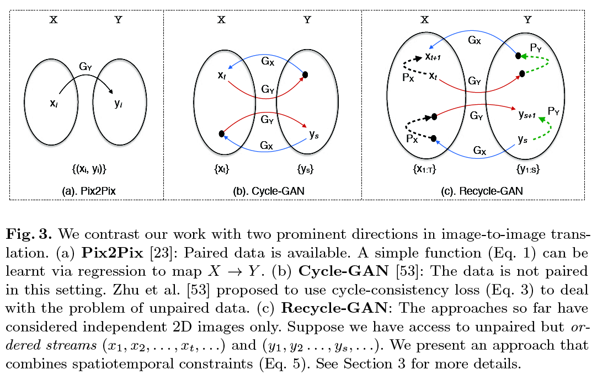
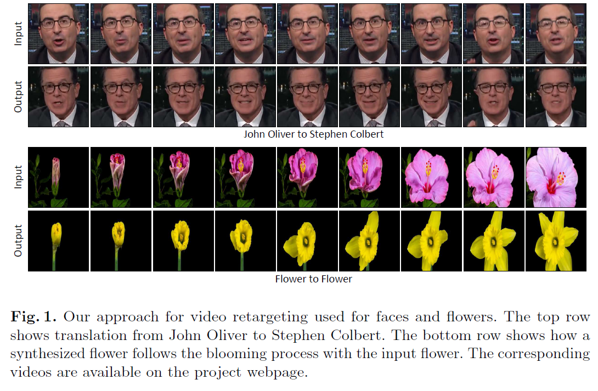

# TITLE: ECCV 2018 Recycle GAN Unsupervised Video Retargeting

## SUMMARY

### ARCHITECTURE SUMMARY

We adopt much of the training details from Cycle-GAN [53] to train our spatial translation model, and Pix2Pix [23] for our temporal prediction model. The generative network consists of two convolution (downsampling with stride-2), six residual blocks and finally two upsampling convolution (each with a stride 0.5). We use the same network architecture for $G_X$, and $G_Y$. The resolution of the images for all the experiments is set to 256 x 256. The discriminator network is a 70 x 70 PatchGAN [23,53] that is used to classify a 70 x 70 image patch if it is real or fake. We set all $\lambda_s$ = 10. To implement our temporal predictors $P_X$ and $P_Y$ , we concatenate the last two frames as input to a network whose architecture is identical to U-Net architecture [23,37].

### COMPARED TO

- CycleGAN

### CONTRIBUTIONS

- We introduce a new approach that incorporates spatiotemporal cues along with conditional generative adversarial networks [15] for video retargeting. We demonstrate the advantages of spatiotemporal constraints over the spatial constraints alone for image-to-labels, and labels-to-image in varying environmental settings. We then show the importance of proposed approach in learning better association between two domains, and its importance for self-supervised content alignment of the visual data. Inspired by the ever-existing nature of space-time, we qualitatively demonstrate the effectiveness of our approach for various natural processes such as face-to-face translation, flower-to-flower, synthesizing clouds and winds, aligning sunrise and sunset.

- In this work, we use our model trained with spatiotemporal constraints to align the
semantical content of two videos in a self-supervised manner, and do automatic
alignment of the visual data without any additional supervision.

### DATASETS

Face and Flowers datasets were created by authors. All 3 datasets are available on github: <https://github.com/aayushbansal/Recycle-GAN>

- Face
- Flowers
- Viper (used as a proxy for Cityscapes)

### IMPLEMENTATION

Python and pytorch (by the authors): <https://github.com/aayushbansal/Recycle-GAN>

### QUALITATIVE EVALUATION SUMMARY

- Face to Face: We use the publicly available videos of various public figures
for the face-to-face translation task. The faces are extracted using the facial
keypoints generated using the OpenPose Library[6] and a minor manual efforts
are made to remove false positives.

- Flower to Flower: We use various flowers, and extracted their
time-lapse from publicly available videos. The time-lapses show the blooming of
different flowers but without any sync. We use our approach to align the content,
i.e. both flowers bloom or die together.

- Windy and cloudy weather conditions, sunrise and sunset.

### RESULTS

