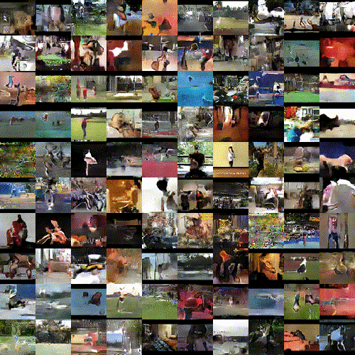

# TITLE: ICCV 2017 Temporal Generative Adversarial Nets with Singular Value Clipping

- [TITLE: ICCV 2017 Temporal Generative Adversarial Nets with Singular Value Clipping](#title-iccv-2017-temporal-generative-adversarial-nets-with-singular-value-clipping)
  - [SUMMARY](#summary)
    - [APPLICATIONS SUMMARY](#applications-summary)
    - [ARCHITECTURE SUMMARY](#architecture-summary)
    - [AUTHORS](#authors)
    - [COMPARED TO](#compared-to)
    - [CONTRIBUTIONS](#contributions)
    - [DATASETS](#datasets)
    - [IMPLEMENTATION](#implementation)
    - [METRICS](#metrics)
    - [QUALITATIVE EVALUATION SUMMARY](#qualitative-evaluation-summary)
    - [QUANTITATIVE EVALUATION SUMMARY](#quantitative-evaluation-summary)
    - [RESULTS](#results)
  - [REASONING AND RELATED WORK](#reasoning-and-related-work)
  - [ARCHITECTURE](#architecture)
  - [REGULARIZATION](#regularization)
  - [APPLICATIONS](#applications)
  - [EXPERIMENTS](#experiments)
  - [QUANTITATIVE EVALUATION](#quantitative-evaluation)

## SUMMARY

### APPLICATIONS SUMMARY

- Frame interpolation by simply interpolating the trajectory in the latent space $[z^1_1, z^2_1, ... , z^T_1]$ and running the image generator $G_1$ on the new points. The authors used a simple bilinear filter for interpolating the $z^t_1$. The resulting images have more realistic motion dynamics than what a simple image interpolation method on $x^t$ would produce.

- Condition TGAN can use label information (category of video) to produce better quality videos. The labels are converted to one hot vectors and given to $G_0$, $G_1$ and the discriminator. The one hot vector is broadcast to a voxel of the same resolution as the video and concatenated with the video and this is given to the discriminator.

### ARCHITECTURE SUMMARY


Temporal genrator $G_0$ turns a fixed length random vector $z_0$ drawn from a uniform distribution in [-1, 1] into a series of random vectors $[z^1_1, z^2_1, ..., z^T_1]$

$$G_0: z_0 \to [z^1_1, z^2_1, ..., z^T_1]$$

Conv1d is used to turn a $z_0$ which is of 1 time step and $K_0$ channels into T time steps and $K_1$ channel $[z^1_1, z^2_1, ..., z^T_1]$

Example (testing-chainer <https://colab.research.google.com/drive/1LOC2A8m7slamX-cykkbs4ThxpjpXf0BH#scrollTo=8CRL9QaZjJYA):>

```text
debug 1: (16, 100, 1)
debug 2: (16, 512, 1)
debug 3: (16, 256, 2)
debug 4: (16, 128, 4)
debug 5: (16, 128, 8)
debug 6: (16, 100, 16)

(16, 100, 16)
(batch_size, 100 channels, 1 timestep) into (batch_size, 100 channels, 16 time steps)
```

Image generator $G_1$ turns each random vector $z^t_1$ and the fixed $z_0$ into an single frame of the video.

$$G_1: (z^t_1, z_0) \to x^t$$

Same example as before (testing-chainer <https://colab.research.google.com/drive/1LOC2A8m7slamX-cykkbs4ThxpjpXf0BH#scrollTo=8CRL9QaZjJYA):>

```text
debug -4: (16, 100)
debug -3: original shape: (16, 4096) , target shape: (16, 256, 4, 4)
debug -2: original shape: (16, 4096) , target shape: (16, 256, 4, 4)
debug -1: (16, 256, 4, 4) (16, 256, 4, 4)
debug 0: (16, 512, 4, 4)
debug 1: (16, 256, 8, 8)
debug 2: (16, 128, 16, 16)
debug 3: (16, 64, 32, 32)
debug 4: (16, 32, 64, 64)
debug 5: (16, 1, 64, 64)

(16, 1, 64, 64)
(batch_size, 1 channels, 64 height, 64 width) for moving mnist
```

Discriminator takes the entire video as input. Discriminator consists of just 4 Conv3d layers and 1 Conv2d layer leading to a real scalar value. Wasserstein loss is used. SVD clipping is used to enforce Lipschitz constraint. SVD of each weight matrix is calculated and all singular values above 1 are set to 1. SVD is expensive and only done every 5 iterations. The discriminator is trained for 1 iteration just like normal GAN (but can be trained for more iterations since Wasserstein loss is being used).

Same example as before (testing-chainer <https://colab.research.google.com/drive/1LOC2A8m7slamX-cykkbs4ThxpjpXf0BH#scrollTo=8CRL9QaZjJYA):>

```text
debug 0: (16, 1, 16, 64, 64)
debug 1: (16, 64, 8, 32, 32)
debug 2: (16, 128, 4, 16, 16)
debug 3: (16, 256, 2, 8, 8)
debug 4: (16, 512, 1, 4, 4)
debug 5: (16, 512, 4, 4)
debug 6: (16, 1, 1, 1)

((16, 1, 1, 1), dtype('float32'))
(batch_size, 1 channels, 1 height, 1 width) scalar output of discriminator.
```

### AUTHORS

Preferred Networks inc., Japan

- Masaki Saito [msaito@preferred.jp](mailto:msaito@preferred.jp)
- Eiichi Matsumoto [matsumoto@preferred.jp](mailto:matsumoto@preferred.jp)
- Shunta Saito [shunta@preferred.jp](mailto:shunta@preferred.jp)

### COMPARED TO

- 3D model (custom model). A simple model in which the generator has one linear layer and
four 3D deconvolutional layers and the discriminator has five 3D convolutional layers.

- Video GAN nips-2016-generating-videos-with-scene-dynamics

### CONTRIBUTIONS

- The generative model that can efficiently capture the latent space
of the time dimension in videos. It also enables a natural
extension to an application such as frame interpolation.

- The alternative parameter clipping method for WGAN that
significantly stabilizes the training of the networks that have
advanced structure.

### DATASETS

- Moving MNIST
- UCF-101
- Golf scene dataset

### IMPLEMENTATION

In Chainer by the authors: <https://github.com/pfnet-research/tgan>

### METRICS

- Generative Adversarial Metric (GAM compares adversarial models against each other)
- Inception score

### QUALITATIVE EVALUATION SUMMARY

- Moving MNIST: Predicted frames by the existing model tend to be blurry. TGAN is capable of producing consistent frames in which each image is sharp, clear and easy to discriminate two digits. However even though each digit continues to move in a straight line, its shape sometimes slightly changes by time. Even though existing models seem to generate frames in which each digit does not change, these methods
can not be directly compared with TGAN because the qualitative results the authors have shown are for “video prediction” that predicts future frames from initial inputs,
whereas TGAN generates them without such priors. In order to illustrate the effectiveness of $z_0$ in $G_1$, we further conducted the experiment with the TGAN in which G1 does not take $z_0$ as an argument (model (c)). In this experiment, we observed that in the model (c) the problem of mode collapse tends to occur compared to our model.


- Videos generated by the 3D model have the most artifacts compared with other models. VideoGAN tends to avoid these artifacts because the background is relatively fixed in the UCF-101, however the probability of generating unidentified videos is higher than that of TGAN. This is because VideoGAN is vulnerable to videos with background movement. In order to indicate that the quality of our model is comparable with that of VideoGAN (these results can be seen in their project page), an experiment was conducted with the golf scene dataset. This dataset, in which the background is always fixed, is advantageous for VideoGAN that exploits this
assumption. Even under such unfavorable conditions, the quality of the videos generated by our model is almost the same as the existing method; both create a figure that seems likes a person’s shadow, and it changes with time.


### QUANTITATIVE EVALUATION SUMMARY

Table 4. Inception scores for models of UCF-101.

|Method                      | Inception Score |
|----------------------------|----------------:|
| 3D model (Weight clipping) |  4.32 ± .01     |
| 3D model (SVC)             |  4.78 ± .02     |
| Video GAN (Normal GAN)     |  8.18 ± .05     |
| Video GAN (SVC)            |  8.31 ± .09     |
| TGAN (Normal GAN)          |  9.18 ± .11     |
| TGAN (Weight clipping)     | 11.77 ± .11     |
| TGAN (SVC)                 | 11.85 ± .07     |
| Conditional TGAN (SVC)     | 15.83 ± .18     |
| UCF-101 dataset            | 34.49 ± .03     |

Ablation study:
Table 3. GAM scores for models of moving MNIST. “TGAN” denotes
the model trained with the WGAN and the SVC. In “TGAN
($G_1(z^t_1)$)”, $G_1$ has $z_1$ only (the SVC was used for training). “3D
model (GAN)” and “3D model (SVC)” were trained with the normal
GAN and the SVC, respectively.

| Model A | Model B             | GAM score | Winner |
|---------|---------------------|----------:|--------|
| TGAN    | 3D model (GAN)      | 1.70      | TGAN   |
| TGAN    | 3D model (SVC)      | 1.27      | TGAN   |
| TGAN    | TGAN ($G_1(z^t_1)$) | 1.03      | TGAN   |

### RESULTS



## REASONING AND RELATED WORK

Although a simple approach is to use 3D convolutional
layers for representing the generating process of a video, it
implies that images along x-t plane and y-t plane besides
x-y plane are considered equally, where x and y denote
the spatial dimensions and t denotes the time dimension.
We believe that the nature of time dimension is essentially
different from the spatial dimensions in the case of videos
so that such approach has difficulty on the video generation
problem. The relevance of this assumption has been also
discussed in some recent studies [33, 24, 46] that have shown
good performance on the video recognition task.

Our contributions are summarized as follows. (i) The
generative model that can efficiently capture the latent space
of the time dimension in videos. It also enables a natural
extension to an application such as frame interpolation. (ii)
The alternative parameter clipping method for WGAN that
significantly stabilizes the training of the networks that have
advanced structure.

The Generative Adversarial Network (GAN), which we
have mainly employed in this study, is a model for unsupervised
learning that finds a good representation of samples
by simultaneously training two different networks called the
generator and the discriminator.

In particular, Ranzato et al. [28]
proposed a Recurrent Neural Network (RNN) model that can
learn both spatial and temporal correlations.

Kalchbrenner et al. [15] also
employed a convolutional LSTM model, and proposed Video
Pixel Networks that directly learn the joint distribution of
the raw pixel values.

However, the above studies cannot directly be applied to the
task of generating entire sequences from scratch since they
require an initial sequence as an input.

It is known that the GAN training is unstable and requires
careful adjustment of the parameters. To overcome such
instability of learning, Arjovsky et al. [1] focused on the
property that the GAN training can also be interpreted as the
minimization of the Jensen-Shannon (JS) divergence, and
proposed Wasserstein GAN (WGAN) that trains the generator
and the discriminator to minimize an Earth Mover’s
distance (EMD, a.k.a. first Wasserstein distance) instead
of the JS divergence. Several experiments the authors conducted
reported that WGANs are more robust than ordinal
GANs, and tend to avoid mode dropping.

In order to make the discriminator be the K-Lipschitz,
the authors proposed a method that clamps all the weights
in the discriminator to a fixed box denoted as w ∈ [−c, c].
Although this weight clipping is a simple and assures the discriminator
satisfies theK-Lipschitz condition, it also implies
we cannot know the relation of the parameters between c
and K. As it is known that the objective of the discriminator
of Eq.(2) is a good approximate expression of EMD in the
case of K = 1, this could be a problem when we want to
find the approximate value of EMD.

## ARCHITECTURE


| Temporal generator | Image generator                                        |
|--------------------|--------------------------------------------------------|

| $z_0 \in R^{1 \times 100}$ | $z_0 \in R^{1 \times 100}$ | $z^t_1 \in R^100$ |
|-----------------------|-------------------|---------------------------------|
| deconv (1, 512, 0, 1) | linear (256 · 42) | linear (256 · 42)               |
| deconv (4, 256, 1, 2) | concat + deconv (4, 256, 1, 2)                      |
| deconv (4, 128, 1, 2) | deconv (4, 128, 1, 2)                               |
| deconv (4, 128, 1, 2) | deconv (4, 64, 1, 2)                                |
| deconv (4, 100, 1, 2) | deconv (4, 32, 1, 2)                                |
| tanh                  | deconv (3, 3, 1, 1) + tanh                          |

Table 1. Network configuration of the generator. The second row
represents the input variables. “linear (·)” is the number of output
units in the linear layer. The parameters in the convolutional and
the deconvolutional layer are denoted as “conv/deconv ((kernel
size), (output channels), (padding), (strides)).”

Temporal GAN
Here we introduce the proposed model based on the above
discussion. Let T > 0 be the number of frames to be generated,
and $G_0 : R^{K_0} -> R^{T \times K_1}$ be the temporal generator
that gets another latent variable $z_0 \in R^{K_0}$ as an argument
and generates latent variables denoted as $[z^1_1, ... , z^T_1]$. In our
model, $z_0$ is randomly drawn from a distribution $p_{G_0}(z_0)$.
Next, we introduce image generator $G_1 : R^{K_0} \times R^{K_1} -> R^M$
that yields a video from these latent variables. Note
that $G_1$ takes both the latent variables generated from $G_0$
as well as original latent variable $z_0$ as arguments.
While $z_1$ varies with time, $z_0$ is invariable regardless of the time,
and we empirically observed that it has a significant role in
suppressing a sudden change of the action of the generated
video. That is, in our representation, the generated video is
represented as $[G_1(z_0, z^1_1), ... , G_1(z_0, z^T_1)]$.

Temporal generator Unlike typical CNNs that perform
two-dimensional convolutions in the spatial direction, the
deconvolutional layers in the temporal generator perform
a one-dimensional deconvolution in the temporal direction.
For convenience of computation, we first regard z_0 \in R^K_0
as a one-dimensional activation map of z_0 \in R^1 x K_0 , where
the length and the number of channels are one and K_0, respectively.
A uniform distribution is used to sample z_0.
Next, applying the deconvolutional layers we expand its
length while reducing the number of channels. The settings
for the deconvolutional layers are the same as those
of the image generator except for the number of channels
and one-dimensional deconvolution. Like the original image
generator we insert a Batch Normalization (BN) layer [13]
after deconvolution and use Rectified Linear Units (ReLU)
[23] as activation functions.

Image generator The image generator takes two latent
variables as arguments. After performing a linear transformation
on each variable, we reshape them into the form
shown in Table 1, concatenate them and perform five deconvolutions.
These settings are almost the same as the existing
DCGAN, i.e., we used ReLU [23] and Batch Normalization
layer [13]. The kernel size, stride, and padding are respectively
4, 2, and 2 except for the last deconvolutional layer.
Note that the number of output channels of the last deconvolutional
layer depends on whether the dataset contains color
information or not.

Discriminator We employ spatio-temporal 3D convolutional
layers to model the discriminator. The layer settings
are similar to the image generator. Specifically, we use four
convolutional layers with 4 x 4 x 4 kernel and a stride of 2.
The number of output channels is 64 in the initial convolutional
layer, and set to double when the layer goes deeper. As
with the DCGAN, we used LeakyReLU [20] with a = 0.2
and Batch Normalization layer [13] after these convolutions.
Note that we do not insert the batch normalization after the
initial convolution. Finally, we use a fully-connected layer
and summarize all of the units in a single scalar. Each shape
of the tensor used in the discriminator is shown in Fig.1.

## REGULARIZATION

Singular Value Clipping
As we described before, WGAN requires the discriminator
to fulfill the K-Lipschitz constraint, and the authors employed
a parameter clipping method that clamps the weights
in the discriminator to [−c, c]. However, we empirically observed
that the tuning of hyper parameter c is severe, and it
frequently fails in learning under a different situation like
our proposed model. We assumed this problem would be
caused by a property that the K-Lipschitz constraint widely
varies depending the value of c, and propose an alternative
method that can explicitly adjust the value of K.

To satisfy 1-Lipschitz constraint, we add a constraint to
all linear layers in the discriminator that satisfies the spectral
norm of weight parameter W is equal or less than one. This
means that the singular values of weight matrix are all one or
less. To this end, we perform singular value decomposition
(SVD) after parameter update, replace all the singular values
larger than one with one, and reconstruct the parameters with
them. We also apply the same operation to convolutional
layers by interpreting a higher order tensor in weight parameter
as a matrix ˆW . We call these operations Singular Value
Clipping (SVC).

As with the linear and the convolutional layer, we clamp
the value of γ which represents a scaling parameter of the
batch normalization layer in the same way. We summarize
a clipping method of each layer in Table 2.

The clear advantage of our alternative clipping method
is that it does not require the careful tuning of hyperparameter
c. Another advantage we have empirically observed is
to stabilize the training of WGAN; in our experiments, our
method can successfully train an advanced model even under
the situation where the behavior of loss function becomes unstable
with the conventional clipping. We show an example
of such differences in Fig.2.

Although the problem of SVC is an increased computational
cost, it can be mitigated by decreasing the frequency
of performing the SVC. We show the summary of the algorithm
of WGAN with the SVC in Algorithm 1. In our
experiments, the computational time of SVD is almost the
same as that of the forward-backward computation, but we
observed the frequency of clipping is sufficient once every
five iterations, i.e., nclip = 5.

## APPLICATIONS

Frame interpolation:
One of the advantages of our model is to be able to generate
an intermediate frame between two adjacent frames.
Since the video generation in our model is formulated as
generating a trajectory in the latent image space represented
by [z_0 and z^t_1] , our generator can easily yield long sequences
by just interpolating the trajectory. Specifically, we add
a bilinear filter to the last layer of the temporal generator,
and interpolate the trajectory in the latent image space (see
Section 3.4).

Conditional TGAN:
In some cases, videos in a dataset contain some labels
which correspond to a category of the video such as
“IceDancing” or “Baseball”. In order to exploit them and improve
the quality of videos by the generator, we also develop
a Conditional TGAN (CTGAN), in which the generator can
take both label l and latent variable z_0.
The structure of CTGAN is similar with that of the original
Conditional GAN. In temporal generator, after transforming
l into one-hot vector vl, we concatenate both this vector
and z0, and regard it as a new latent variable. That is, the
temporal generator of the CTGAN is denoted as G0(z0, vl).
The image generator of the CTGAN also takes the one-hot
label vector as arguments, i.e., G1(z0, zt
1 , vl). As with the
original image generator, we first perform linear transformation
on each variable, reshape them, and operate five
deconvolutions.
In the discriminator, we first broadcast the one-hot label
vector to a voxel whose resolution is the same as that of
the video. Thus, if the number of elements of vl is V , the
number of channels of the voxel is equal to V . Next, we
concatenate both the voxel and the input video, and send it
into the convolutional layers.

## EXPERIMENTS

Moving MNIST To investigate the properties of our models,
we trained the models on the moving MNIST dataset
[35], in which there are 10,000 clips each of which has 20
frames and consists of two digits moving inside a 64 x 64
patch. In these clips, two digits move linearly and the direction
and magnitude of motion vectors are randomly chosen.
If a digit approaches one of the edges in the patch, it bounces
off the edge and its direction is changed while maintaining
the speed. In our experiments, we randomly extracted 16
frames from these clips and used them as a training dataset.

UCF-101 UCF-101 is a commonly used video dataset that
consists of 13,320 videos belonging to 101 different categories
such as IceDancing and Baseball Pitch [34]. Since
the resolution of videos in the dataset is too large for the generative
models, we resized all the videos to 85 x 64 pixels,
randomly extracted 16 frames, and cropped a center square
with 64 pixels.

Golf scene dataset Golf scene dataset is a large-scale
video dataset made by Vondrick et al. [44], and contains
20,268 golf videos with 128 x 128 resolution. Since each
video includes 29 short clips on average, it contains 583,508
short video clips in total. As with the UCF-101, we resized
all the video clips with 64 x 64 pixels. To satisfy the assumption
that the background is always fixed, they stabilized
all of the videos with SIFT and RANSAC algorithms. As
such assumption is not included in our method, this dataset
is considered to be advantageous for existing methods.

Training configuration
All the parameters used in the optimizer are the same as
those of the original WGAN. Specifically, we used the RMSProp
optimizer [41] with the learning rate of 0.00005. All
the weights in the temporal generator and the discriminator
are initialized with HeNormal [8], and the weights in the
image generator are initialized with the uniform distribution
within a range of [−0.01, 0.01]. Chainer [42] was used to
implement all models and for experiments.

For comparison, we employed the conventional clipping
method and the SVC to train models with the WGAN. In
the conventional clipping method, we carefully searched
clipping parameter c and confirmed that the best value is
c = 0.01. We set nD to 1 for the both methods.

For comparison, we implemented two models: (i) a simple
model in which the generator has one linear layer and
four 3D deconvolutional layers and the discriminator has
five 3D convolutional layers, and (ii) a Video GAN proposed
by [44]. We call the former “3D model”.

Model A Model B GAM score Winner
TGAN 3D model (GAN) 1.70 TGAN
TGAN 3D model (SVC) 1.27 TGAN
TGAN TGAN (G1(zt
1)) 1.03 TGAN
Table 3. GAM scores for models of moving MNIST. “TGAN” denotes
the model trained with the WGAN and the SVC. In “TGAN
(G1(zt
1))”, G1 has z1 only (the SVC was used for training). “3D
model (GAN)” and “3D model (SVC)” were trained with the normal
GAN and the SVC, respectively.

Method Inception score
3D model (Weight clipping) 4.32 ± .01
3D model (SVC) 4.78 ± .02
Video GAN [44] (Normal GAN) 8.18 ± .05
Video GAN (SVC) 8.31 ± .09
TGAN (Normal GAN) 9.18 ± .11
TGAN (Weight clipping) 11.77 ± .11
TGAN (SVC) 11.85 ± .07
Conditional TGAN (SVC) 15.83 ± .18
UCF-101 dataset 34.49 ± .03
Table 4. Inception scores for models of UCF-101.

## QUANTITATIVE EVALUATION

As indicators of the quantitative
evaluation, we adopted a Generative Adversarial Metric
(GAM) [12] that compares adversarial models against each
other, and an inception score [32] that has been commonly
used to measure the quality of the generator.

For the comparison of two generative models, we used
GAM scores in the moving MNIST dataset. Unlike the
normal GAN in which the discriminator uses the binary cross
entropy loss, the discriminator of the WGAN is learned to
keep the fake samples and the real samples away, and we
cannot choose zero as a threshold for discriminating real
and fake samples. Therefore, we first generate a sufficient
number of fake samples, and set a score that can classify
fake and real samples well as the threshold.

Table 3 shows the results. In the GAM, a score higher than
one means that the model A generates better fake samples
that can fool the discriminator in the model B. It can be seen
that our model can generate better samples that can deceive
other existing methods. It can be seen that the TGAN beats
the 3D models easily, but wins against the TGAN in which
G1 has z^t_1 only. These results are the same as the results
obtained by the aforementioned qualitative evaluation.

In order to compute the inception score, a dataset having
label information and a good classifier for identifying the
label are required. Thus, we used the UCF-101 dataset that
has 101 action categories, and a pre-trained model of C3D
[43], which was trained on Sports-1M dataset [16] and finetuned
for the UCF-101, was employed as a classifier. We also
calculated the inception scores by sampling 10,000 times
from the latent random variable, and derived rough standard
deviation by repeating this procedure four times. To compute
the inception score when using the conditional TGAN, we
added the prior distribution for the category to the generator,
and transformed the conditional generator into the generator
representing the model distribution. We also computed the
inception score when using a real dataset to see an upper
bound.

Table 4 shows quantitative results. It can be seen that in
the 3D model, the quality of the generated videos is worse
than the video GAN and our proposed model. Although we
observed that using the SVC slightly improves the inception
score, its value is a little and still lower than that of the video
GAN.We also confirmed that the SVC is effective in the case
of the video GAN, however, its value is lower than our models.
On the other hand, our models achieve the best scores
compared with other existing methods. In addition to the
video GAN, the TGAN using the SVC slightly outperformed
the TGAN using the conventional weight clipping method.
Although the quality of the SVC is almost indistinguishable
compared with existing methods, we had to carefully change
the value of c to achieve such quality. We believe that our
clipping method is not a tool for dramatically improving the
quality of the generator, but a convenient method to reduce
the trouble of adjusting hyper parameters and significantly
stabilize the training of the models.
