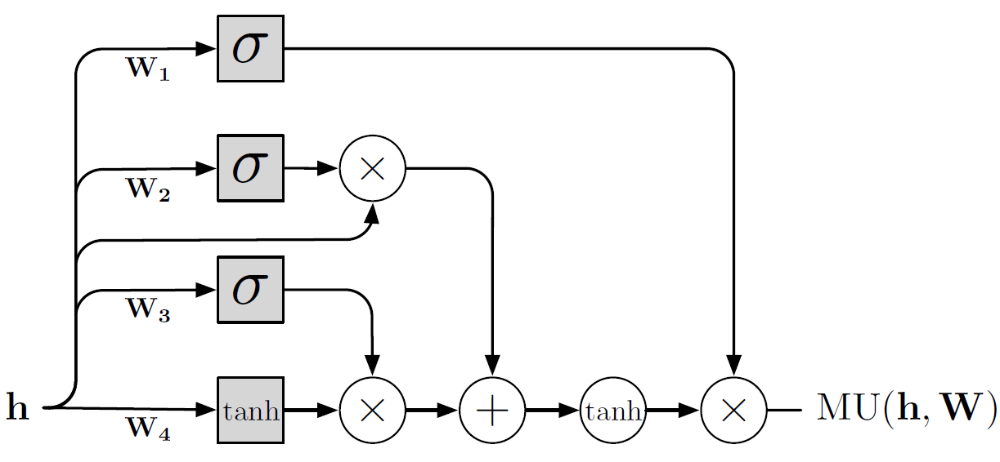
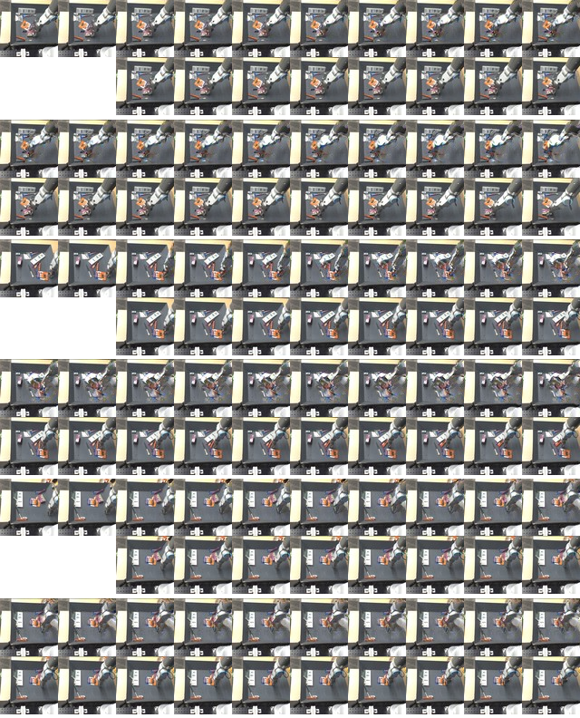
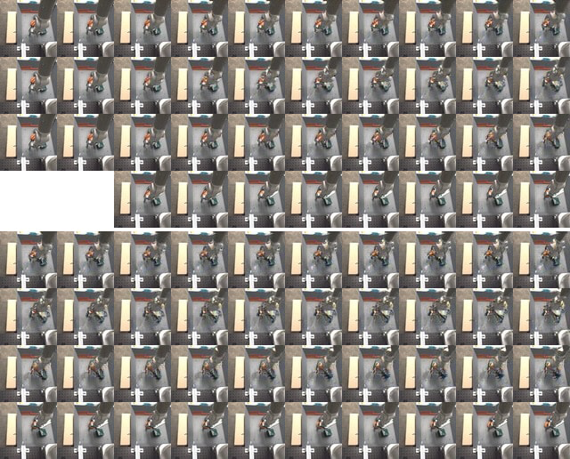
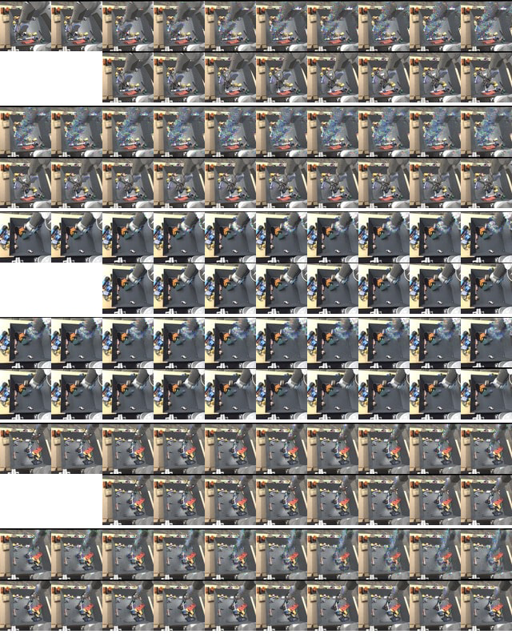
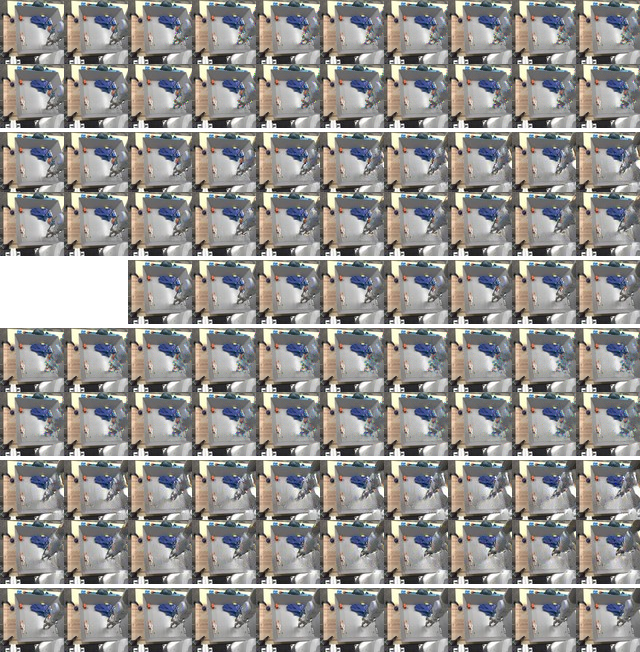

# TITLE: ICML 2017 Video Pixel Networks

- [TITLE: ICML 2017 Video Pixel Networks](#title-icml-2017-video-pixel-networks)
  - [SUMMARY](#summary)
    - [APPLICATIONS SUMMARY](#applications-summary)
    - [ARCHITECTURE SUMMARY](#architecture-summary)
    - [AUTHORS](#authors)
    - [COMPARED TO](#compared-to)
    - [CONTRIBUTIONS](#contributions)
    - [DATASETS](#datasets)
    - [IMPLEMENTATION](#implementation)
    - [METRICS](#metrics)
    - [QUALITATIVE EVALUATION SUMMARY](#qualitative-evaluation-summary)
    - [QUANTITATIVE EVALUATION SUMMARY](#quantitative-evaluation-summary)
    - [RELATED WORK](#related-work)
    - [RESULTS](#results)

## SUMMARY

### APPLICATIONS SUMMARY

- Future prediction

### ARCHITECTURE SUMMARY

Figure 1. Dependency map (top) and neural network structure (bottom) for the VPN (left) and the baseline model (right). F^t denotes
the estimated distribution over frame Ft, from which Ft is sampled. Dashed lines denote masked convolutional layers.

Probabilistic Model:
Below we define the probabilistic model implemented by Video Pixel Networks. Let a video x be a four dimensional tensor of pixel values $x_{t, i, j, c}$, where the first
(temporal) dimension $t \in \{0, ... , T\}$ corresponds to one of the frames in the video, the next two (spatial) dimensions $i, j \in \{0, ... , N\}$ index the pixel at row i and column j in frame t, and the last dimension $c \in \{R, G, B\}$ denotes one
of the three RGB channels of the pixel. We let each $x_{t, i, j, c}$ be a random variable that takes one of the 256 possible RGB color values of the pixel.

By applying the chain rule to factorize the video likelihood p(x) as a product of conditional probabilities, we can model it in a tractable manner and without introducing independence assumptions:

$$\begin{aligned} p(\mathbf{x})=& \prod_{t=0}^{T} \prod_{i=0}^{N} \prod_{j=0}^{N} p\left(\mathbf{x}_{t, i, j, B} | \mathbf{x}_{<}, \mathbf{x}_{t, i, j, R}, \mathbf{x}_{t, i, j, G}\right) \\ & \times p\left(\mathbf{x}_{t, i, j, G} | \mathbf{x}_{<}, \mathbf{x}_{t, i, j, R}\right) p\left(\mathbf{x}_{t, i, j, R} | \mathbf{x}_{<}\right) \end{aligned}$$

Here $\mathbf{x}_{<}=\mathbf{x}_{(t,<i,<j ;)} \cup \mathbf{x}_{(<t, :, :, :)}$ comprises the RGB values of all pixels to the left and above the pixel at position
(i, j) in the current frame t, as well as the RGB values of pixels from all the previous frames. Note that the factorization itself does not impose a unique ordering on the set of variables. We choose an ordering according to two criteria. The first criterion is determined by the properties and uses of the data; frames in the video are predicted according to their temporal order. The second criterion favors orderings
that can be computed efficiently; pixels are predicted starting from one corner of the frame (the top left corner) and ending in the opposite corner of the frame (the bottom right one) as this allows for the computation to be implemented efficiently (van den Oord et al., 2016b). The order for the prediction of the colors is chosen by convention as R, G and B.

The VPN models directly the four dimensions of video tensors. We use Ft to denote the t-th frame $x_{t,:,:,:}$ in the video x. Figure 1 illustrates the fourfold dependency structure for the green color channel value of the pixel x in frame Ft, which depends on:

- all pixels in all the previous frames $F_{<t}$.
- all three colors of the already generated pixels in $F_t$.
- the already generated red color value of the pixel x.

We follow the PixelRNN approach (van den Oord et al., 2016b) in modelling each conditional factor as a discrete multinomial distribution over 256 raw color values. This allows for the predicted distributions to be arbitrarily multimodal.

Remarks on the Factorization:

To illustrate the properties of the two factorizations, suppose that a model needs to predict the value of a pixel x and the value of the adjacent pixel y in a frame F, where the transition to the frame $F$ from the previous frames $F_<$ is non-deterministic. For a simple example, suppose the previous frames $F_<$ depict a robotic arm and in the current frame $F$ the robotic arm is about to move either left or right. The baseline model estimates $p(x | F_<)$ and $p(y | F_<)$ as distributions with two modes, one for the robot moving left and one for the robot moving right. Sampling independently from $p(x | F_<)$ and $p(y | F_<)$ can lead to two inconsistent
pixel values coming from distinct modes, one pixel value depicting the robot moving left and the other depicting the robot moving right. The accumulation of these inconsistencies for a few frames leads to known artifacts such as blurring of video continuations. By contrast, in this example, the VPN estimates $p(x | F_<)$ as the same bimodal distribution, but then estimates $p(y | x, F_<) conditioned on the selected value of x. The conditioned distribution is unimodal and, if the value of x is sampled to depict the robot moving left, then the value of y is sampled accordingly to also depict the robot moving left.

Generating a video tensor requires sampling $T . N^2 . 3$ variables, which for a second of video with resolution 64 x 64 is in the order of $10^5$ samples. This figure is in the order of $10^4$ for generating a single image or for a second of audio signal (van den Oord et al., 2016a), and it is in the order of $10^2$ for language tasks such as machine translation (Kalchbrenner & Blunsom, 2013).

Architecture:
The architecture consists of two parts. The first part models the temporal dimension of the data and consists of Resolution Preserving CNN Encoders whose outputs are
given to a Convolutional LSTM. The second part models the spatial and color dimensions of the video and consists of PixelCNN architectures (van den Oord et al., 2016b;c) that are conditioned on the outputs of the CNN Encoders.

Resolution Preserving CNN Encoders
Given a set of video frames $F_0, ... , F_T$, the VPN first encodes each of the first T frames $F_0, ... , F_{T - 1}$ with a CNN Encoder. These frames form the histories that condition the generated frames. Each of the CNN Encoders is composed of k (k = 8 in the experiments) residual blocks (Sect. 4) and the spatial resolution of the input frames is preserved throughout the layers in all the blocks. Preserving the resolution
is crucial as it allows the model to condition each pixel that needs to be generated without loss of representational capacity. The outputs of the T CNN Encoders, which
are computed in parallel during training, are given as input to a Convolutional LSTM, which also preserves the resolution. This part of the VPN computes the temporal dependencies of the video tensor and is represented in Fig. 1 by the shaded blocks.

Multiplicative Units:
A multiplicative unit (Fig. 3) is constructed by incorporating LSTM-like gates into a convolutional layer.

Figure 3. Structure of a multiplicative unit (MU). The squares represent the three gates and the update. The circles represent component-wise operations.

Residual Multiplicative Blocks:
To allow for easy gradient propagation through many layers of the network, we stack two MU layers in a residual multiplicative block (Fig. 2) where the input has a residual (additive skip) connection to the output (He et al., 2016). For computational efficiency, the number of channels is halved in MU layers inside the block.

Figure 2. Structure of the residual multiplicative block (RMB) incorporating two multiplicative units (MUs).

Dilated Convolutions: Having a large receptive field helps the model to capture the
motion of larger objects. One way to increase the receptive field without much effect on the computational complexity is to use dilated convolutions (Chen et al., 2014;
Yu & Koltun, 2015), which make the receptive field grow exponentially, as opposed to linearly, in the number of layers. In the variant of VPN that uses dilation, the dilation rates are the same within each RMB, but they double from one RMB to the next up to a chosen maximum size, and then repeat (van den Oord et al., 2016a). In particular, in the CNN encoders we use two repetitions of the dilation scheme [1, 2, 4, 8], for a total of 8 RMBs. We do not use dilation in the decoders.

### AUTHORS

Google DeepMind, London, UK

- Nal Kalchbrenner [nalk@google.com](mailto:nalk@google.com)
- A¨aron van den Oord [avdnoord@google.com](mailto:avdnoord@google.com)
- Karen Simonyan [simonyan@google.com](mailto:simonyan@google.com)
- Ivo Danihelka [danihelka@google.com](mailto:danihelka@google.com)
- Oriol Vinyals [vinyals@google.com](mailto:vinyals@google.com)
- Alex Graves [gravesa@google.com](mailto:gravesa@google.com)
- Koray Kavukcuoglu [korayk@google.com](mailto:korayk@google.com)

### COMPARED TO

Baseline model: We compare the VPN model with a baseline model that encodes the temporal dependencies in videos from previous frames to the next, but ignores the spatial dependencies between the pixels within a frame and the dependencies between
the color channels. In this case the joint distribution is factorized by introducing independence assumptions:

$$\begin{aligned} p(\mathbf{x}) & \approx \prod_{t=0}^{T} \prod_{i=0}^{N} \prod_{j=0}^{N} p\left(\mathbf{x}_{t, i, j, B} | \mathbf{x}_{<t, :, :, :}\right) \\ \times & p\left(\mathbf{x}_{t, i, j, G} | \mathbf{x}_{<t, :, :}\right) p\left(\mathbf{x}_{t, i, j, R} | \mathbf{x}_{<t, :, :}\right) \end{aligned}$$

Figure 1 illustrates the conditioning structure in the baseline model. The green channel value of pixel x only depends on the values of pixels in previous frames. Various models have been proposed that are similar to our baseline model in that they capture the temporal dependencies only (Ranzato et al., 2014; Srivastava et al., 2015a; Oh et al.,

Also compared to several other video prediction frameworks.

### CONTRIBUTIONS

- We have introduced the Video Pixel Network (VPN), a deep generative model of video data that models the factorization of the joint likelihood of video.

- Despite its lack of specific motion priors or surrogate losses, the VPN approaches the lower bound on the loss on the Moving MNIST benchmark that corresponds to a large improvement over the previous state of the art. On the Robotic Pushing dataset, the VPN achieves significantly better likelihoods than the baseline model that lacks the fourfold dependency structure.

- We have show that the fourfold dependency structure provides a robust and generic method for generating videos without systematic artifacts.

### DATASETS

- Moving MNIST: The Moving MNIST dataset consists of sequences of 20 frames of size 64 x 64, depicting two potentially overlapping MNIST digits moving with constant velocity and bouncing off walls. Training sequences are generated on-the-fly using digits from the MNIST training set without a limit on the number of generated training sequences (our models observe 19.2M training sequences before convergence).
The test set is fixed and consists of 10000 sequences that contain digits from the MNIST test set. 10 of the 20 frames are used as context and the remaining 10 frames are generated.

- BAIR Robot Pushing: The Robotic Pushing dataset consists of sequences of 20
frames of size 64 x 64 that represent camera recordings of a robotic arm pushing objects in a basket. The data consists of a training set of 50000 sequences, a validation set, and two test sets of 1500 sequences each, one involving a subset
of the objects seen during training and the other one involving novel objects not seen during training. Each frame in the video sequence is paired with the state of the robot at that frame and with the desired action to reach the next frame. The transitions are non-deterministic as the robotic arm may not reach the desired state in a frame due to occlusion by the objects encountered on its trajectory. 2 frames,
2 states and 2 actions are used as context; the desired 18 actions in the future are also given. The 18 frames in the future are then generated conditioned on the 18 actions as well as on the 2 steps of context.

### IMPLEMENTATION

### METRICS

- Cross-Entropy Loss: In order to make our results comparable, for this dataset only we use the same sigmoid cross-entropy loss as used in prior work (Srivastava et al., 2015a). The loss is defined as:

$$H(z, y)=-\sum_{i} z_{i} \log y_{i}+\left(1-z_{i}\right) \log \left(1-y_{i}\right)$$

where $z_i$ are the grayscale targets in the Moving MNIST frames that are interpreted as probabilities and $y_i$ are the predictions. The lower bound on $H(z, y)$ may be non-zero. In fact, if we let $z_i$ = $y_i$, for the 10 frames that are predicted in each sequence of the Moving MNIST test data, $H(z, y)$ = 86.3 nats/frame.

### QUALITATIVE EVALUATION SUMMARY

A qualitative evaluation of video continuations produced by the models matches the quantitative results. Figure 4 shows random continuations produced by the VPN and the
baseline model on the Moving MNIST test set. The frames generated by the VPN are consistently sharp even when they deviate from the ground truth. By contrast, the continuations produced by the baseline model get progressively more blurred with time – as the uncertainty of the model grows with the number of generated frames, the lack of inter-frame spatial dependencies leads the model to take the expectation over possible trajectories.

Figure 4. Randomly sampled continuations of videos from the
Moving MNIST test set. For each set of three rows, the first
10 frames in the middle row are the given context frames. The
next three rows of 10 frames each are as follows: frames generated
from the baseline model (top row), frames generated from
the VPN (middle row) and ground truth frames (bottom row).

Figure 5 contains random samples of the VPN on the validation set with seen objects (together with the corresponding ground truth). The model is able to distinguish
between the robotic arm and the background, correctly handling occlusions and only pushing the objects when they come in contact with the robotic arm. The VPN generates
the arm when it enters into the frame from one of the sides. The position of the arm in the samples is close to that in the ground truth, suggesting the VPN has learned to follow the actions. The generated videos remain detailed throughout the 18 frames and few artifacts are present. The samples remain good showing the ability of the VPN to generalize to new sequences of actions.

Figure 5. Randomly sampled continuations of videos from the
Robotic Pushing validation set (with seen objects). Each set of
four rows corresponds to a sample of 2 given context frames and
18 generated frames. In each set of four rows, rows 1 and 3 are
samples from the VPN. Rows 2 and 4 are the actual continuation
in the data.

### QUANTITATIVE EVALUATION SUMMARY

Table 1 reports the results of various recent video models on the Moving MNIST test set.

| Model                      | Test  |
|----------------------------|------:|
| (Shi et al., 2015)         | 367.2 |
| (Srivastava et al., 2015a) | 341.2 |
| (Brabandere et al., 2016)  | 285.2 |
| (Cricri et al., 2016)      | 187.7 |
| (Patraucean et al., 2015)  | 179.8 |
| Baseline model             | 110.1 |
| **VPN**                    | 87.6  |
| Lower Bound                | 86.3  |

Table 1. Cross-entropy results in nats/frame on the Moving MNIST dataset.

Our baseline model achieves 110.1 nats/frame, which is significantly better than the previous state of the art (Patraucean et al., 2015). We attribute these gains to architectural features and, in particular, to the resolution preserving aspect of the network. Further, the VPN achieves 87.6 nats/frame, which approaches the lower bound of 86.3 nats/frame.

Table 2 reports results of architectural variants of the VPNs. 

| Model                   | Test |
|-------------------------|-----:|
| VPN (RMB, No Dilation)  | 89.2 |
| VPN (Relu, No Dilation) | 89.1 |
| VPN (Relu, Dilation)    | 87.7 |
| VPN (RMB, Dilation)     | 87.6 |
| Lower Bound             | 86.3 |

Table 2. Cross-entropy results in nats/frame on the Moving MNIST dataset (Ablation study).

The model with dilated convolutions improves over its nondilated counterpart as it can more easily act on the relatively large digits moving in the 64 x 64 frames. In the case of Moving MNIST, MUs do not yield a significant improvement in performance over just using ReLUs, possibly due to the relatively low complexity of the task. A sizeable improvement is obtained from MUs on the Robotic Pushing dataset (Tab. 3).

Table 3 reports the results of the baseline model and variants of the VPN on the Robotic Pushing validation and test sets.

| Model                      | Valid. | Test Seen | Test Novel |
|----------------------------|-------:|----------:|-----------:|
| Baseline model             | 2.06   | 2.08      | 2.07       |
| VPN (Relu, Dilation)       | 0.73   | 0.72      | 0.75       |
| VPN (Relu, No Dilation)    | 0.72   | 0.73      | 0.75       |
| VPN (RMB, Dilation)        | 0.63   | 0.65      | 0.64       |
| **VPN** (RMB, No Dilation) | 89.2   | 89.2      | 89.2       |

Table 3. Negative log-likelihood in nats/dimension on the Robotic Pushing dataset.

The best variant of the VPN has a > 65% reduction in negative log-likelihood over the baseline model. This highlights the importance of space and color dependencies
in non-deterministic environments. The results on the validation and test datasets with seen objects and on the test dataset with novel objects are similar. This shows that the models have learned to generalize well not just to new action sequences, but also to new objects. Furthermore, we see that using multiplicative interactions in the VPN gives a significant improvement over using ReLUs.

### RELATED WORK

### RESULTS

Figure 6. Randomly sampled continuations of videos from the Robotic Pushing test set with novel objects not seen during training. Each set of four rows is as in Fig. 5.

Figure 7. Three different samples from the VPN starting from the same 2 context frames on the Robotic Pushing validation set. For each set of four rows, top three rows are generated samples, the bottom row is the actual continuation in the data.

Figure 8. Randomly sampled continuations from the baseline
model on the Robotic Pushing validation set (with seen objects).
Each set of four rows is as in Fig. 5.
Figure

Figure 9. Comparison of continuations given the same 2 context
frames from the Robotic Pushing validation set for the baseline
model (rows 1 and 2, and 6 and 7), for the VPN (rows 3 and 4,
and 8 and 9) and for the actual continuation in the data (rows 5
and 10).
