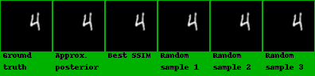
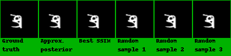
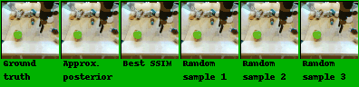

# TITLE: ICCV 2017 Stochastic Video Generation with a Learned Prior

- [TITLE: ICCV 2017 Stochastic Video Generation with a Learned Prior](#title-iccv-2017-stochastic-video-generation-with-a-learned-prior)
  - [SUMMARY](#summary)
    - [ARCHITECTURE SUMMARY](#architecture-summary)
    - [CONTRIBUTIONS](#contributions)
    - [DATASETS](#datasets)
    - [IMPLEMENTATION](#implementation)
    - [METRICS](#metrics)
    - [RESULTS](#results)

## SUMMARY

### ARCHITECTURE SUMMARY

$LSTM_{\theta}$ is a two layer LSTMs with 256 cells in each layer.
$LSTM_{\phi}$ and $LSTM_{\psi}$  are both single layer LSTMs with
256 cells in each layer. Each network has a linear embedding
layer and a fully connected output layer. The output of
LSTM is passed through a tanh nonlinearity before going
into the frame decoder. For Stochastic Moving MNIST, the frame encoder has a
DCGAN discriminator architecture (Radford et al., 2016)
with output dimensionality |h| = 128. Similarly, the decoder
uses a DCGAN generator architecture and a sigmoid output
layer.

For KTH and BAIR datasets, the frame encoder uses the
same architecture as VGG16 (Simonyan & Zisserman, 2015)
up until the final pooling layer with output dimensionality
|h| = 128. The decoder is a mirrored version of the encoder
with pooling layers replaced with spatial up-sampling and
a sigmoid output layer.

For all datasets we add skip connections from the encoder
at the last ground truth frame to the decoder at t, enabling
the model to easily generate static background features.

### CONTRIBUTIONS

- Novel video prediction model that combines a deterministic prediction of the next frame with stochastic latent variables, drawn from a time-varying distribution
learned from training sequences. Our recurrent inference network estimates the latent distribution for each time step allowing easy end-to-end training.

- Evaluating the model on real-world sequences, we demonstrate high quality generations that are comparable to, or better than, existing approaches. On synthetic data where it is possible to characterize the distribution of samples, we see that is
able to match complex distributions of futures. The framework is sufficiently general that it can readily be applied to more complex datasets, given appropriate encoder and
decoder modules.

### DATASETS

- Stochastic Moving MNIST (introduced by this paper): Stochastic Moving MNIST (SM-MNIST) is a dataset consisting of sequences of frames of size 64×64, containing one or two MNIST digits moving and bouncing off edge of the frame (walls). In the original Moving MNIST dataset (Srivastava et al., 2015) the digits move with constant velocity and bounce off the walls in a deterministic manner. By contrast, SM-MNIST digits move with a constant velocity along a trajectory until they hit at wall at which point they bounce off with a random speed and direction. This dataset thus contains segments of deterministic motion interspersed with moments of uncertainty, i.e. each time a digit hits a wall.

- KTH Action Dataset
- BAIR robot pushing dataset

### IMPLEMENTATION

Python and pytorch (by the authors): <https://github.com/edenton/svg>

### METRICS

- Structural Similarity (SSIM)
- Peak Signal-to-Noise Ratio (PSNR)

### RESULTS

